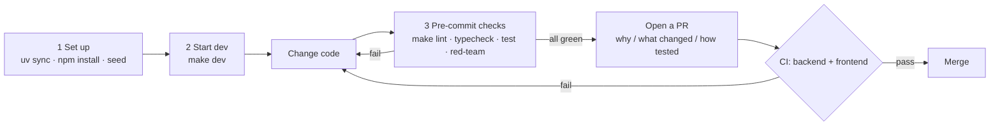

# Contributing

Issues and PRs for ResolveAI are welcome — especially in these areas:

- New MCP servers (beyond the existing 5 SaaS mocks).
- Strengthening any of the four guardrail layers (input / exec / output / memory).
- Expanding the adversarial set (200 adversarial prompts in [`apps/api/tests/fixtures/red_team.jsonl`](apps/api/tests/fixtures/red_team.jsonl), harness [`scripts/eval_adversarial.py`](scripts/eval_adversarial.py)).
- New LLM providers or routing strategies.

## Contribution flow at a glance



## 1. Local setup

```bash
# Install uv — https://docs.astral.sh/uv/
uv sync                          # Backend + MCP servers
cd apps/web && npm install && cd -   # Frontend

# Start Postgres + pgvector
cp .env.example .env
docker compose up -d postgres
make seed
```

Requirements:

- Python 3.12+ (uv recommended)
- Node.js 22+
- Docker / Docker Compose (Postgres + pgvector)

## 2. Start dev

```bash
make dev
# Backend http://localhost:8000  (Swagger at /docs)
# Frontend http://localhost:3000
```

## 3. Pre-commit checks (same as CI)

```bash
make lint        # ruff + eslint
make typecheck   # mypy + tsc
make test        # pytest + next lint
make red-team    # Adversarial-prompt smoke (baseline profile; expect 0 PII leaks)
```

> Run the full 200-prompt adversarial set with `uv run python scripts/eval_adversarial.py`.

Run `make fmt` once before committing to auto-fix Python / frontend formatting. Add new Python packages to `[tool.uv.workspace] members`.

## 4. Documentation conventions

- **Material technical decisions** go in the matching [`docs/milestone-*-plan.md`](.) plan, or a new `DECISIONS.md` (ADR style).
- **Milestone progress** updates [`docs/roadmap.md`](docs/roadmap.md).
- **New MCP servers**: document the tool surface and capability level (read / write / destructive) in [`packages/mcp-servers/<name>/README.md`](packages/mcp-servers/).

## 5. Commit messages

- Short English summaries, conventional commits (`feat:` / `fix:` / `docs:` / `refactor:` / `chore:` / `test:`).
- One commit, one change; split cross-package edits when you can.
- In the PR description: **why / what changed / how you tested**. When adding adversarial samples, include the red-team pass rate.

## 6. CI must pass

Every PR runs two jobs; both must be green:

- `backend` (uv / ruff / `mypy apps/api/src packages` / pytest)
- `frontend` (Next.js lint + build; `next build` includes tsc)

> Local `make typecheck` matches CI: backend `mypy` on `apps/api/src` and `packages`, plus frontend `tsc`.

If your change affects the red-team pass rate, include a before/after comparison in the PR.

## 7. Larger proposals

New agents, handoff-protocol changes, switching LLM provider, or tenant-isolation changes —
**open an issue to align on direction first**, so a large investment does not collide with existing work.

— Thank you for contributing!
