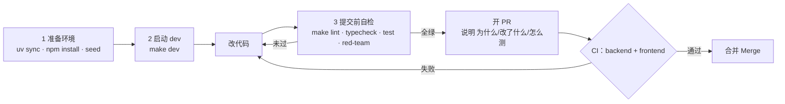

# 贡献指南 / Contributing

欢迎为 ResolveAI 提 issue 或 PR —— 尤其欢迎以下方向：

- 新增 MCP server（在现有 5 个 SaaS mock 之外）。
- 补强四层护栏（guardrails）的任意一层（input / exec / output / memory）。
- 扩充对抗集（200 条 adversarial prompt 在 [`apps/api/tests/fixtures/red_team.jsonl`](apps/api/tests/fixtures/red_team.jsonl)，入口脚本 [`scripts/eval_adversarial.py`](scripts/eval_adversarial.py)）。
- 接入新的 LLM provider 或路由（routing）策略。

## 提交流程一图



## 1. 准备本地环境

```bash
# 装 uv —— https://docs.astral.sh/uv/
uv sync                          # 后端 + MCP servers
cd apps/web && npm install && cd -   # 前端

# 起 Postgres + pgvector
cp .env.example .env
docker compose up -d postgres
make seed
```

要求：

- Python 3.12+（推荐 uv）
- Node.js 22+
- Docker / Docker Compose（Postgres + pgvector）

## 2. 启动 dev

```bash
make dev
# 后端 http://localhost:8000  （Swagger 在 /docs）
# 前端 http://localhost:3000
```

## 3. 提交前自检（与 CI 一致）

```bash
make lint        # ruff + eslint
make typecheck   # mypy + tsc
make test        # pytest + next lint
make red-team    # 对抗 prompt 烟测（baseline profile，期望 0 PII 泄漏）
```

> 完整 200 条对抗集用 `uv run python scripts/eval_adversarial.py` 跑。

提交前跑一次 `make fmt` 自动修复 Python / 前端格式。新增 Python 包记得加进 `[tool.uv.workspace] members`。

## 4. 文档约定

- **重要技术决策**写到对应的 [`docs/milestone-*-plan.md`](.) 方案文档，或新建 `DECISIONS.md`（ADR 风格）。
- **阶段性进展**更新 [`docs/roadmap.md`](docs/roadmap.md)。
- **新增 MCP server**：在 [`packages/mcp-servers/<name>/README.md`](packages/mcp-servers/) 里写清 tool surface 与 capability 等级（read / write / destructive）。

## 5. Commit 信息

- 用英文简短说明，遵循 conventional commits（`feat:` / `fix:` / `docs:` / `refactor:` / `chore:` / `test:`）。
- 一个 commit 只做一件事；跨子模块改动尽量拆开。
- PR 描述里说明：**为什么改 / 改了什么 / 怎么测**，新增对抗样本时贴上 red-team 通过率。

## 6. CI 必须通过

每个 PR 会跑两个 job，都要绿：

- `backend`（uv / ruff / mypy / pytest）
- `frontend`（Next.js lint + tsc）

如果改动会影响 red-team 通过率，请在 PR 描述里贴前后对比。

## 7. 较大的提案

新增 Agent、修改 handoff 协议、切换 LLM provider、或改动租户隔离机制 ——
**先开 issue 讨论方向**，避免投入大改后才发现冲突。

—— 感谢贡献！
