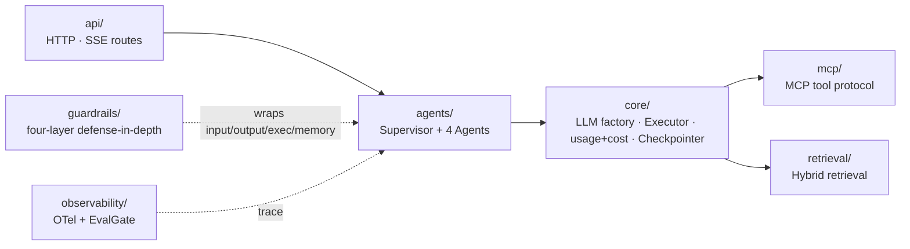

# `resolveai-api` — Backend

FastAPI + LangGraph multi-agent orchestration service.

## How a request flows through the modules



## Module map

| Directory | Responsibility | Milestone |
|---|---|---|
| `agents/` | Supervisor + 4 agents (Triage / Billing / Technical / Escalation): roles and orchestration | [M2](../../docs/milestone-2-plan.md) · [M3](../../docs/milestone-3-plan.md) |
| `core/` | Shared core: LLM factory (cost-aware routing) · Executor (capability gate + sandbox) · usage/cost (`capture_run`) · budget circuit-breaker · Checkpointer | [M2](../../docs/milestone-2-plan.md) · [M11](../../docs/milestone-11-plan.md) |
| `guardrails/` | Four-layer defense-in-depth (input / exec / output / memory) | [M4](../../docs/milestone-4-plan.md) · [M5](../../docs/milestone-5-plan.md) |
| `mcp/` | MCP tool protocol: discovery + capability allowlist | [M3](../../docs/milestone-3-plan.md) |
| `retrieval/` | Hybrid retrieval (BM25 + dense + RRF + reranker) | [M6](../../docs/milestone-6-plan.md) |
| `eval/` | Architecture-ablation eval library (trace / pricing / judge / variants) | [M7](../../docs/milestone-7-plan.md) |
| `observability/` | OTel spans + EvalGate integration | [M8](../../docs/milestone-8-plan.md) |
| `api/` | HTTP / SSE routes (`/api/v1/chat` and others) | [M1](../../docs/roadmap.md) |

## Local start

```bash
uv run uvicorn resolveai_api.main:app --reload
# Swagger: http://localhost:8000/docs
```
