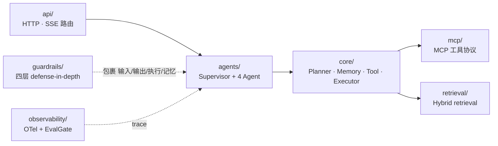

# `resolveai-api` — Backend

FastAPI + LangGraph 多 Agent 编排服务。

## 请求如何流经各模块



## 模块对照

| 目录 | 设计文档章节 |
|---|---|
| `agents/` | §1.4 4 个 Agent 分工 + §2.2 Agent 编排 |
| `core/` | §1.4 Planner / Memory / Tool / Executor 四件套 |
| `guardrails/` | §2.3 决策 4 — 四层 defense-in-depth |
| `mcp/` | §2.3 决策 3 — MCP 工具协议 |
| `retrieval/` | §2.2 Hybrid retrieval (BM25 + dense + RRF + reranker) |
| `observability/` | §2.2 OTel + EvalGate 接入 |
| `api/` | HTTP/SSE 路由（`/api/v1/chat` 等） |

## 本地启动

```bash
uv run uvicorn resolveai_api.main:app --reload
# Swagger: http://localhost:8000/docs
```
