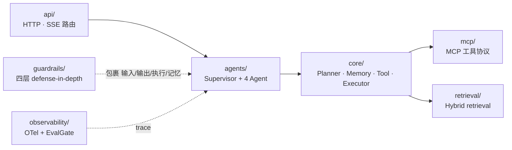

# `resolveai-api` — Backend

FastAPI + LangGraph 多 Agent 编排服务。

## 请求如何流经各模块



## 模块对照

| 目录 | 职责 | 对应里程碑 |
|---|---|---|
| `agents/` | Supervisor + 4 个 Agent（Triage / Billing / Technical / Escalation）分工与编排 | [M2](../../docs/milestone-2-plan.md) · [M3](../../docs/milestone-3-plan.md) |
| `core/` | 共享内核：Planner / Memory / Tool / Executor 四件套 | [M2](../../docs/milestone-2-plan.md) |
| `guardrails/` | 四层 defense-in-depth（input / exec / output / memory） | [M4](../../docs/milestone-4-plan.md) · [M5](../../docs/milestone-5-plan.md) |
| `mcp/` | MCP 工具协议：discovery + capability 白名单 | [M3](../../docs/milestone-3-plan.md) |
| `retrieval/` | Hybrid retrieval（BM25 + dense + RRF + reranker） | [M6](../../docs/milestone-6-plan.md) |
| `eval/` | 架构消融 eval 库（trace / pricing / judge / variants） | [M7](../../docs/milestone-7-plan.md) |
| `observability/` | OTel span + EvalGate 接入 | [M8](../../docs/milestone-8-plan.md) |
| `api/` | HTTP / SSE 路由（`/api/v1/chat` 等） | [M1](../../docs/roadmap.md) |

## 本地启动

```bash
uv run uvicorn resolveai_api.main:app --reload
# Swagger: http://localhost:8000/docs
```
