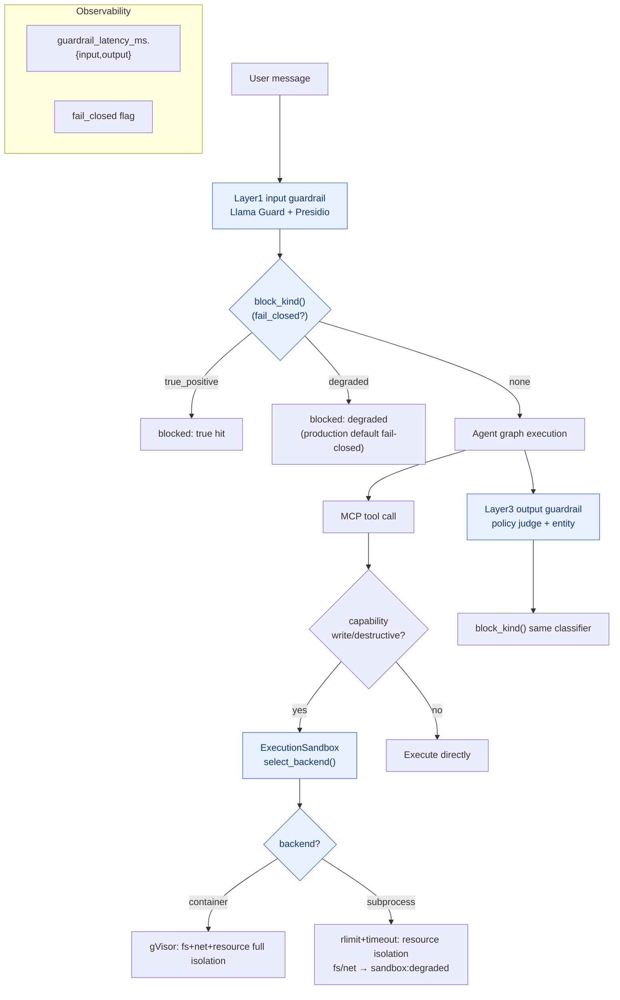

# Milestone 10 — Production-grade guardrails & a real sandbox

**Status:** ✅ Implemented (LM-free, `146 passed`). Landed:
- **Profile-aware fail-closed:** `config.ENV_PROFILE` (demo/production) + `GUARDRAIL_FAIL_CLOSED=auto` (follows profile), `attribution.resolve_fail_closed()`; production defaults to hard block.
- **Block attribution taxonomy:** `attribution.BlockKind` (`true_positive` / `degraded` / `none`) + `block_kind()`; SupervisorGraph.stream `blocked` events carry `layer`+`kind`; `done` events carry `guardrail_latency_ms` + `fail_closed`.
- **Real sandbox:** `guardrails/sandbox.py` — subprocess backend (POSIX `setrlimit` + wall-clock timeout; real CPU/memory/process/file-size enforcement) + container command builder (gVisor `runsc`/`runc` full isolation) + runtime detection + backend selection.
- **Degraded-flag wiring:** `ExecutionSandbox` computes `SandboxPolicy` from capability and selects a backend; write/destructive tools record `sandbox:degraded:<dims>` for dimensions the backend cannot cover (default `SANDBOX_MODE=off` behavior unchanged).
- **Escape-test quantification:** `apps/api/tests/fixtures/sandbox_escapes.jsonl` + `scripts/eval_sandbox.py` → `reports/sandbox/escape_matrix_*.md`. Local measurement: subprocess layer **blocked 4/5** resource attacks; **filesystem read escape** (exactly the quantified case for needing gVisor).
- **Tests:** `test_sandbox.py` (real child-process rlimit/timeout containment + pure-function container contract) + `test_hardening.py` (profile / block_kind / production default hard-block).

**Leftover (non-blocking; do when further productionizing):** actually pack MCP tools into a gVisor container to run (today tools are in-process async calls; the sandbox layer does policy selection + degraded flags + enforcement verified by the escape harness). Container-layer escape execution needs CI with docker+runsc installed.

`resolve_fail_closed` decision and backend selection:

| profile | `GUARDRAIL_FAIL_CLOSED` | Degraded-flag outcome | `SANDBOX_MODE` | Effective backend |
|---|---|---|---|---|
| demo | `auto` | allow (fail-open, favor availability) | `off` | none (metadata only) |
| production | `auto` | **block** (fail-closed, favor safety) | `on` | container (if runsc) → else subprocess |
| any | `on`/`off` | explicit override | `subprocess`/`container` | force that layer |

---

## Original plan (kept for comparison)

**Foundation** (hardening pass): `GUARDRAIL_FAIL_CLOSED` switch, `DEGRADED_FLAGS` + `has_degraded_flag()`, Supervisor dual-side degraded-block wiring.

**Goal:** Upgrade guardrails from “can demo a block” to “production-dependable”: default **fail-closed**, tool execution on a **real kernel-level sandbox**, and **escape tests** that quantify sandbox effectiveness (block rate / escape rate), plus per-layer latency budgets and degrade policy.

**Design principle:** Library-first — sandbox via gVisor (`runsc`) / container `--runtime=runsc` or K8s Pod-per-call; do not invent seccomp. Guardrail degrade semantics reuse existing `DEGRADED_FLAGS`; do not invent a new flag system.

---

## 1. Current state (already in place)

- Four-layer guardrails (M4) run for real: input Llama Guard + Presidio; execution Executor capability allowlist; output policy judge + hallucinated-entity; memory namespace isolation.
- **Fail-closed can already be turned on:** with `GUARDRAIL_FAIL_CLOSED=on`, degraded flags such as `llama_guard_timeout` / `*_unavailable` / `policy_judge_timeout` trigger a block; default `off` (demo fail-open, favor availability).
- Execution-side `guardrails/execution/` (gVisor config exists under `infra/`), but tools currently mostly run in-process in the executor — kernel-level isolation is not forced.

## 2. Key gaps

1. Fail-closed is only a switch; missing a **production profile default-on** and separate counts for “degraded block vs true-positive block” (SLO reports need to distinguish “blocked because of timeout” vs “blocked because truly harmful”).
2. Tool execution **not wired to a real sandbox**: destructive tools (refund/escalate) still run inside the API process.
3. No **escape tests** quantifying the sandbox: cannot prove with numbers that “the sandbox blocked X% of malicious tool behavior.”
4. Guardrail latency has no budget / no p95 instrumentation.

## 3. Technical approach

### 3.1 Productionizing fail-closed
- Add `settings.env_profile` (`demo` / `production`); under `production`, `guardrail_fail_closed` defaults to `on`.
- `GuardrailReport` adds a `degraded_block` flag; `_emit_report` separately increments `blocked_true_positive` vs `blocked_degraded`, for the M11 dashboard.

### 3.2 Real sandboxed execution
- `core/executor.py` adds `SandboxedExecutor`: destructive/write tool calls packed into a one-shot container (`docker run --runtime=runsc --network=<allowlist> --read-only --memory=... --cpus=... --pids-limit=...`) or a K8s Job.
- Sandbox I/O over a stdin/stdout JSON protocol (reuse the MCP stdio mental model).
- Degrade: if no `runsc`, fall back to `runc` + seccomp profile and set `sandbox:degraded` (works with fail-closed).

### 3.3 Escape test set
- `apps/api/tests/fixtures/sandbox_escapes.jsonl`: read `/etc/passwd`, outbound connect to a non-allowlisted domain, fork bomb, write to disk, read env-var secrets.
- `scripts/eval_sandbox.py`: run each attempt in the sandbox, record blocked/escaped, write `reports/sandbox/escape_matrix.md` (one table).

### 3.4 Latency budget
- Each guardrail-layer span (reuse M8 OTel) gets `layer` + `duration_ms`; over budget auto-degrades and fail-open/closed follows profile.

## 4. Acceptance

- [x] Under `production` profile, fail-closed defaults on (`resolve_fail_closed`); blocks classified by `BlockKind` as `true_positive` / `degraded` (`blocked` event + span attributes)
- [x] Real sandbox backends landed: subprocess layer rlimit/timeout **measured as actually enforced** (`test_sandbox.py`); container-layer command contract unit-tested; full path of destructive tools executing inside `runsc` listed as leftover (needs docker+runsc CI)
- [x] Escape-test table: 6 attack classes, `scripts/eval_sandbox.py` → `reports/sandbox/escape_matrix_*.md`, reports subprocess-layer block rate (local 4/5, fs escape)
- [x] Per-layer guardrail latency on the `done` event (`guardrail_latency_ms.{input,output}`) + `ticket.run` span
- [x] New tests all green (`146 passed`); `ruff` passes; `mypy` introduces no new errors (58 baseline held)
