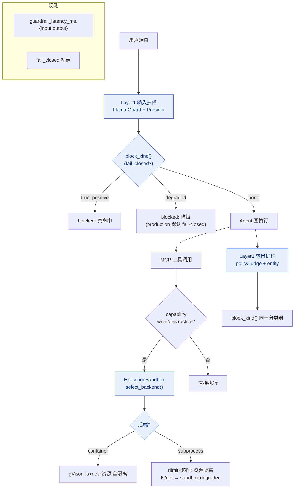

# Milestone 10 — 生产级护栏 & 真沙箱

**Status:** ✅ 已实施（LM-free，`146 passed`）。落地内容：
- **profile-aware fail-closed**：`config.ENV_PROFILE`（demo/production）+ `GUARDRAIL_FAIL_CLOSED=auto`（跟随 profile），`attribution.resolve_fail_closed()`；production 默认硬拦截。
- **拦截归因分类**：`attribution.BlockKind`（`true_positive` / `degraded` / `none`）+ `block_kind()`，`SupervisorGraph.stream` 的 `blocked` 事件带 `layer`+`kind`，`done` 事件带 `guardrail_latency_ms` + `fail_closed`。
- **真实沙箱**：`guardrails/sandbox.py` —— subprocess 后端（POSIX `setrlimit` + 墙钟超时，真实强制 CPU/内存/进程/文件大小）+ container 命令构造器（gVisor `runsc`/`runc` 全维隔离）+ 运行时探测 + 后端选择。
- **降级标记接线**：`ExecutionSandbox` 按 capability 计算 `SandboxPolicy` + 选后端，对 write/destructive 工具在后端无法覆盖的维度记 `sandbox:degraded:<dims>`（`SANDBOX_MODE=off` 默认时行为不变）。
- **逃逸测试量化**：`apps/api/tests/fixtures/sandbox_escapes.jsonl` + `scripts/eval_sandbox.py` → `reports/sandbox/escape_matrix_*.md`。本机实测 subprocess 层对资源型攻击 **4/5 拦截**，**filesystem 读逃逸**（正是需要 gVisor 的量化依据）。
- **测试**：`test_sandbox.py`（真实子进程 rlimit/超时containment + 纯函数容器契约）+ `test_hardening.py`（profile / block_kind / production 默认硬拦截）。

**遗留（非阻塞，进一步生产化时做）：** 把 MCP 工具真正打包进 gVisor 容器执行（当前工具是进程内 async 调用，沙箱层做的是策略选择 + 降级标记 + 由逃逸 harness 验证 enforcement）；container 层的逃逸执行需在装了 docker+runsc 的 CI 上跑。

resolve\_fail\_closed 决策与后端选择：

| profile | `GUARDRAIL_FAIL_CLOSED` | 降级 flag 结果 | `SANDBOX_MODE` | 有效后端 |
|---|---|---|---|---|
| demo | `auto` | 放行（fail-open，favor 可用性） | `off` | none（仅元数据） |
| production | `auto` | **拦截**（fail-closed，favor 安全） | `on` | container（有 runsc）→ 否则 subprocess |
| 任意 | `on`/`off` | 显式覆盖 | `subprocess`/`container` | 强制该层 |

---

## 原始规划（保留作对照）

**地基**（加固 pass）：`GUARDRAIL_FAIL_CLOSED` 开关、`DEGRADED_FLAGS` + `has_degraded_flag()`、Supervisor 双侧降级拦截接线。

**Goal:** 把护栏从「能演示拦截」升级为「生产可依赖」：默认 **fail-closed**、工具执行接**真实内核级沙箱**、并用**逃逸测试**量化沙箱有效性（拦截率 / 逃逸率），配套每层延迟预算与降级策略。

**Design principle:** 调库优先 —— 沙箱用 gVisor（`runsc`）/ 容器 `--runtime=runsc` 或 K8s Pod-per-call，不自研 seccomp；护栏降级语义复用已有 `DEGRADED_FLAGS`，不新造 flag 体系。

---

## 1. 现状（已就绪）

- 四层护栏（M4）真跑：输入 Llama Guard + Presidio、执行 Executor capability 白名单、输出 policy judge + hallucinated-entity、记忆命名空间隔离。
- **fail-closed 已可开**：`GUARDRAIL_FAIL_CLOSED=on` 时，`llama_guard_timeout` / `*_unavailable` / `policy_judge_timeout` 等降级 flag 触发拦截；默认 `off`（demo fail-open，favor 可用性）。
- 执行侧 `guardrails/execution/`（gVisor 配置存在于 `infra/`），但工具当前主要走进程内 executor，未强制内核级隔离。

## 2. 关键缺口

1. fail-closed 只是开关，缺**生产 profile 默认 on** + 「降级拦截 vs 真命中拦截」的分开计数（SLO 报表需要区分"因为超时拦"和"因为真有害拦"）。
2. 工具执行**未接真实沙箱**：destructive 工具（refund/escalate）仍在 API 进程内跑。
3. 没有**逃逸测试**量化沙箱：不能用数字证明"沙箱拦住了 X% 的恶意工具行为"。
4. 护栏延迟无预算/无 p95 埋点。

## 3. 技术方案

### 3.1 fail-closed 生产化
- 新增 `settings.env_profile`（`demo` / `production`），`production` 下 `guardrail_fail_closed` 默认 `on`。
- `GuardrailReport` 增加 `degraded_block` 标志；`_emit_report` 分别累计 `blocked_true_positive` 与 `blocked_degraded`，供 M11 dashboard。

### 3.2 真实沙箱执行
- `core/executor.py` 增加 `SandboxedExecutor`：destructive/write 工具调用打包为一次性容器（`docker run --runtime=runsc --network=<allowlist> --read-only --memory=... --cpus=... --pids-limit=...`）或 K8s Job。
- 沙箱 I/O 走 stdin/stdout JSON 协议（复用 MCP stdio 心智）。
- 降级：无 `runsc` 时回退到 `runc` + seccomp profile，并打 `sandbox:degraded` flag（配合 fail-closed）。

### 3.3 逃逸测试集
- `apps/api/tests/fixtures/sandbox_escapes.jsonl`：读 `/etc/passwd`、外连非白名单域名、fork bomb、写盘、读环境变量密钥。
- `scripts/eval_sandbox.py`：对每条尝试跑沙箱，记录 blocked/escaped，输出 `reports/sandbox/escape_matrix.md`（一张表）。

### 3.4 延迟预算
- 每层护栏 span（复用 M8 OTel）加 `layer` + `duration_ms`；超预算自动降级并按 profile 决定 fail-open/closed。

## 4. 验收

- [x] `production` profile 下 fail-closed 默认 on（`resolve_fail_closed`），拦截按 `BlockKind` 区分 `true_positive` / `degraded`（`blocked` 事件 + span 属性）
- [x] 真实沙箱后端落地：subprocess 层 rlimit/超时**实测强制**（`test_sandbox.py`），container 层命令契约单测覆盖；destructive 工具在 `runsc` 内执行的完整链路列为遗留（需 docker+runsc CI）
- [x] 逃逸测试表：6 类攻击，`scripts/eval_sandbox.py` → `reports/sandbox/escape_matrix_*.md`，报告 subprocess 层拦截率（本机 4/5，fs 逃逸）
- [x] 护栏各层 latency 进 `done` 事件（`guardrail_latency_ms.{input,output}`）+ `ticket.run` span
- [x] 新增测试全绿（`146 passed`），`ruff` 通过，`mypy` 不新增错误（维持 58 基线）
