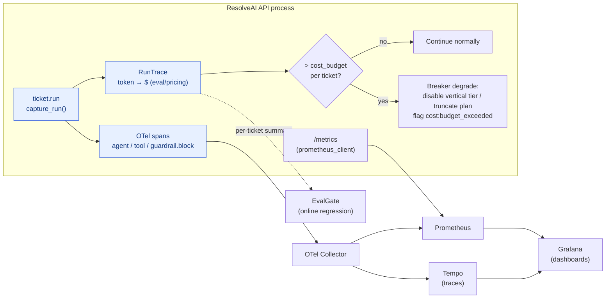

# Milestone 11 — Observability loop & cost governance

**Status:** ✅ Implemented (LM-free, `150 passed`). Landed:
- **`/metrics` Prometheus endpoint:** `observability/metrics.py` (process-level counters/histograms; graceful no-op if `prometheus_client` is missing, mirroring tracing.py) + `api/metrics.py` route. Metrics follow Prometheus naming: `resolveai_tickets_total{outcome}`, `resolveai_guardrail_blocks_total{layer,kind}`, `resolveai_tool_calls_total`/`resolveai_tool_errors_total`, `resolveai_cost_budget_exceeded_total`, `resolveai_ticket_cost_usd`/`resolveai_ticket_tokens`/`resolveai_guardrail_latency_ms{layer}` (histogram).
- **Cost budget + circuit breaker:** `config.COST_BUDGET_USD` (lenient default `$0.05`, `<=0` disables) + `core/budget.py` (`is_over_budget`/`over_cost_budget` read the active `RunTrace`). Vertical Plan-Execute routing and the ReAct loop **stop spending further** when over budget (protective degrade, finish with existing observations). Supervisor sets `cost:budget_exceeded` and the `done` event carries `over_budget`/`cost_budget_usd`.
- **One-command observability stack:** `docker-compose.yml` `--profile obs` expands to OTel Collector + Tempo (traces) + Prometheus (scrape host `/metrics` + collector spanmetrics) + Grafana (pre-provisioned datasources + `ResolveAI — Agent Ops & Cost` dashboard); all images pin tags. `make obs` / `make obs-down` / `make metrics`.
- **Real OTel export:** `observability/tracing.py` already used `OTLPSpanExporter` and deps were in `pyproject` (`opentelemetry-*`); this milestone completes the collector → Tempo downstream.
- **Cost regression gate:** `scripts/regression_gate.py` `_GUARDED` already included `mean_cost_usd` (non-zero exit if price rise exceeds threshold); this milestone adds `test_regression_gate_flags_cost_increase` to lock that behavior.
- **Tests:** `test_observability.py` (pure budget math, routing breaker, metric recorder, `/metrics` endpoint, fake-backend end-to-end breaker) + `test_m8.py` cost-regression case.

**Original foundation:** `core/usage.py` `capture_run()` aggregates tokens (by tier) and tool calls per request; `SupervisorGraph.stream` already emits `{tokens, input_tokens, output_tokens, cost_usd, tool_calls, usage_by_tier}` on `done` and backfills `ticket.run` span `total_tokens`/`cost_usd`; `eval/pricing.py` provides the cost model; M8 already has an OTel `span()` helper (default no-op).

**Goal:** Wire “no-op span + per-request cost” into a full observability loop: **trace → OTel Collector → Tempo/Prometheus → Grafana**, plus **per-request cost budget + circuit breaker** and a **cost regression gate**.

**Design principle:** Library-first — OTel SDK + Collector + Grafana all use off-the-shelf images; cost aggregation reuses `RunTrace`; do not invent custom telemetry.

---

## 1. Current state (already in place)

- `capture_run()` is active on the full `/chat` path; tier callbacks bucket tokens (triage / vertical); the executor records every tool call.
- `done` events already carry real token counts and modeled cost; the frontend `/chat` can display them (hardened in this pass).
- OTel span helper exists but the exporter is no-op (no export unless `OTEL_*` is configured).

## 2. Key gaps

1. Spans are not actually exported; no visual dashboard.
2. Cost is **observed** but not **governed**: no budget, no breaker.
3. No `/metrics` Prometheus endpoint.
4. No cost regression gate (a version bump could silently raise price).

## 3. Technical approach

### 3.1 Observability stack
- `docker-compose.observability.yml`: otel-collector + Tempo (traces) + Prometheus + Grafana, one-command bring-up.
- `observability/tracing.py` wires a real `OTLPSpanExporter` (`OTEL_EXPORTER_OTLP_ENDPOINT`), keeping no-op degrade when unconfigured.
- Grafana pre-provisioned dashboard JSON (`infra/grafana/`): auto-resolve rate, per-tier token/cost, layered guardrail blocks, P50/P95 latency, tool error rate.

### 3.2 Cost budget + circuit breaker
- `settings.cost_budget_usd_per_ticket` (lenient default). Incremental check in `capture_run`: set `run_trace.over_budget=True` when over budget.
- Supervisor checks budget after each vertical step; if over, **degrade**: disable the vertical tier (fall back to the small triage model) / truncate plan steps, and set `cost:budget_exceeded` (goes on the report).

### 3.3 /metrics + regression gate
- `GET /metrics` exposes Prometheus counters (request count, block count, mean cost, token histograms).
- `scripts/regression_gate.py` adds a cost dimension: non-zero exit if mean cost per ticket rises vs baseline by more than the threshold.

## 4. Productionization & industry alignment (review)

- **SLO / SLI** (write into Grafana + regression-gate thresholds):
  - auto-resolve rate ≥ 60% (`resolved / total`)
  - P95 end-to-end latency < 6s (fake backend; real models get a separate baseline)
  - mean cost per ticket ≤ budget (default `$0.05`, overridable in `.env`)
  - guardrail false-positive rate < 2% (benign set)
- **Tech choices (off-the-shelf, image tags pinned):** `prometheus_client` (Python, app-side `/metrics`), `otel/opentelemetry-collector-contrib`, `prom/prometheus`, `grafana/grafana`, `grafana/tempo` — all pinned to concrete tags in compose, avoid `latest` drift.
- **Three pillars of observability:** traces (Tempo) + metrics (Prometheus) + logs (structured JSON; Loki later). Metrics follow Prometheus naming (`resolveai_tickets_total`, `resolveai_ticket_cost_usd` (histogram), `resolveai_guardrail_blocks_total{layer,kind}`).
- **Resilience / degrade:** OTel exporter, EvalGate push, and `/metrics` are all fail-open (a down dependency must not take down the ticket); the cost breaker itself is **protective degrade**, not a denial of service.
- **Rollout / rollback:** both the obs stack and the breaker are config-gated (`OTEL_*` unset → no-op; `COST_BUDGET_USD` lenient default); features can be canaried and rolled back in seconds.
- **Fit for AI-coding workflows:** everything is deterministically verifiable with `LLM_BACKEND=fake` (no GPU/network); `make obs-up` / `make obs-down`; every acceptance item has an executable assertion (pytest / `curl /metrics` / regression-gate exit code) so an agent can self-verify and CI can gate.

## 5. Acceptance

- [x] `docker compose --profile obs up` (`make obs`) starts OTel Collector + Tempo + Prometheus + Grafana; Grafana has pre-provisioned `ResolveAI — Agent Ops & Cost` dashboard (images pinned)
- [x] Over-budget tickets trigger breaker degrade and set `cost:budget_exceeded`; end-to-end coverage (fake backend, `test_cost_budget_breaker_end_to_end`)
- [x] `/metrics` exposes spec-named Prometheus metrics; pytest scrapes and asserts (`test_metrics_endpoint_exposes_prometheus_families`)
- [x] Cost regression gate active in CI (`mean_cost_usd`; simulated price-rise case non-zero exit, `test_regression_gate_flags_cost_increase`)
- [x] New tests all green (`150 passed`); `ruff` passes; `mypy` holds 58 baseline
