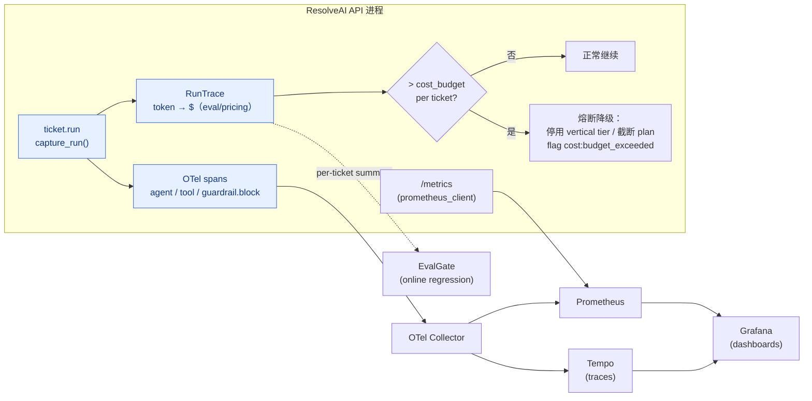

# Milestone 11 — 可观测闭环 & 成本治理

**Status:** 📋 规划中。**地基已落地**：`core/usage.py` 的 `capture_run()` 每请求聚合 token（按 tier）与工具调用；`SupervisorGraph.stream` 已在 `done` 事件下发 `{tokens, input_tokens, output_tokens, cost_usd, tool_calls, usage_by_tier}` 并回填 `ticket.run` span 的 `total_tokens`/`cost_usd`；`eval/pricing.py` 提供成本模型；M8 已有 OTel `span()` helper（默认 no-op）。

**Goal:** 把「no-op span + 每请求成本」接成完整可观测闭环：**trace → OTel Collector → Tempo/Prometheus → Grafana**，并加上**每请求成本预算 + 熔断**与**成本回归门**。

**Design principle:** 调库优先 —— OTel SDK + Collector + Grafana 全用现成镜像；成本聚合复用 `RunTrace`，不自研埋点。

---

## 1. 现状（已就绪）

- `capture_run()` 在 `/chat` 全链路激活，tier 回调把 token 分桶（triage / vertical），executor 记录每次工具调用。
- `done` 事件已带真实 token 数与建模成本；前端 `/chat` 已可展示（本次加固）。
- OTel span helper 存在但 exporter 为 no-op（`OTEL_*` 未配置即不导出）。

## 2. 关键缺口

1. span 未真实导出，没有可视化 dashboard。
2. 成本只**观测**不**治理**：无预算、无熔断。
3. 无 `/metrics` Prometheus 端点。
4. 成本无回归门（版本迭代可能悄悄涨价）。

## 3. 技术方案

### 3.1 可观测栈
- `docker-compose.observability.yml`：otel-collector + Tempo（trace）+ Prometheus + Grafana，一键起。
- `observability/tracing.py` 接真实 `OTLPSpanExporter`（`OTEL_EXPORTER_OTLP_ENDPOINT`），保留未配置即 no-op 的降级。
- Grafana 预置 dashboard JSON（`infra/grafana/`）：auto-resolve rate、per-tier token/成本、护栏分层拦截、P50/P95 latency、tool 错误率。

### 3.2 成本预算 + 熔断
- `settings.cost_budget_usd_per_ticket`（默认宽松）。`capture_run` 增量检查：超预算时置 `run_trace.over_budget=True`。
- Supervisor 在每个 vertical 步后检查预算，超则**降级**：停用 vertical tier（改走 triage 小模型）/ 截断 plan 步数，并打 `cost:budget_exceeded` flag（走 report）。

### 3.3 /metrics + 回归门
- `GET /metrics` 暴露 Prometheus 计数（请求数、拦截数、平均成本、token 直方图）。
- `scripts/regression_gate.py` 增加成本维度：单 ticket 平均成本较基线上涨 > 阈值即非零退出。

## 4. 生产化 & 行业对齐（review）

- **SLO / SLI**（写进 Grafana + 回归门阈值）：
  - auto-resolve rate ≥ 60%（`resolved / total`）
  - P95 端到端 latency < 6s（fake backend；真模型另设基线）
  - 单 ticket 平均成本 ≤ 预算（默认 `$0.05`，`.env` 可调）
  - 护栏拦截 false-positive rate < 2%（benign 集）
- **技术选型（现成、镜像 pin）**：`prometheus_client`（Python，app 侧 `/metrics`）、`otel/opentelemetry-collector-contrib`、`prom/prometheus`、`grafana/grafana`、`grafana/tempo` —— compose 里全部 pin 到具体 tag，避免 `latest` 漂移。
- **可观测三支柱对齐**：traces（Tempo）+ metrics（Prometheus）+ logs（结构化 JSON，后续接 Loki）。指标遵循 Prometheus 命名规范（`resolveai_tickets_total`、`resolveai_ticket_cost_usd`(histogram)、`resolveai_guardrail_blocks_total{layer,kind}`）。
- **弹性 / 降级**：OTel exporter、EvalGate push、`/metrics` 全部 fail-open（依赖挂掉不拖垮 ticket）；成本熔断本身是**保护性降级**而非拒服务。
- **rollout / 回滚**：观测栈与熔断均由 config 开关控制（`OTEL_*` 未配置→no-op；`COST_BUDGET_USD` 宽松默认）；feature 可灰度、可秒级回滚。
- **AI-coding 工作流契合**：全部可用 `LLM_BACKEND=fake` 确定性验证（无需 GPU/网络）；提供 `make obs-up` / `make obs-down`；每条验收都有可执行断言（pytest / `curl /metrics` / 回归门退出码），便于 agent 自验证与 CI 门禁。

## 5. 验收

- [ ] `docker compose -f docker-compose.observability.yml up` 后 Grafana 能看到真实 trace + 指标（镜像已 pin）
- [ ] 超预算 ticket 触发熔断降级并打 `cost:budget_exceeded`，端到端测试覆盖（fake backend）
- [ ] `/metrics` 暴露规范命名的 Prometheus 指标，pytest 抓取断言
- [ ] 成本回归门在 CI 生效（模拟涨价用例非零退出）
- [ ] 新增测试全绿，`ruff`/`mypy` 不新增错误
