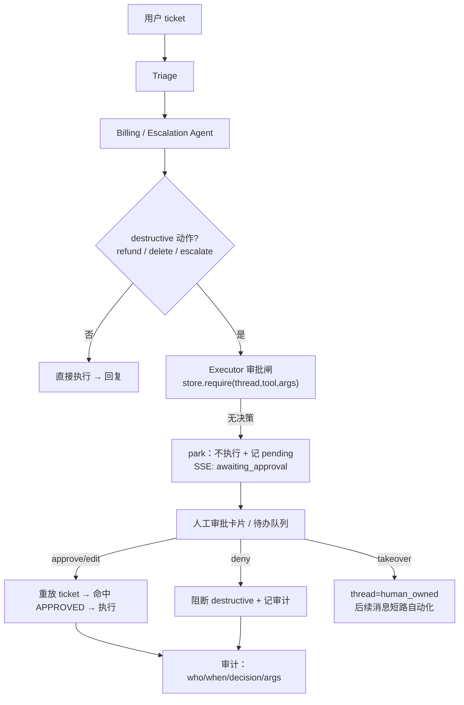

# Milestone 12 — Human-in-the-Loop 接力

**Status:** ✅ **已实现**（approval gate + 审批/接管 API + `awaiting_approval` SSE + 前端审批卡片 + 全绿 e2e）。默认 `APPROVAL_MODE=off`，行为与 M12 前**逐字节一致**；打开后 destructive 动作全部走人工闸。

**Goal:** 把「Agent 自动升级」升级为「真正的人机协作」：高风险（destructive capability）动作**执行前挂起等待人工审批**，人工可 approve / deny / edit，坐席可**接管** thread；全程沿用 `AsyncPostgresSaver` 的断点续聊 / 跨班次恢复。

**Design principle（诚实的取舍）：** 审批闸放在**唯一的 `Executor.call_tool` 收敛点**（`core/approvals.py` + request-scoped `ApprovalContext`），而**不是**在嵌套子图里用 `interrupt()`——后者要在 billing/escalation 子图 + SSE 流式 + resume 之间打通挂起态，脆弱且回归风险高。挂起动作的 request id 由 `(thread_ref, tool, args)` **确定性派生**，因此人工 approve 后**重放恢复**（re-run 同一 ticket → 同一 destructive step 命中 `APPROVED` 决策 → 真执行），对话态由既有 checkpointer 持久化。**在图内 `Command(resume=...)` 原地续跑**列为进一步生产化（见 §6），当前不在范围。

---

## 1. 现状（已就绪）

- 4 Agent 拓扑 + escalation 真路由（本次落地）。
- `AsyncPostgresSaver` 断点续聊已在 M2 验证（`test_chat_flow` checkpoint 恢复）。
- destructive 工具在 M3 已标 `audit=True`。

## 2. 关键缺口

1. destructive 动作（refund/删除/escalate）**无审批闸**，Agent 直接执行。
2. 无审批 UI / API，无待办队列。
3. 无「坐席接管」路径（人工替代 Agent 继续对话）。

## 3. 技术方案（已实现）

### 3.1 审批闸（Executor 收敛点）
- `core/approvals.py`：`ApprovalStore`（线程安全、进程内；id = `sha256(thread_ref|tool|sorted(args))[:16]`，order-insensitive）+ request-scoped `ApprovalContext(thread_ref, tenant_id, enabled, pending)` contextvar，镜像 `core.usage.capture_run` 模式。
- `Executor.call_tool`：仅当 `capability=="destructive"` 且当前 `ApprovalContext.enabled` 时启用闸；`APPROVED`→（用 `edited_args` 若有）真执行，`DENIED`→返回阻断 sentinel 不执行，`PENDING/无`→登记 pending + 返回 `[awaiting human approval]` sentinel（**不执行**）。`ExecutionResult.approval ∈ none|pending|denied`。
- `Supervisor.stream`：图跑完后若 `ctx.pending` 非空 → 发 `awaiting_approval` SSE（含 pending 明细）并 `record_awaiting()`（`resolveai_approvals_pending_total` + `tickets_total{outcome="awaiting_approval"}`），不再发 `done`。

### 3.2 审批 API + UI
- `GET /api/v1/approvals?tenant_id=&status=`：待办/历史队列。`GET /api/v1/approvals/{id}`：单条（含审计字段）。
- `POST /api/v1/approvals/{id}`：`{decision: approve|deny|edit, by?, edited_args?, note?}`；非法 decision→400，未知 id→404。
- 前端 `/chat`：`awaiting_approval` → 渲染审批卡片（工具 + args + 批准/拒绝）；批准后**重放**续跑；`human_owned` → 提示接管中。

### 3.3 坐席接管
- `POST /api/v1/threads/takeover` `{tenant_id, customer_id, thread_id, owner}` → 把 `namespace` 标为 human-owned；`Supervisor.stream` 开头短路发 `human_owned`、不进 Agent 图。
- `POST /api/v1/threads/release`：交回自动化。

### 3.4 审计
- `ApprovalRequest` 记 who(`decided_by`) / when(`decided_at`) / decision(`status`) / edited_args / note，经 `to_public()` 出 API。生产可把 store 换 Postgres 持久化（接口已存储无关）。

## 4. 生产化 & 行业对齐（review）

- **行业规范**：HITL 审批（irreversible action 前置确认）是 Anthropic / OpenAI agent 安全指南与 Sierra/Decagon 生产实践的标配；`interrupt()`/`Command(resume)` 是 LangGraph 官方持久化人机协作机制——本方案不自研，直接对齐。
- **SLO / SLI**：待审 → 决策的 P95 时长（审批 SLA）、需审批动作占比、deny/edit 率、审批后回归安全响应成功率。接 M11 metrics（`resolveai_approvals_total{decision}`）。
- **持久性**：审批挂起态落 `AsyncPostgresSaver`，进程重启 / 跨班次可续（M2 已验证 checkpoint 恢复）。审计日志 append-only。
- **安全边界（诚实）**：本项目**不做鉴权**，故审批人身份是 demo-trust（前端自报），价值在「流程与可续性」而非「防冒充审批人」——与 M9 RLS 的诚实定位一致。真·RBAC 属未来工作，明确不在范围。
- **弹性**：审批服务不可用时，destructive 动作**默认拒绝**（fail-closed，与 M10 一致），绝不静默放行。
- **AI-coding 工作流契合**：`interrupt`/`resume` 全程可用 fake backend 确定性测试；e2e 覆盖 approve/deny/takeover + 重启续跑；验收均为可执行断言。

## 5. 验收

- [x] destructive 动作前挂起（不执行），approve 后重放才执行；deny 阻断（`test_gate_parks_then_denies_then_approves`、`test_escalation_parks_destructive_then_resumes_on_approval`）
- [x] `edit` 决策以人工修改后的 args 执行（`test_gate_edit_executes_with_edited_args`）
- [x] 审批 API roundtrip + 前端审批卡片（`test_approvals_api_roundtrip`；`apps/web/app/chat/page.tsx`，tsc + eslint 全绿）
- [x] 坐席接管 → 自动化短路（`test_takeover_api`、`test_supervisor_short_circuits_when_thread_is_human_owned`）
- [x] `APPROVAL_MODE=off` 默认零行为变化；e2e 覆盖 park/deny/approve/edit/takeover/human_owned（`test_approvals.py`，18 用例）
- [x] 新增测试全绿（171 passed LM-free），`ruff` clean，`mypy src` 不新增错误（38→38）

## 6. 进一步生产化（明确不在本次范围）

- **图内原地续跑**：用 LangGraph `interrupt()`/`Command(resume=...)` 在挂起点原地恢复（免重放），需打通嵌套子图 + SSE 挂起态；当前用**重放恢复**（幂等、确定性、可测）替代。
- **审批持久化**：`ApprovalStore` 换 Postgres（多副本 / 重启可续）；接口已存储无关。
- **真 RBAC**：审批人身份现为 demo-trust（前端自报），与 M9 RLS 的诚实定位一致；防冒充审批人属未来工作。
