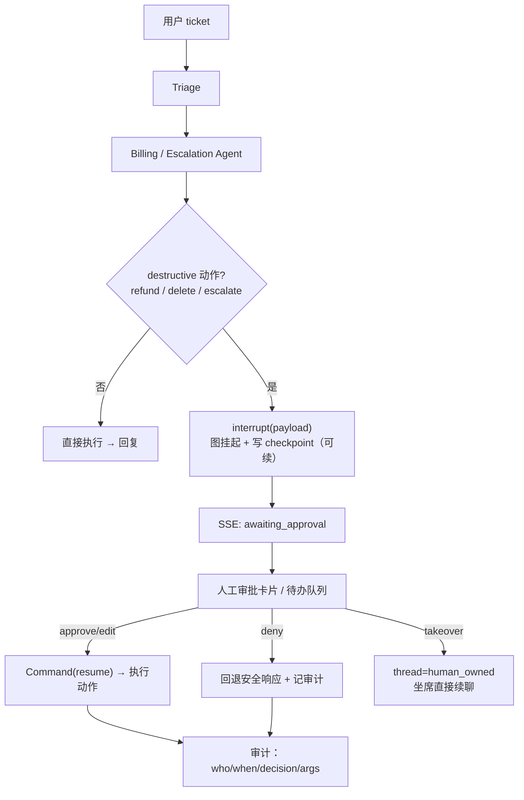

# Milestone 12 — Human-in-the-Loop 接力

**Status:** 📋 规划中。**地基已落地**：billing/technical → escalation 现在是**真图边**（`GraphState.escalate` + `agents/supervisor.py::_route_after_vertical` 条件路由 + `add_conditional_edges`），取代了旧的「文字建议后缀」；`test_hardening.py::test_billing_escalation_is_a_real_graph_handoff` 验证 escalation 节点真的会执行。

**Goal:** 把「Agent 自动升级」升级为「真正的人机协作」：高风险动作**执行前中断等待人工审批**，人工可 approve/deny/edit，坐席可**接管** thread；全程沿用 `AsyncPostgresSaver` 的断点续聊 / 跨班次恢复。

**Design principle:** 调库优先 —— 用 LangGraph 官方 `interrupt()` / `Command(resume=...)` 做 human-in-the-loop，不自研挂起-恢复；决策持久化复用现有 checkpointer。

---

## 1. 现状（已就绪）

- 4 Agent 拓扑 + escalation 真路由（本次落地）。
- `AsyncPostgresSaver` 断点续聊已在 M2 验证（`test_chat_flow` checkpoint 恢复）。
- destructive 工具在 M3 已标 `audit=True`。

## 2. 关键缺口

1. destructive 动作（refund/删除/escalate）**无审批闸**，Agent 直接执行。
2. 无审批 UI / API，无待办队列。
3. 无「坐席接管」路径（人工替代 Agent 继续对话）。

## 3. 技术方案

### 3.1 审批中断
- billing/escalation 子图在 destructive 工具调用前 `interrupt({"action": ..., "args": ..., "risk": ...})`，图挂起并把待审 payload 写入 checkpoint。
- `/chat` SSE 增加 `awaiting_approval` 事件；前端渲染审批卡片。

### 3.2 审批 API + UI
- `POST /approvals/{thread_id}`：`{decision: approve|deny|edit, edited_args?}` → `graph.ainvoke(Command(resume=decision), config)` 续跑。
- `GET /approvals`：待办队列（按 tenant / 风险排序）。
- 前端 `/chat` 审批卡片 + `/approvals` 待办页（复用现有组件风格）。

### 3.3 坐席接管
- `POST /threads/{id}/takeover`：把 thread 标为 `human_owned`，后续消息不再进 Agent 图，由坐席直接回复（写入同一 messages checkpoint，跨班次可恢复）。
- 交回：`release` 回到 Agent。

### 3.4 审计
- 审批/接管决策落 `agent_checkpoints` 关联审计记录：who / when / decision / edited_args。

## 4. 生产化 & 行业对齐（review）

- **行业规范**：HITL 审批（irreversible action 前置确认）是 Anthropic / OpenAI agent 安全指南与 Sierra/Decagon 生产实践的标配；`interrupt()`/`Command(resume)` 是 LangGraph 官方持久化人机协作机制——本方案不自研，直接对齐。
- **SLO / SLI**：待审 → 决策的 P95 时长（审批 SLA）、需审批动作占比、deny/edit 率、审批后回归安全响应成功率。接 M11 metrics（`resolveai_approvals_total{decision}`）。
- **持久性**：审批挂起态落 `AsyncPostgresSaver`，进程重启 / 跨班次可续（M2 已验证 checkpoint 恢复）。审计日志 append-only。
- **安全边界（诚实）**：本项目**不做鉴权**，故审批人身份是 demo-trust（前端自报），价值在「流程与可续性」而非「防冒充审批人」——与 M9 RLS 的诚实定位一致。真·RBAC 属未来工作，明确不在范围。
- **弹性**：审批服务不可用时，destructive 动作**默认拒绝**（fail-closed，与 M10 一致），绝不静默放行。
- **AI-coding 工作流契合**：`interrupt`/`resume` 全程可用 fake backend 确定性测试；e2e 覆盖 approve/deny/takeover + 重启续跑；验收均为可执行断言。

## 5. 验收

- [ ] destructive 动作前中断，approve 后才执行；deny 回退安全响应
- [ ] 审批卡片 + 待办队列前端可用
- [ ] 坐席接管 → 续聊 → 交回，跨进程重启后 thread 状态恢复
- [ ] e2e 测试覆盖 approve / deny / takeover 三条路径
- [ ] 新增测试全绿，`ruff`/`mypy` 不新增错误
