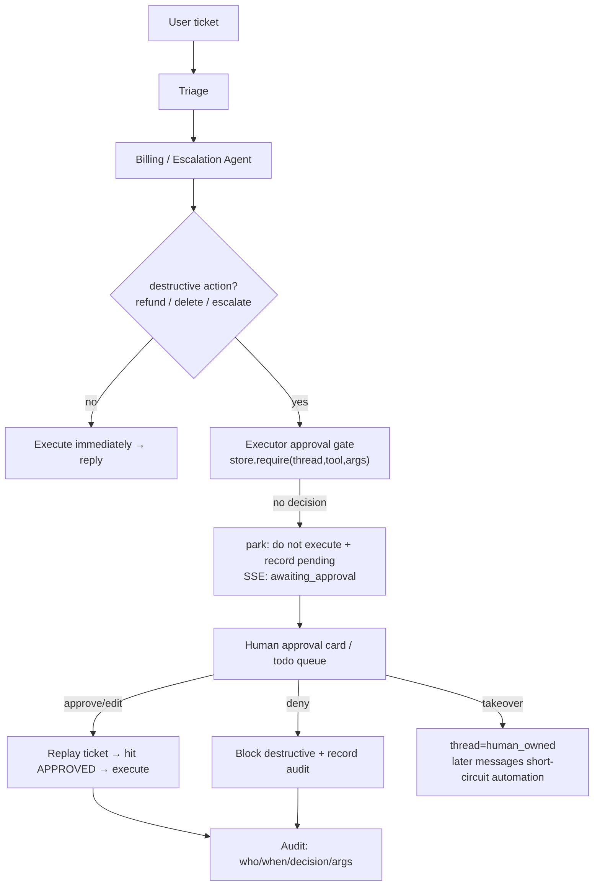

# Milestone 12 — Human-in-the-loop handoff

**Status:** ✅ **Implemented** (approval gate + approve/takeover API + `awaiting_approval` SSE + frontend approval card + all-green e2e). Default `APPROVAL_MODE=off`; behavior is **byte-for-byte identical** to pre-M12. When on, every destructive action goes through a human gate.

**Goal:** Upgrade “the agent auto-escalates” to “real human–machine collaboration”: high-risk (destructive capability) actions **pause before execution and wait for human approval**. A human can approve / deny / edit; a support agent can **take over** the thread. End-to-end reuse of `AsyncPostgresSaver` for pause-and-resume / cross-shift recovery.

**Design principle (honest trade-off):** Put the approval gate at the **single `Executor.call_tool` choke point** (`core/approvals.py` + request-scoped `ApprovalContext`), **not** `interrupt()` inside nested subgraphs — the latter would have to thread a paused state through billing/escalation subgraphs + SSE streaming + resume, which is fragile and high-regression-risk. The parked action’s request id is **deterministically derived** from `(thread_ref, tool, args)`, so after a human approve we **resume by replay** (re-run the same ticket → the same destructive step hits an `APPROVED` decision → actually execute). Conversation state is persisted by the existing checkpointer. **In-graph `Command(resume=...)` continue-in-place** is listed as further productionization (see §6) and is out of scope now.

---

## 1. Current state (already in place)

- 4-agent topology + real escalation routing (landed in this pass).
- `AsyncPostgresSaver` pause-and-resume already verified in M2 (`test_chat_flow` checkpoint restore).
- Destructive tools already marked `audit=True` in M3.

## 2. Key gaps

1. Destructive actions (refund / delete / escalate) have **no approval gate**; the agent executes them directly.
2. No approval UI / API, no todo queue.
3. No “support-agent takeover” path (a human continues the conversation instead of the agent).

## 3. Technical approach (implemented)

### 3.1 Approval gate (Executor choke point)
- `core/approvals.py`: `ApprovalStore` (thread-safe, in-process; id = `sha256(thread_ref|tool|sorted(args))[:16]`, order-insensitive) + request-scoped `ApprovalContext(thread_ref, tenant_id, enabled, pending)` contextvar, mirroring `core.usage.capture_run`.
- `Executor.call_tool`: gate only when `capability=="destructive"` and current `ApprovalContext.enabled`; `APPROVED` → actually execute (with `edited_args` if present), `DENIED` → return a block sentinel without executing, `PENDING`/none → register pending + return `[awaiting human approval]` sentinel (**do not execute**). `ExecutionResult.approval ∈ none|pending|denied`.
- `Supervisor.stream`: after the graph finishes, if `ctx.pending` is non-empty → emit `awaiting_approval` SSE (with pending details) and `record_awaiting()` (`resolveai_approvals_pending_total` + `tickets_total{outcome="awaiting_approval"}`); do not emit `done`.

### 3.2 Approval API + UI
- `GET /api/v1/approvals?tenant_id=&status=`: todo / history queue. `GET /api/v1/approvals/{id}`: single item (including audit fields).
- `POST /api/v1/approvals/{id}`: `{decision: approve|deny|edit, by?, edited_args?, note?}`; illegal decision → 400, unknown id → 404.
- Frontend `/chat`: `awaiting_approval` → render approval card (tool + args + approve/deny); after approve, **replay** to continue; `human_owned` → show takeover-in-progress.

### 3.3 Support-agent takeover
- `POST /api/v1/threads/takeover` `{tenant_id, customer_id, thread_id, owner}` → mark `namespace` human-owned; `Supervisor.stream` short-circuits at the start with `human_owned` and does not enter the agent graph.
- `POST /api/v1/threads/release`: hand back to automation.

### 3.4 Audit
- `ApprovalRequest` records who (`decided_by`) / when (`decided_at`) / decision (`status`) / edited_args / note, exposed via `to_public()`. Production can swap the store to Postgres persistence (the interface is already storage-agnostic).

## 4. Productionization & industry alignment (review)

- **Industry norms:** HITL approval (confirm irreversible actions up front) is table stakes in Anthropic / OpenAI agent safety guidance and Sierra/Decagon production practice; `interrupt()`/`Command(resume)` is LangGraph’s official persisted human-collaboration mechanism — this design does not invent one; it aligns with that.
- **SLO / SLI:** P95 time from pending → decision (approval SLA), share of actions that need approval, deny/edit rate, post-approval return-to-safe-response success rate. Wire to M11 metrics (`resolveai_approvals_total{decision}`).
- **Durability:** parked approval state lives in `AsyncPostgresSaver`; process restart / cross-shift resume works (M2 already verified checkpoint restore). Audit log is append-only.
- **Security boundary (honest):** this project **does not implement auth**, so approver identity is demo-trust (frontend self-report). Value is in “flow and resumability,” not “stop an impersonating approver” — same honest positioning as M9 RLS. Real RBAC is future work and explicitly out of scope.
- **Resilience:** if the approval service is unavailable, destructive actions are **denied by default** (fail-closed, consistent with M10); never silently allow.
- **Fit for AI-coding workflows:** `interrupt`/`resume` is fully testable with a fake backend; e2e covers approve/deny/takeover + restart-and-resume; acceptance items are all executable assertions.

## 5. Acceptance

- [x] Destructive actions park before execution (do not run); execute only after approve + replay; deny blocks (`test_gate_parks_then_denies_then_approves`, `test_escalation_parks_destructive_then_resumes_on_approval`)
- [x] `edit` decision executes with human-modified args (`test_gate_edit_executes_with_edited_args`)
- [x] Approval API roundtrip + frontend approval card (`test_approvals_api_roundtrip`; `apps/web/app/chat/page.tsx`, tsc + eslint all green)
- [x] Support-agent takeover → automation short-circuit (`test_takeover_api`, `test_supervisor_short_circuits_when_thread_is_human_owned`)
- [x] `APPROVAL_MODE=off` default: zero behavior change; e2e covers park/deny/approve/edit/takeover/human_owned (`test_approvals.py`, 18 cases)
- [x] New tests all green (171 passed LM-free); `ruff` clean; `mypy src` introduces no new errors (38→38)

## 6. Further productionization (explicitly out of this milestone)

- **In-graph continue-in-place:** use LangGraph `interrupt()`/`Command(resume=...)` to resume at the park point (no replay); requires threading nested subgraphs + SSE paused state. Today **resume-by-replay** substitutes (idempotent, deterministic, testable).
- **Approval persistence:** swap `ApprovalStore` to Postgres (multi-replica / restart-durable); interface is already storage-agnostic.
- **Real RBAC:** approver identity is currently demo-trust (frontend self-report), same honest positioning as M9 RLS; stopping impersonating approvers is future work.
