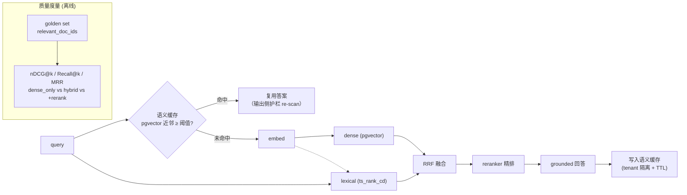

# Milestone 13 — RAG 质量度量 & 语义缓存

**Status:** ✅ **已实现**（nDCG@k 度量 + 三档 profile 质量表 + 检索回归门 + 语义缓存组件并接入检索路径）。`SEMANTIC_CACHE_ENABLED=off` 默认，检索路径与 M13 前**逐字节一致**。

**Goal:** 把 M6 的「检索能跑」升级为「检索质量被量化 + 成本被优化」：产出 **nDCG@k / Recall@k / MRR** 金标度量，并加**语义缓存**降本降延迟。

**Design principle（诚实的取舍）：** 度量用手写标准 IR 公式（纯函数、可单测，不引 `ranx`）。语义缓存当前是**进程内 cosine-NN**（小、无依赖、确定性可测），接口存储无关——**pgvector 持久化 / 跨副本共享**（GPTCache 同思路）列为生产化 swap（见 §6），当前不引第三方向量库。nDCG/Recall 的**真实数字需 seed DB + embedding**（本地算力受限未跑），逻辑与回归门均以 LM-free 单测锁定。

---

## 1. 现状（已就绪）

- Hybrid 检索：BM25 + dense + RRF 融合 + reranker 精排（M6），profile 可切 `hybrid` / `dense_only`。
- dense/lexical 双路并发（本次落地）。
- 金标查询集存在，但只用于「命中标题」粗校验，无排序质量指标。

## 2. 关键缺口

1. 无 **nDCG/Recall@k/MRR**，不能量化"hybrid 比 dense_only 好多少"、"rerank 值不值"。
2. 无**语义缓存**：语义等价的高频问题每次重算 embedding + 检索 + 生成。
3. chunking / embedding backend 未消融。

## 3. 技术方案（已实现）

### 3.1 检索质量度量
- `retrieval/metrics.py`：新增 `dcg_at_k` / `ndcg_at_k`（log2 折扣，支持二值 & 分级相关度）；`recall@k` / `prop_recall@k` / `mrr@k` 复用 M6。
- `scripts/eval_retrieval.py`：每条 golden 追加 `ndcg@k`；产出 `reports/retrieval/quality.md`（profile × metric 表，纯函数 `render_quality_markdown` 单测）。真实数字需 seed DB + embedding。

### 3.2 语义缓存
- `retrieval/semantic_cache.py`：`SemanticCache`（进程内、tenant 分桶、cosine-NN、`threshold`/`ttl_s`/`max_entries`(LRU) 可配，注入 `clock` 便于确定性测 TTL）。
- 接入 `HybridRetriever`：`SEMANTIC_CACHE_ENABLED=on` 时**先 embed 一次**做缓存查；命中→跳过 dense/lexical/rerank 直接返回（`RetrievalTrace.cache_hit=True`）；未命中→复用该 embedding 跑流水线后写缓存。命中/未命中打点 `resolveai_cache_hits_total` / `resolveai_cache_misses_total`。
- 安全：桶按 `tenant_id` 严格隔离（对齐 M9 RLS，杜绝跨租户串答案）；命中返回的是**检索结果**，仍走后续答案生成 + Layer-3 输出侧 re-scan，安全边界不变。

### 3.3 检索回归门
- `check_retrieval_regression`（纯函数）：hybrid 的 `ndcg@k`/`recall@k`/`prop_recall@k` 较 baseline 跌超 `--gate-max-drop-pct`（默认 5%）→ `eval_retrieval.py` 非零退出，供 CI gate。

## 4. 生产化 & 行业对齐（review）

- **行业规范**：nDCG@k / Recall@k / MRR 是 IR 检索质量的标准度量；语义缓存（embedding 近邻复用）是 LLM 降本标配（GPTCache 同思路），本方案复用 pgvector 不引第三方向量库，运维面更小。
- **SLO / SLI**：nDCG@10 ≥ 基线；缓存命中率、命中路径 P95 延迟降幅、单 ticket 成本降幅（接 M11 metrics：`resolveai_cache_hits_total` / `resolveai_cache_misses_total`）。
- **正确性与安全**：缓存 key 带 `tenant_id`（对齐 M9 RLS，杜绝跨租户串答案）；命中结果仍过**输出侧护栏 re-scan**（防缓存投毒 / 陈旧 PII）；TTL + 失效策略防陈旧。
- **评测严谨性**：金标分级相关度 + 固定随机种子 + 报告带样本量与置信区间提示；消融（chunk size/overlap、embedding backend）单变量对照。
- **回滚**：语义缓存由开关控制，命中率/正确性异常可秒级关闭回退到直算路径。
- **AI-coding 工作流契合**：`scripts/eval_retrieval.py` 一键产出 `reports/retrieval/quality.md`；检索回归门给 CI 提供可执行退出码；缓存逻辑用 fake embedder 确定性测试。

## 5. 验收

- [x] nDCG@k 度量 + profile×metric 质量表渲染（`ndcg_at_k`/`dcg_at_k` + `render_quality_markdown`，单测锁定；真实数字需 seed DB + embedding 跑 `eval_retrieval.py`）
- [x] 语义缓存：cosine-NN 命中/未命中、TTL 过期、LRU 淘汰、**tenant 隔离**、命中跳过 DB 往返（`test_semantic_cache.py`，含 `HybridRetriever` 同义词命中集成测试）
- [x] 检索回归门：nDCG/recall 跌超阈值即非零退出（`check_retrieval_regression` + `test_retrieval_regression_gate`）
- [x] 命中/未命中指标 `resolveai_cache_hits_total` / `resolveai_cache_misses_total`
- [x] 新增测试全绿（185 passed LM-free），`ruff` clean，`mypy src` 不新增错误（38→38）

## 6. 进一步生产化（明确不在本次范围）

- **持久 / 共享缓存**：`SemanticCache` 换 pgvector 后端（跨副本共享、重启可续；GPTCache 同思路），接口已存储无关。
- **答案级缓存**：当前缓存**检索结果**（省 DB + rerank）；缓存最终答案（省生成成本）需在命中路径显式补跑输出侧护栏 re-scan，作为后续增量。
- **消融**：chunk size/overlap、embedding backend（ollama vs openai）对 nDCG 的单变量对照表（需算力）。
