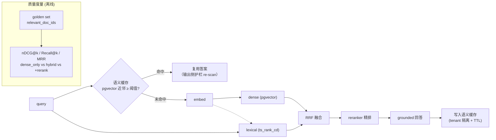

# Milestone 13 — RAG 质量度量 & 语义缓存

**Status:** 📋 规划中。**地基已落地**：`retrieval/hybrid.py` 的 dense（embed + pgvector）与 lexical（`ts_rank_cd`）现在**并发**执行（`asyncio.gather`），降端到端延迟；检索金标 `apps/api/tests/fixtures/kb_retrieval_golden.jsonl` 已存在。

**Goal:** 把 M6 的「检索能跑」升级为「检索质量被量化 + 成本被优化」：产出 **nDCG@k / Recall@k / MRR** 金标度量，并加**语义缓存**降本降延迟；对 chunking / embedding backend 做消融。

**Design principle:** 调库优先 —— 度量用现成实现（`ranx` / 手写标准公式）；语义缓存复用 pgvector 近邻，不引额外向量库。

---

## 1. 现状（已就绪）

- Hybrid 检索：BM25 + dense + RRF 融合 + reranker 精排（M6），profile 可切 `hybrid` / `dense_only`。
- dense/lexical 双路并发（本次落地）。
- 金标查询集存在，但只用于「命中标题」粗校验，无排序质量指标。

## 2. 关键缺口

1. 无 **nDCG/Recall@k/MRR**，不能量化"hybrid 比 dense_only 好多少"、"rerank 值不值"。
2. 无**语义缓存**：语义等价的高频问题每次重算 embedding + 检索 + 生成。
3. chunking / embedding backend 未消融。

## 3. 技术方案

### 3.1 检索质量度量
- 扩充金标：每条 query 标 `relevant_doc_ids`（分级相关度可选）。
- `scripts/eval_retrieval.py`：对 `dense_only` / `hybrid` / `hybrid+rerank` 三档跑 nDCG@{5,10}、Recall@{5,10}、MRR，输出 `reports/retrieval/quality.md`。

### 3.2 语义缓存
- `retrieval/semantic_cache.py`：query embedding 与缓存条目做 pgvector 近邻，相似度超阈值即复用上次答案（带 TTL + tenant 隔离）。
- 命中/未命中埋点（接 M11 metrics）；量化命中率、延迟降幅、成本降幅。
- 安全：缓存 key 带 tenant_id（对齐 RLS），护栏对缓存命中的输出仍过一遍输出侧 re-scan。

### 3.3 消融
- chunk size / overlap / embedding backend（ollama vs openai）对 nDCG 的影响表。

## 4. 生产化 & 行业对齐（review）

- **行业规范**：nDCG@k / Recall@k / MRR 是 IR 检索质量的标准度量；语义缓存（embedding 近邻复用）是 LLM 降本标配（GPTCache 同思路），本方案复用 pgvector 不引第三方向量库，运维面更小。
- **SLO / SLI**：nDCG@10 ≥ 基线；缓存命中率、命中路径 P95 延迟降幅、单 ticket 成本降幅（接 M11 metrics：`resolveai_cache_hits_total` / `resolveai_cache_misses_total`）。
- **正确性与安全**：缓存 key 带 `tenant_id`（对齐 M9 RLS，杜绝跨租户串答案）；命中结果仍过**输出侧护栏 re-scan**（防缓存投毒 / 陈旧 PII）；TTL + 失效策略防陈旧。
- **评测严谨性**：金标分级相关度 + 固定随机种子 + 报告带样本量与置信区间提示；消融（chunk size/overlap、embedding backend）单变量对照。
- **回滚**：语义缓存由开关控制，命中率/正确性异常可秒级关闭回退到直算路径。
- **AI-coding 工作流契合**：`scripts/eval_retrieval.py` 一键产出 `reports/retrieval/quality.md`；检索回归门给 CI 提供可执行退出码；缓存逻辑用 fake embedder 确定性测试。

## 5. 验收

- [ ] 三档检索的 nDCG/Recall/MRR 表产出，结论能 back up "hybrid + rerank 的收益"
- [ ] 语义缓存命中率 / 延迟 / 成本降幅有数字，且 tenant 隔离正确
- [ ] 检索回归门：金标指标下降超阈值即 CI 失败
- [ ] 新增测试全绿，`ruff`/`mypy` 不新增错误
