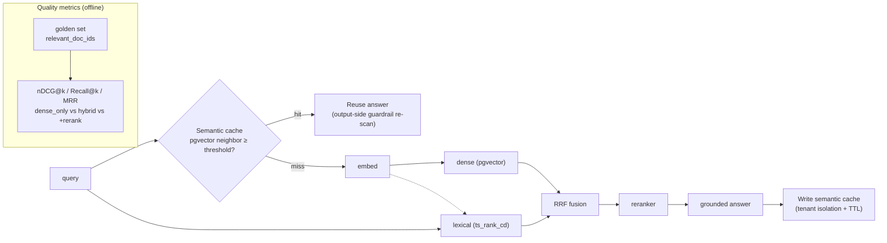

# Milestone 13 — RAG quality metrics & semantic cache

**Status:** ✅ **Implemented** (nDCG@k metrics + three-profile quality table + retrieval regression gate + semantic-cache component wired into the retrieval path). Default `SEMANTIC_CACHE_ENABLED=off`; the retrieval path is **byte-for-byte identical** to pre-M13.

**Goal:** Upgrade M6 “retrieval runs” to “retrieval quality is quantified + cost is optimized”: produce **nDCG@k / Recall@k / MRR** golden metrics, and add a **semantic cache** to cut cost and latency.

**Design principle (honest trade-off):** Metrics use handwritten standard IR formulas (pure functions, unit-testable; do not pull in `ranx`). The semantic cache is currently **in-process cosine-NN** (small, no extra deps, deterministically testable); the interface is storage-agnostic — **pgvector persistence / cross-replica sharing** (same idea as GPTCache) is listed as a productionization swap (see §6). Do not pull in a third-party vector library now. **Real nDCG/Recall numbers need a seeded DB + embeddings** (not run here due to limited local compute); logic and the regression gate are locked with LM-free unit tests.

---

## 1. Current state (already in place)

- Hybrid retrieval: BM25 + dense + RRF fusion + reranker (M6); profile can switch `hybrid` / `dense_only`.
- Concurrent dense/lexical paths (landed in this pass).
- A golden query set exists, but is only used for a coarse “title hit” check — no ranking-quality metrics.

## 2. Key gaps

1. No **nDCG / Recall@k / MRR**, so we cannot quantify “how much better hybrid is than dense_only” or “whether rerank is worth it.”
2. No **semantic cache**: semantically equivalent high-frequency questions recompute embedding + retrieval + generation every time.
3. Chunking / embedding backend not ablated.

## 3. Technical approach (implemented)

### 3.1 Retrieval quality metrics
- `retrieval/metrics.py`: add `dcg_at_k` / `ndcg_at_k` (log2 discount; binary and graded relevance); `recall@k` / `prop_recall@k` / `mrr@k` reuse M6.
- `scripts/eval_retrieval.py`: append `ndcg@k` per golden item; produce `reports/retrieval/quality.md` (profile × metric table; pure-function `render_quality_markdown` unit-tested). Real numbers need a seeded DB + embeddings.

### 3.2 Semantic cache
- `retrieval/semantic_cache.py`: `SemanticCache` (in-process, tenant-bucketed, cosine-NN, configurable `threshold`/`ttl_s`/`max_entries` (LRU), injectable `clock` for deterministic TTL tests).
- Wired into `HybridRetriever`: when `SEMANTIC_CACHE_ENABLED=on`, **embed once** for the cache lookup; hit → skip dense/lexical/rerank and return (`RetrievalTrace.cache_hit=True`); miss → reuse that embedding for the pipeline, then write the cache. Hit/miss increment `resolveai_cache_hits_total` / `resolveai_cache_misses_total`.
- Safety: buckets strictly isolated by `tenant_id` (aligned with M9 RLS; no cross-tenant answer bleed). A hit returns **retrieval results**, which still go through later answer generation + Layer-3 output-side re-scan; the security boundary is unchanged.

### 3.3 Retrieval regression gate
- `check_retrieval_regression` (pure function): if hybrid `ndcg@k`/`recall@k`/`prop_recall@k` drop vs baseline by more than `--gate-max-drop-pct` (default 5%) → `eval_retrieval.py` non-zero exit, for CI gating.

## 4. Productionization & industry alignment (review)

- **Industry norms:** nDCG@k / Recall@k / MRR are standard IR retrieval-quality metrics; semantic cache (reuse embedding nearest neighbors) is table stakes for LLM cost reduction (same idea as GPTCache). This design reuses pgvector and does not pull in a third-party vector library — smaller ops surface.
- **SLO / SLI:** nDCG@10 ≥ baseline; cache hit rate; P95 latency reduction on the hit path; cost reduction per ticket (wire M11 metrics: `resolveai_cache_hits_total` / `resolveai_cache_misses_total`).
- **Correctness and safety:** cache key includes `tenant_id` (aligned with M9 RLS; no cross-tenant answer bleed); hits still pass **output-side guardrail re-scan** (cache poisoning / stale PII); TTL + invalidation prevent staleness.
- **Eval rigor:** golden graded relevance + fixed random seed + reports include sample size and a confidence-interval note; ablations (chunk size/overlap, embedding backend) as single-variable contrasts.
- **Rollback:** semantic cache is switch-gated; on hit-rate/correctness anomalies, disable in seconds and fall back to the direct path.
- **Fit for AI-coding workflows:** `scripts/eval_retrieval.py` one-shot produces `reports/retrieval/quality.md`; the retrieval regression gate gives CI an executable exit code; cache logic is deterministically tested with a fake embedder.

## 5. Acceptance

- [x] nDCG@k metrics + profile×metric quality-table render (`ndcg_at_k`/`dcg_at_k` + `render_quality_markdown`, locked by unit tests; real numbers need a seeded DB + embeddings via `eval_retrieval.py`)
- [x] Semantic cache: cosine-NN hit/miss, TTL expiry, LRU eviction, **tenant isolation**, hit skips DB round-trip (`test_semantic_cache.py`, including `HybridRetriever` synonym-hit integration)
- [x] Retrieval regression gate: non-zero exit if nDCG/recall drop exceeds threshold (`check_retrieval_regression` + `test_retrieval_regression_gate`)
- [x] Hit/miss metrics `resolveai_cache_hits_total` / `resolveai_cache_misses_total`
- [x] New tests all green (185 passed LM-free); `ruff` clean; `mypy src` introduces no new errors (38→38)

## 6. Further productionization (explicitly out of this milestone)

- **Persistent / shared cache:** swap `SemanticCache` to a pgvector backend (cross-replica sharing, restart-durable; same idea as GPTCache); interface is already storage-agnostic.
- **Answer-level cache:** today we cache **retrieval results** (saves DB + rerank); caching the final answer (saves generation cost) would need an explicit output-side guardrail re-scan on the hit path — a follow-on increment.
- **Ablations:** single-variable contrast tables of chunk size/overlap and embedding backend (ollama vs openai) on nDCG (needs compute).
