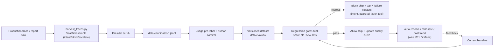

# Milestone 14 — Eval → data flywheel (online self-improvement)

**Status:** ✅ **Implemented** (trace sink → stratified sampling → PII scrub → versioned datasets → dual-score regression gate → failure clustering). Sink off by default (`TRACE_SINK_PATH` empty); best-effort **must never affect the request**.

**Goal:** Upgrade M5’s static eval set into a closed loop of “production traces automatically refill eval; the regression gate self-improves online” — the senior narrative that “the system gets better with traffic, and regressions are blocked automatically.”

**Design principle (honest trade-off):** Reuse existing trace/pricing/judge; do not start a second stack. The flywheel is entirely **pure functions + deterministic** (seeded sampling, regex scrub, handwritten gate math) and unit-testable without LLM/DB/network. Scrubbing uses **lightweight regex** (fast, testable; Presidio is the heavier production option, deliberately not pulled into the offline flywheel path). “Judge pre-label + human-confirm CLI” and “quality curves by dataset version” are listed as further productionization (see §6).

---

## 1. Current state (already in place)

- Static datasets: `red_team.jsonl` (adversarial), `benchmark_tickets.jsonl` (architecture benchmark), `kb_retrieval_golden.jsonl` (retrieval).
- Judge / scoring / pricing / trace run end-to-end (M5/M7).
- Online regression gate (M8) compares to baseline; regression fails the gate.

## 2. Key gaps

1. Eval set is **static**: it does not evolve with the real production distribution.
2. Failures have no **clustered attribution**, so we do not know “what to fix first.”
3. No quality curves over time (auto-resolve rate, miss rate).

## 3. Technical approach (implemented)

### 3.1 Production-side trace sink
- `observability/trace_sink.py`: when `TRACE_SINK_PATH` is set, each terminal ticket (done/blocked/awaiting) appends one **PII-scrubbed** JSON line at each `Supervisor.stream` terminus (best-effort; `try/except` so it never 500s). Scrub again on write (defense-in-depth: no PII on disk even if L1 is off).

### 3.2 Sample → scrub → candidates
- `eval/flywheel.py`: `stratified_sample` (stratify by `intent×outcome` + seeded, to avoid “only sample blocked” bias), `scrub_text`/`find_pii`/`assert_no_pii` (email/card/SSN/phone/Stripe id), `to_candidate` (scrub + normalize).
- `scripts/harvest_traces.py`: read sink → sample → scrub → `assert_no_pii` **hard gate** (residual PII → non-zero exit) → write `data/candidates/*.jsonl` + failure-cluster report.

### 3.3 Versioned datasets
- `write_dataset_version` + `dataset_manifest`: write `data/eval/vN/{cases.jsonl,manifest.json}`; manifest records sample size + intent/outcome/source distribution + failure clusters (provenance).

### 3.4 Dual-score regression gate + failure clustering
- `score_dataset` (auto_resolve_rate / guardrail_miss_rate / mean_cost_usd) + `regression_violations` + `dual_score_gate`: score **both** “legacy + harvested” sets; regression on either set → `gate_failed` (prevents overfitting the new set only).
- `cluster_failures` + `render_top_failures_md`: cluster failures by (intent, reason = guardrail layer / escalate / tool), produce `reports/flywheel/top_failures.md`, pointing directly at “what to fix first.”

## 4. Productionization & industry alignment (review)

- **Industry norms:** this is the standard shape of industry “data flywheel / eval-driven development” (isomorphic to Sierra, OpenAI evals, LangSmith datasets): production traffic → sample → label → versioned dataset → regression gate → ship, closed-loop self-improvement.
- **Data governance:** candidate cases hit disk **only after Presidio scrub**; datasets are semantically versioned (`data/eval/vN/`) + manifest records source distribution/sample size; zero residual PII is a hard bar (can add a CI assertion scan).
- **Label quality:** dual track of judge pre-label + human confirm; record labeler and time; judge↔human disagreement rate as a judge-trust metric.
- **Regression-gate rigor:** **dual-score** old and new sets (prevents “overfit the new set only”); regress on either set → block; failures clustered by (intent, guardrail layer, tool), pointing directly at “what to fix first.”
- **Feedback latency / sampling bias:** stratified sampling avoids “only sample blocked” bias; sampling rate and cold-start policy are explicit.
- **Fit for AI-coding workflows:** the flywheel is a natural fit for agent iteration — each change runs the regression gate for an executable exit code + the top-failures report as the next-round prompt input; fully scripted, reproducible, no human babysitting.

## 5. Acceptance

- [x] Production traces automatically land as **scrubbed** candidate cases (`trace_sink` + e2e `test_trace_sink_appends_scrubbed_record`: scrub on write, `find_pii()==[]`)
- [x] Zero residual PII hard gate (`assert_no_pii` + `test_fixture_candidates_have_zero_residual_pii`; harvest residual → exit 2)
- [x] Dataset versioning + provenance manifest (`write_dataset_version` / `dataset_manifest`)
- [x] Regression gate **dual-scores** old and new sets; simulated regression cases are blocked (`dual_score_gate` + `test_dual_score_gate_blocks_on_any_dataset`)
- [x] Top-N failure-cluster report (`cluster_failures` + `render_top_failures_md`)
- [x] New tests all green (198 passed LM-free); `ruff` clean; `mypy src` introduces no new errors (38→38)

## 6. Further productionization (explicitly out of this milestone)

- **Label feedback loop:** judge pre-label + human-confirm CLI/notebook; record labeler/time + judge↔human disagreement rate (judge trust).
- **Quality curves:** record auto-resolve / miss / cost trends by dataset version; wire M11 Grafana.
- **Second-pass scrub:** offline flywheel uses regex scrub; wiring Presidio (M4) as a second check would further cut residual risk.
- **Sink persistence:** file sink → Kafka/object storage, aggregate across replicas.
