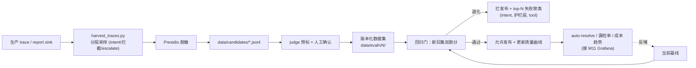

# Milestone 14 — Eval→数据飞轮（在线自改进）

**Status:** ✅ **已实现**（trace sink → 分层采样 → PII 脱敏 → 版本化数据集 → 双跑分回归门 → 失败聚类）。sink 默认关（`TRACE_SINK_PATH` 空），best-effort **绝不影响请求**。

**Goal:** 把 M5 的静态 eval 集升级为「生产 trace 自动回灌 eval、回归门在线自改进」的闭环 —— senior 级的「系统会随流量自己变好、且退化会被自动拦」叙事。

**Design principle（诚实的取舍）：** 复用现有 trace/pricing/judge，不另起炉灶。飞轮全部为**纯函数 + 确定性**（seeded 采样、regex 脱敏、手写门禁数学），无需 LLM/DB/网络即可单测。脱敏用**轻量 regex**（快、可测；Presidio 是更重的生产选项，飞轮离线路径刻意不引）。「judge 预标 + 人工确认 CLI」「按数据集版本画质量曲线」列为进一步生产化（见 §6）。

---

## 1. 现状（已就绪）

- 静态数据集：`red_team.jsonl`（对抗）、`benchmark_tickets.jsonl`（架构 benchmark）、`kb_retrieval_golden.jsonl`（检索）。
- judge / scoring / pricing / trace 端到端可跑（M5/M7）。
- online regression gate（M8）对比基线，回归即失败。

## 2. 关键缺口

1. eval 集**静态**：不随生产真实分布演化。
2. 失败案例无**聚类归因**，不知道"最该修什么"。
3. 没有随时间的质量曲线（auto-resolve rate、漏检率）。

## 3. 技术方案（已实现）

### 3.1 生产侧 trace sink
- `observability/trace_sink.py`：`TRACE_SINK_PATH` 设置时，每个终态 ticket（done/blocked/awaiting）在 `Supervisor.stream` 各终点 append 一行 **PII 脱敏**的 JSON（best-effort，`try/except` 兜底绝不 500）。写入时再脱敏一次（防御纵深：L1 关也无 PII 落盘）。

### 3.2 采样 → 脱敏 → 候选
- `eval/flywheel.py`：`stratified_sample`（按 `intent×outcome` 分层 + seeded，防「只采被拦的」偏置）、`scrub_text`/`find_pii`/`assert_no_pii`（email/卡号/SSN/电话/Stripe id）、`to_candidate`（脱敏 + 规整）。
- `scripts/harvest_traces.py`：读 sink → 采样 → 脱敏 → `assert_no_pii` **硬门**（残留 PII 即非零退出）→ 写 `data/candidates/*.jsonl` + 失败聚类报表。

### 3.3 版本化数据集
- `write_dataset_version` + `dataset_manifest`：写 `data/eval/vN/{cases.jsonl,manifest.json}`，manifest 记样本量 + intent/outcome/source 分布 + 失败聚类（provenance）。

### 3.4 双跑分回归门 + 失败聚类
- `score_dataset`（auto_resolve_rate / guardrail_miss_rate / mean_cost_usd）+ `regression_violations` + `dual_score_gate`：对「legacy + harvested」**双集**跑分，任一集回归即 `gate_failed`（防只在新集过拟合）。
- `cluster_failures` + `render_top_failures_md`：失败按 (intent, reason=护栏层/escalate/tool) 聚类，产 `reports/flywheel/top_failures.md`，直接指向「最该修什么」。

## 4. 生产化 & 行业对齐（review）

- **行业规范**：这就是业界「data flywheel / eval-driven development」的标准形态（Sierra、OpenAI evals、LangSmith datasets 同构）：生产流量 → 采样 → 标注 → 版本化数据集 → 回归门 → 发布，闭环自改进。
- **数据治理**：候选 case **Presidio 脱敏后**才落盘；数据集语义化版本（`data/eval/vN/`）+ manifest 记录来源分布/样本量；PII 零残留是硬门槛（可加一条 CI 断言扫描）。
- **标注质量**：judge 预标 + 人工确认双轨；记录标注者与时间；judge 与人工不一致率作为 judge 可信度指标。
- **回归门严谨性**：新旧集**双跑分**（防「只在新集过拟合」），退化任一集即拦；失败按 (intent, 护栏层, tool) 聚类，直接指向「最该修什么」。
- **反馈延迟 / 采样偏置**：分层采样避免「只采被拦的」偏置；明确采样率与冷启动策略。
- **AI-coding 工作流契合**：飞轮天然适配 agent 迭代——每次改动跑回归门拿可执行退出码 + top-failures 报表作为下一轮 prompt 输入；全部脚本化、可复现、无需人盯。

## 5. 验收

- [x] 生产 trace 自动沉淀为**脱敏**候选 case（`trace_sink` + e2e `test_trace_sink_appends_scrubbed_record`：写时脱敏，`find_pii()==[]`）
- [x] PII 零残留硬门（`assert_no_pii` + `test_fixture_candidates_have_zero_residual_pii`；harvest 残留即 exit 2）
- [x] 数据集版本化 + provenance manifest（`write_dataset_version` / `dataset_manifest`）
- [x] 回归门对新旧集**双跑分**，模拟退化用例被拦（`dual_score_gate` + `test_dual_score_gate_blocks_on_any_dataset`）
- [x] top-N 失败聚类报表（`cluster_failures` + `render_top_failures_md`）
- [x] 新增测试全绿（198 passed LM-free），`ruff` clean，`mypy src` 不新增错误（38→38）

## 6. 进一步生产化（明确不在本次范围）

- **标注回流**：judge 预标 + 人工确认 CLI/notebook，记录标注者/时间 + judge↔人工不一致率（judge 可信度）。
- **质量曲线**：按数据集版本记 auto-resolve/漏检/成本趋势，接 M11 Grafana。
- **重脱敏**：离线飞轮用 regex 脱敏；接 Presidio（M4）作二次核查可进一步降残留风险。
- **sink 持久化**：文件 sink → Kafka/对象存储，跨副本聚合。
