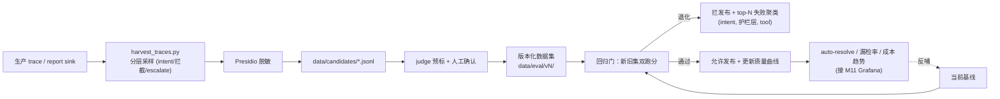

# Milestone 14 — Eval→数据飞轮（在线自改进）

**Status:** 📋 规划中。**地基已落地**：M5 对抗 eval + judge/scoring、M8 `scripts/regression_gate.py` + OTel span、本次加固的每请求 `capture_run` trace（token/成本/tool_calls）。

**Goal:** 把 M5 的静态 eval 集升级为「生产 trace 自动回灌 eval、回归门在线自改进」的闭环 —— senior 级的「系统会随流量自己变好、且退化会被自动拦」叙事。

**Design principle:** 复用现有 eval harness、judge、pricing、trace，不另起炉灶；采样与脱敏复用 Presidio。

---

## 1. 现状（已就绪）

- 静态数据集：`red_team.jsonl`（对抗）、`benchmark_tickets.jsonl`（架构 benchmark）、`kb_retrieval_golden.jsonl`（检索）。
- judge / scoring / pricing / trace 端到端可跑（M5/M7）。
- online regression gate（M8）对比基线，回归即失败。

## 2. 关键缺口

1. eval 集**静态**：不随生产真实分布演化。
2. 失败案例无**聚类归因**，不知道"最该修什么"。
3. 没有随时间的质量曲线（auto-resolve rate、漏检率）。

## 3. 技术方案

### 3.1 Trace 采样 → 候选 case
- `scripts/harvest_traces.py`：从 trace / report sink 采样（按 intent / 是否被拦 / 是否 escalate 分层），**Presidio 脱敏**后写入 `data/candidates/*.jsonl`。

### 3.2 标注回流
- judge 预标 + 人工确认（简易 CLI / notebook），确认后 append 到版本化数据集（`data/eval/vN/`）。

### 3.3 在线回归门升级
- 回归门对「当前基线 + 新采集 case」双跑分；新版本在任一集回归即拦发布。
- 失败案例按 (intent, 护栏层, tool) 聚类，产出 `reports/flywheel/top_failures.md`。

### 3.4 质量曲线
- 按数据集版本记录 auto-resolve rate / 护栏漏检率 / 平均成本，画趋势图（接 M11 Grafana 或静态图）。

## 4. 生产化 & 行业对齐（review）

- **行业规范**：这就是业界「data flywheel / eval-driven development」的标准形态（Sierra、OpenAI evals、LangSmith datasets 同构）：生产流量 → 采样 → 标注 → 版本化数据集 → 回归门 → 发布，闭环自改进。
- **数据治理**：候选 case **Presidio 脱敏后**才落盘；数据集语义化版本（`data/eval/vN/`）+ manifest 记录来源分布/样本量；PII 零残留是硬门槛（可加一条 CI 断言扫描）。
- **标注质量**：judge 预标 + 人工确认双轨；记录标注者与时间；judge 与人工不一致率作为 judge 可信度指标。
- **回归门严谨性**：新旧集**双跑分**（防「只在新集过拟合」），退化任一集即拦；失败按 (intent, 护栏层, tool) 聚类，直接指向「最该修什么」。
- **反馈延迟 / 采样偏置**：分层采样避免「只采被拦的」偏置；明确采样率与冷启动策略。
- **AI-coding 工作流契合**：飞轮天然适配 agent 迭代——每次改动跑回归门拿可执行退出码 + top-failures 报表作为下一轮 prompt 输入；全部脚本化、可复现、无需人盯。

## 5. 验收

- [ ] 生产 trace 能自动沉淀为脱敏候选 case
- [ ] 数据集版本化，新增 case 可回流
- [ ] 回归门对新旧集双跑分，模拟退化用例被拦
- [ ] top-N 失败聚类报表产出
- [ ] 新增测试全绿，`ruff`/`mypy` 不新增错误
