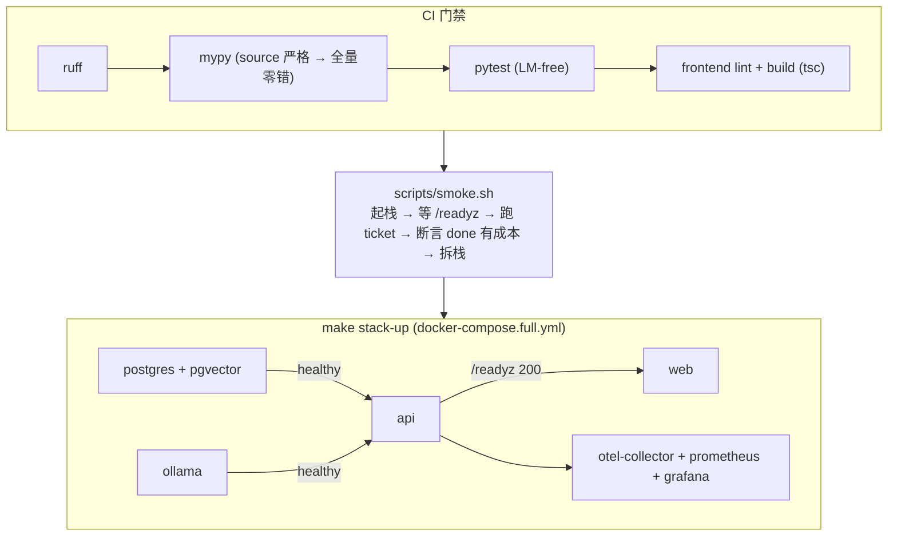

# Milestone 15 — 类型洁净 & 一键全栈部署

**Status:** 📋 规划中。**地基已落地**：CI 已加前端 `npm run build`（隐式 TypeScript 类型门禁）；后端 `ruff` 已在 CI；`/readyz` 已改为真探测 DB/MCP 并在 degraded 时返回 503。当前 `mypy` 本地基线 **58 错**（多在测试文件的 `BaseTool` 覆盖模式与 `Literal[..., END]`）。

**Goal:** 补齐工程收尾 —— `mypy` 收敛到**零错**并进 CI type gate、`docker-compose` **一键起全栈**（含依赖服务与 healthcheck 顺序）、部署可复现。

**Design principle:** 增量收敛类型、不为过类型检查而牺牲运行时正确性；部署用现成 compose/K8s，不自研编排。

---

## 1. 现状（已就绪）

- CI：后端 `ruff` + pytest；前端 `lint` + `build`（本次加固新增 build，含 tsc）。
- `/readyz` 真探测（本次加固），可直接接容器 healthcheck。
- `docker-compose.yml` 起 postgres(+pgvector)；MCP server 走 stdio 子进程。

## 2. 关键缺口

1. `mypy` 58 错未清，未进 CI（新增类型错误无人拦）。
2. 全栈非一键：ollama / api / web / 观测栈需手动分别起。
3. 部署无生产 profile 文档与冒烟脚本。

## 3. 技术方案

### 3.1 类型洁净
- 分批修：
  - source：`agents/supervisor.py` 的 `Literal[..., END]`（END 用 `str` 或 `Hashable` 注解）、`with_structured_output` 返回 `Runnable[Any, BaseModel]` 收窄、`output_filter.py` 的 `self._runnable` None 收窄（加 `assert`）。
  - tests：`BaseTool` 覆盖用 `ClassVar` / 正确字段注解或集中 `# type: ignore[...]` 并附因由。
- `pyproject.toml` mypy 配置分级（先 source 严格、tests 宽松，再逐步收紧）。

### 3.2 CI type gate
- CI 增加 `uv run mypy apps/api packages` 步骤（零错为准）；先对 source 强制、tests 允许基线，逐步归零。

### 3.3 一键全栈
- `docker-compose.full.yml`：api + web + postgres(pgvector) + ollama + otel-collector + grafana，`depends_on` + healthcheck（api 依赖 postgres healthy、web 依赖 api `/readyz` 200）。
- `make stack-up` / `make stack-down`。

### 3.4 部署文档 + 冒烟
- 生产 `.env` profile（`GUARDRAIL_FAIL_CLOSED=on`、真 endpoint、低权限 DB 角色）。
- `scripts/smoke.sh`：起栈 → 等 `/readyz` → 跑一条 ticket → 断言 `done` 有成本 → 拆栈。

## 4. 生产化 & 行业对齐（review）

- **行业规范**：静态类型门禁（mypy strict）、`depends_on` + healthcheck 顺序编排、readiness/liveness 分离、生产/演示 profile 分层，都是标准 12-factor / 云原生实践。
- **收敛策略（防「为过检查牺牲正确性」）**：先对 `source` 强制零错并进 CI，`tests` 允许基线并逐步归零；禁止用 `Any` 一把梭，`# type: ignore` 必须带具体错误码 + 因由注释。
- **部署可复现**：镜像 pin tag、`.env` profile 化（生产 `GUARDRAIL_FAIL_CLOSED=on` + `SANDBOX_MODE` 上 gVisor + 低权限 DB 角色对齐 M9 RLS）、冒烟脚本作为「部署即验收」。
- **回滚 / 弹性**：全栈由 compose profile 控制，可分层起停；healthcheck 失败不放流量（web 依赖 api `/readyz` 200）。
- **AI-coding 工作流契合**：type gate 让 agent 改动**编译期**就被拦，减少运行时 surprise；`make stack-up` + `scripts/smoke.sh` 给 agent 一条可执行的端到端自验证路径；类型收敛可分批 PR，天然适配增量代理式开发。

## 5. 验收

- [ ] `uv run mypy apps/api packages` 零错
- [ ] CI type gate 生效（引入类型错误的 PR 失败）
- [ ] `make stack-up` 一键起全栈，healthcheck 顺序正确，`/readyz` 变 200
- [ ] 冒烟脚本端到端通过
- [ ] 无运行时回归（全量 pytest 绿、前端 build 绿）
