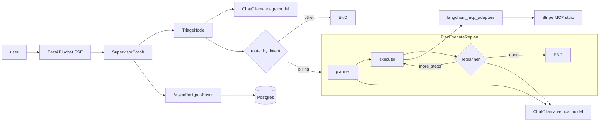

# Milestone 2 — Technical implementation plan

**Status:** Implemented (see [roadmap.md](roadmap.md) Milestone 2).

**Goal:** Land one end-to-end vertical slice (a minimal usable path through the full stack), including: a local Ollama-driven LLM, structured triage, billing Plan–Execute–Replan, a real Stripe MCP over stdio, a LangChain MCP adapters tool bridge, and LangGraph checkpointing (`AsyncPostgresSaver` for dev / production, `MemorySaver` for tests).

---

## 1. Overview

| Area | Deliverable |
|------|----------------|
| LLM | `langchain-ollama` `ChatOllama`; default `LLM_BACKEND=ollama`, optional `anthropic` fallback |
| Triage | `with_structured_output(TriageOutput)` → `ticket_summary` + guardrail flag merge |
| Billing | LangGraph subgraph: planner → executor → replanner, with `MAX_STEPS` cap |
| MCP | `langchain-mcp-adapters` `MultiServerMCPClient` + `get_tools()`; capability annotated on `tool.metadata` |
| Stripe | Official MCP Python SDK: `Server` + `stdio_server`; in-memory deterministic `data.py` |
| State | `AsyncPostgresSaver` when `CHECKPOINT_BACKEND=postgres`; `MemorySaver` when `memory` |
| Safety | Executor enforces whitelist for `capability=destructive`; read tools allowed by default |

---

## 2. Stack alignment (2026 default choices)

| Subsystem | Choice | Rationale |
|-----------|--------|-----------|
| LLM client | `langchain-ollama` `ChatOllama` | Local stack supported by LangChain; Qwen 3.5+ supports tool calling / JSON-style structured output |
| Triage I/O | Pydantic v2 + `with_structured_output(schema)` | LangChain 1.x pattern |
| Plan / execute | Three-node subgraph + conditional edge to `END` | LangGraph “planning agents” pattern |
| MCP bridge | `langchain-mcp-adapters` | Official adapter; avoid hand-written JSON-RPC |
| MCP server | `mcp.server.lowlevel.Server` + `stdio_server` | MCP Python SDK |
| Persistence | `langgraph.checkpoint.postgres.aio.AsyncPostgresSaver` | Async-first, matches FastAPI |
| Tests | `langgraph.checkpoint.memory.MemorySaver` | Fast, hermetic CI |

---

## 3. Data flow (after M2)

---

## 4. Delivery checklist (implementation tasks)

Items tracked during implementation; corresponding original Cursor plan todos.

- [x] **deps** — add `langchain-ollama` and `langchain-mcp-adapters`; refresh `uv.lock`
- [x] **config** — `llm_backend`, `ollama_base_url`, `checkpoint_backend`, `psycopg_dsn`; sync to `.env.example`
- [x] **llm_factory** — [`apps/api/src/resolveai_api/core/llm.py`](../apps/api/src/resolveai_api/core/llm.py): `make_llm` / `make_structured_llm`
- [x] **checkpointer** — [`apps/api/src/resolveai_api/core/checkpointer.py`](../apps/api/src/resolveai_api/core/checkpointer.py): `lifespan_checkpointer()` → Postgres or memory
- [x] **mcp_loader** — [`apps/api/src/resolveai_api/mcp/loader.py`](../apps/api/src/resolveai_api/mcp/loader.py): client, tool load, `metadata["capability"]` / `full_name`, `filter_by_whitelist`
- [x] **stripe_real** — Stripe MCP: `list_tools` / `call_tool`, [`data.py`](../packages/mcp-servers/stripe/src/mcp_servers/stripe/data.py) seeded charges
- [x] **triage_impl** — [`triage.py`](../apps/api/src/resolveai_api/agents/triage.py): structured `TriageOutput` → `ticket_summary`
- [x] **billing_subgraph** — [`billing_graph.py`](../apps/api/src/resolveai_api/agents/billing_graph.py): planner / executor / replanner + `MAX_STEPS`
- [x] **billing_wire** — [`billing.py`](../apps/api/src/resolveai_api/agents/billing.py): delegate to subgraph; whitelist-filtered tools
- [x] **executor_caps** — [`executor.py`](../apps/api/src/resolveai_api/core/executor.py): `BaseTool` + destructive whitelist
- [x] **supervisor_wire** — [`supervisor.py`](../apps/api/src/resolveai_api/agents/supervisor.py): `compile(checkpointer=…)`; thread id `tenant::customer::thread`; [`main.py`](../apps/api/src/resolveai_api/main.py) lifespan connects checkpointer + MCP tools; [`api/dependencies.py`](../apps/api/src/resolveai_api/api/dependencies.py) exposes `get_supervisor`
- [x] **tests** — `test_triage_structured`, `test_billing_subgraph`, `test_stripe_mcp`, `test_capability_whitelist`, extend `e2e_tests/test_chat_flow`
- [x] **verify** — `make test` / ruff green; manual SSE smoke against Ollama + Stripe MCP

---

## 5. Dependencies

Declared in [`apps/api/pyproject.toml`](../apps/api/pyproject.toml) (exact lower bounds evolve with the lockfile):

- `langchain-ollama`
- `langchain-mcp-adapters`

Workspace root [`pyproject.toml`](../pyproject.toml) lists MCP server packages so `uv sync` installs them for local runs and tests.

---

## 6. Added and modified files (summary)

### Added

- [`apps/api/src/resolveai_api/core/llm.py`](../apps/api/src/resolveai_api/core/llm.py)
- [`apps/api/src/resolveai_api/core/checkpointer.py`](../apps/api/src/resolveai_api/core/checkpointer.py)
- [`apps/api/src/resolveai_api/agents/billing_graph.py`](../apps/api/src/resolveai_api/agents/billing_graph.py)
- [`apps/api/src/resolveai_api/mcp/loader.py`](../apps/api/src/resolveai_api/mcp/loader.py)
- [`apps/api/src/resolveai_api/api/dependencies.py`](../apps/api/src/resolveai_api/api/dependencies.py)
- [`packages/mcp-servers/stripe/src/mcp_servers/stripe/data.py`](../packages/mcp-servers/stripe/src/mcp_servers/stripe/data.py)

### Modified (high level)

- [`apps/api/src/resolveai_api/config.py`](../apps/api/src/resolveai_api/config.py)
- [`apps/api/src/resolveai_api/main.py`](../apps/api/src/resolveai_api/main.py)
- [`apps/api/src/resolveai_api/agents/supervisor.py`](../apps/api/src/resolveai_api/agents/supervisor.py), [`triage.py`](../apps/api/src/resolveai_api/agents/triage.py), [`billing.py`](../apps/api/src/resolveai_api/agents/billing.py), [`base.py`](../apps/api/src/resolveai_api/agents/base.py)
- [`apps/api/src/resolveai_api/core/executor.py`](../apps/api/src/resolveai_api/core/executor.py)
- [`apps/api/src/resolveai_api/mcp/registry.py`](../apps/api/src/resolveai_api/mcp/registry.py) — start only servers whose `MCP_*_CMD` is non-empty (Stripe by default; other SaaS stubs optional, filled in M3)
- [`packages/mcp-servers/stripe/.../server.py`](../packages/mcp-servers/stripe/src/mcp_servers/stripe/server.py)
- [`.env.example`](../.env.example)

**Note:** [`apps/api/src/resolveai_api/core/planner.py`](../apps/api/src/resolveai_api/core/planner.py) remains a stub; billing planning is implemented directly in `billing_graph.py` via `make_structured_llm`.

---

## 7. Implementation notes

### 7.1 Triage

- Schema: `TriageOutput` (intent, entities, confidence, adversarial flags, SLA tier).
- `make_structured_llm("triage", TriageOutput)`, then merge `adversarial_flags` into `guardrail_flags`, prefixing `triage:` when needed.

### 7.2 Billing subgraph

| Node | Role |
|------|------|
| `planner` | Emits a `Plan` (ordered steps) via structured output |
| `executor` | Executes one step per invocation; `bind_tools` + optional tool calls; uses `Executor.call_tool` |
| `replanner` | Emits a `Replan`: a new `Plan` or a terminal `Response` |

Stop when `response` is set, or the iteration budget (`MAX_STEPS`) is exceeded.

### 7.3 Stripe MCP

- Handlers call `data.py`; invalid refund amounts or already-refunded charges raise `ValueError` (surfaced to callers / tests).
- `TOOLS` entries carry `capability: read | destructive` for the loader to annotate.

### 7.4 Capability whitelist

- After MCP → LangChain conversion, tools carry `metadata["full_name"]` (e.g. `stripe.refund`).
- Billing receives a filtered tool list; `Executor` still requires destructive tools to appear in the per-call whitelist.

### 7.5 Checkpointer

- Env: `CHECKPOINT_BACKEND=postgres` | `memory`.
- LangGraph Postgres DSN: SQLAlchemy-style `DATABASE_URL` converted via `Settings.psycopg_dsn` for `AsyncPostgresSaver.from_conn_string`.
- On startup: `await saver.setup()` (idempotent table create).

---

## 8. Test matrix

| File | Purpose |
|------|---------|
| [`apps/api/tests/test_triage_structured.py`](../apps/api/tests/test_triage_structured.py) | Mock structured LLM; intent, flags, error fallback |
| [`apps/api/tests/test_billing_subgraph.py`](../apps/api/tests/test_billing_subgraph.py) | Mock planner/executor LLMs; completion path + `MAX_STEPS` |
| [`apps/api/tests/test_stripe_mcp.py`](../apps/api/tests/test_stripe_mcp.py) | `list_tools`, `list_charges`, `refund`, error paths |
| [`apps/api/tests/test_capability_whitelist.py`](../apps/api/tests/test_capability_whitelist.py) | Destructive blocked when not whitelisted; read allowed |
| [`e2e_tests/test_chat_flow.py`](../e2e_tests/test_chat_flow.py) | Supervisor stream + checkpoint resume on `MemorySaver` (LLM mocked for speed) |

[`apps/api/tests/conftest.py`](../apps/api/tests/conftest.py) sets `CHECKPOINT_BACKEND=memory` (and related defaults) for hermetic runs.

---

## 9. Industry checklist (after M2)

- [x] LLM runs local Qwen models via `langchain-ollama`
- [x] Triage via `with_structured_output(Pydantic model)`
- [x] Billing Plan–Execute–Replan as a standalone LangGraph subgraph
- [x] MCP integration via `langchain-mcp-adapters`
- [x] Stripe MCP via official Python SDK (`Server` + stdio)
- [x] Async Postgres checkpointer, close to production-shaped deploys
- [x] `thread_id` namespace: `tenant::customer::thread`
- [x] Executor-layer enforcement for destructive tools

---

## 10. Explicitly out of M2 scope

- Deep LangSmith / OTel wiring inside `make_llm` (later milestone)
- gVisor / real sandbox per tool call (Executor still uses placeholder scope)
- Real stdio MCP for Zendesk / Slack / Salesforce / Intercom (M3)
- Long-horizon RAG memory (messages + checkpoint only for now)

---

## 11. Acceptance criteria

- `make test` (or `uv run pytest`) passes, including the files in §8.
- SSE `POST /api/v1/chat` shows at least a `triage` `agent_step`, plus `billing` on billing intent, then `done`.
- With `CHECKPOINT_BACKEND=postgres` and a live DB: restart the API, reuse the same `thread_id`, confirm checkpoint continuity (after the ops runbook is filled in, inspect `agent_checkpoints` / LangGraph tables).
- High-value charge path: seeded data includes charges over $500; the billing replanner may surface escalation in `Response` without automatically routing to the Escalation agent (cross-agent handoff is a later milestone).
