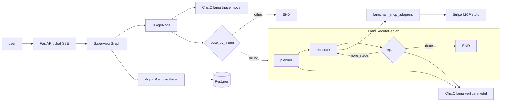

# Milestone 2 — 技术实现方案

**Status:** 已实现（见 [roadmap.md](roadmap.md) Milestone 2）。

**Goal（目标）:** 打通一条端到端的纵切（vertical slice，即「一条贯穿全栈的最小可用链路」），包含：本地 Ollama 驱动的 LLM、结构化 triage、billing 的 Plan–Execute–Replan、经 stdio 接入的真实 Stripe MCP、LangChain MCP adapters 工具桥接，以及 LangGraph checkpointing（开发 / 生产用 `AsyncPostgresSaver`，测试用 `MemorySaver`）。

---

## 1. 概览

| 领域 | 交付内容 |
|------|----------------|
| LLM | `langchain-ollama` `ChatOllama`；默认 `LLM_BACKEND=ollama`，可选 `anthropic` fallback |
| Triage | `with_structured_output(TriageOutput)` → `ticket_summary` + guardrail flag merge |
| Billing | LangGraph subgraph：planner → executor → replanner，带 `MAX_STEPS` 上限 |
| MCP | `langchain-mcp-adapters` `MultiServerMCPClient` + `get_tools()`；`tool.metadata` 上标注 capability |
| Stripe | 官方 MCP Python SDK：`Server` + `stdio_server`；内存 deterministic `data.py` |
| State | `CHECKPOINT_BACKEND=postgres` 时用 `AsyncPostgresSaver`；`memory` 时用 `MemorySaver` |
| Safety | Executor 对 `capability=destructive` 强制 whitelist；read tools 默认允许 |

---

## 2. 技术栈对齐（2026 默认选型）

| 子系统 | 选型 | 理由 |
|-----------|--------|-----------|
| LLM client | `langchain-ollama` `ChatOllama` | LangChain 支持的本地栈；Qwen 3.5+ 支持 tool calling / JSON-style structured output |
| Triage I/O | Pydantic v2 + `with_structured_output(schema)` | LangChain 1.x 模式 |
| Plan / execute | 三节点 subgraph + 条件边到 `END` | LangGraph “planning agents” 模式 |
| MCP bridge | `langchain-mcp-adapters` | 官方 adapter；避免手写 JSON-RPC |
| MCP server | `mcp.server.lowlevel.Server` + `stdio_server` | MCP Python SDK |
| Persistence | `langgraph.checkpoint.postgres.aio.AsyncPostgresSaver` | Async-first，与 FastAPI 匹配 |
| Tests | `langgraph.checkpoint.memory.MemorySaver` | 快速、hermetic CI |

---

## 3. 数据流（M2 之后）

---

## 4. 交付清单（实现任务）

以下条目在实现过程中跟踪；对应原 Cursor plan todos。

- [x] **deps** — 添加 `langchain-ollama` 和 `langchain-mcp-adapters`；刷新 `uv.lock`
- [x] **config** — `llm_backend`、`ollama_base_url`、`checkpoint_backend`、`psycopg_dsn`；同步到 `.env.example`
- [x] **llm_factory** — [`apps/api/src/resolveai_api/core/llm.py`](../apps/api/src/resolveai_api/core/llm.py)：`make_llm` / `make_structured_llm`
- [x] **checkpointer** — [`apps/api/src/resolveai_api/core/checkpointer.py`](../apps/api/src/resolveai_api/core/checkpointer.py)：`lifespan_checkpointer()` → Postgres 或 memory
- [x] **mcp_loader** — [`apps/api/src/resolveai_api/mcp/loader.py`](../apps/api/src/resolveai_api/mcp/loader.py)：client、tool load、`metadata["capability"]` / `full_name`、`filter_by_whitelist`
- [x] **stripe_real** — Stripe MCP：`list_tools` / `call_tool`，[`data.py`](../packages/mcp-servers/stripe/src/mcp_servers/stripe/data.py) seeded charges
- [x] **triage_impl** — [`triage.py`](../apps/api/src/resolveai_api/agents/triage.py)：structured `TriageOutput` → `ticket_summary`
- [x] **billing_subgraph** — [`billing_graph.py`](../apps/api/src/resolveai_api/agents/billing_graph.py)：planner / executor / replanner + `MAX_STEPS`
- [x] **billing_wire** — [`billing.py`](../apps/api/src/resolveai_api/agents/billing.py)：委托 subgraph；whitelist-filtered tools
- [x] **executor_caps** — [`executor.py`](../apps/api/src/resolveai_api/core/executor.py)：`BaseTool` + destructive whitelist
- [x] **supervisor_wire** — [`supervisor.py`](../apps/api/src/resolveai_api/agents/supervisor.py)：`compile(checkpointer=…)`；thread id `tenant::customer::thread`；[`main.py`](../apps/api/src/resolveai_api/main.py) lifespan 连接 checkpointer + MCP tools；[`api/dependencies.py`](../apps/api/src/resolveai_api/api/dependencies.py) 暴露 `get_supervisor`
- [x] **tests** — `test_triage_structured`、`test_billing_subgraph`、`test_stripe_mcp`、`test_capability_whitelist`、扩展 `e2e_tests/test_chat_flow`
- [x] **verify** — `make test` / ruff 绿；对 Ollama + Stripe MCP 做手动 SSE smoke

---

## 5. 依赖

声明于 [`apps/api/pyproject.toml`](../apps/api/pyproject.toml)（精确 lower bounds 随 lockfile 演进）：

- `langchain-ollama`
- `langchain-mcp-adapters`

Workspace root [`pyproject.toml`](../pyproject.toml) 列出 MCP server packages，以便 `uv sync` 为本地运行和测试安装它们。

---

## 6. 新增与修改文件（摘要）

### 新增

- [`apps/api/src/resolveai_api/core/llm.py`](../apps/api/src/resolveai_api/core/llm.py)
- [`apps/api/src/resolveai_api/core/checkpointer.py`](../apps/api/src/resolveai_api/core/checkpointer.py)
- [`apps/api/src/resolveai_api/agents/billing_graph.py`](../apps/api/src/resolveai_api/agents/billing_graph.py)
- [`apps/api/src/resolveai_api/mcp/loader.py`](../apps/api/src/resolveai_api/mcp/loader.py)
- [`apps/api/src/resolveai_api/api/dependencies.py`](../apps/api/src/resolveai_api/api/dependencies.py)
- [`packages/mcp-servers/stripe/src/mcp_servers/stripe/data.py`](../packages/mcp-servers/stripe/src/mcp_servers/stripe/data.py)

### 修改（高层）

- [`apps/api/src/resolveai_api/config.py`](../apps/api/src/resolveai_api/config.py)
- [`apps/api/src/resolveai_api/main.py`](../apps/api/src/resolveai_api/main.py)
- [`apps/api/src/resolveai_api/agents/supervisor.py`](../apps/api/src/resolveai_api/agents/supervisor.py)、[`triage.py`](../apps/api/src/resolveai_api/agents/triage.py)、[`billing.py`](../apps/api/src/resolveai_api/agents/billing.py)、[`base.py`](../apps/api/src/resolveai_api/agents/base.py)
- [`apps/api/src/resolveai_api/core/executor.py`](../apps/api/src/resolveai_api/core/executor.py)
- [`apps/api/src/resolveai_api/mcp/registry.py`](../apps/api/src/resolveai_api/mcp/registry.py) — 仅启动 `MCP_*_CMD` 非空的 server（默认 Stripe；其他 SaaS stub 可选，M3 再补）
- [`packages/mcp-servers/stripe/.../server.py`](../packages/mcp-servers/stripe/src/mcp_servers/stripe/server.py)
- [`.env.example`](../.env.example)

**Note:** [`apps/api/src/resolveai_api/core/planner.py`](../apps/api/src/resolveai_api/core/planner.py) 仍为 stub；billing planning 在 `billing_graph.py` 中通过 `make_structured_llm` 直接实现。

---

## 7. 实现说明

### 7.1 Triage

- Schema：`TriageOutput`（intent、entities、confidence、adversarial flags、SLA tier）。
- `make_structured_llm("triage", TriageOutput)`，然后将 `adversarial_flags` merge 进 `guardrail_flags`，必要时加 `triage:` 前缀。

### 7.2 Billing subgraph

| Node | 角色 |
|------|------|
| `planner` | 通过 structured output 输出 `Plan`（有序 steps） |
| `executor` | 每次 invocation 执行一步；`bind_tools` + 可选 tool calls；使用 `Executor.call_tool` |
| `replanner` | 输出 `Replan`：新 `Plan` 或 terminal `Response` |

当 `response` 已设置，或超过迭代预算（`MAX_STEPS`）时停止。

### 7.3 Stripe MCP

- Handlers 调用 `data.py`；invalid refund amounts 或 already-refunded charges 抛出 `ValueError`（ surfaced 给 callers / tests）。
- `TOOLS` entries 携带 `capability: read | destructive`，供 loader 标注。

### 7.4 Capability whitelist

- MCP → LangChain 转换后，tools 携带 `metadata["full_name"]`（如 `stripe.refund`）。
- Billing 传入 filtered tool list；`Executor` 仍要求 destructive tools 出现在 per-call whitelist 中。

### 7.5 Checkpointer

- 环境变量：`CHECKPOINT_BACKEND=postgres` | `memory`。
- LangGraph 的 Postgres DSN：SQLAlchemy-style `DATABASE_URL` 经 `Settings.psycopg_dsn` 转换，供 `AsyncPostgresSaver.from_conn_string` 使用。
- 启动时：`await saver.setup()`（幂等建表）。

---

## 8. 测试矩阵

| File | 目的 |
|------|---------|
| [`apps/api/tests/test_triage_structured.py`](../apps/api/tests/test_triage_structured.py) | Mock structured LLM；intent、flags、error fallback |
| [`apps/api/tests/test_billing_subgraph.py`](../apps/api/tests/test_billing_subgraph.py) | Mock planner/executor LLMs；completion path + `MAX_STEPS` |
| [`apps/api/tests/test_stripe_mcp.py`](../apps/api/tests/test_stripe_mcp.py) | `list_tools`、`list_charges`、`refund`、error paths |
| [`apps/api/tests/test_capability_whitelist.py`](../apps/api/tests/test_capability_whitelist.py) | Destructive 未 whitelist 时 blocked；read allowed |
| [`e2e_tests/test_chat_flow.py`](../e2e_tests/test_chat_flow.py) | Supervisor stream + `MemorySaver` 上 checkpoint resume（LLM mocked 加速） |

[`apps/api/tests/conftest.py`](../apps/api/tests/conftest.py) 为 hermetic runs 设置 `CHECKPOINT_BACKEND=memory`（及相关 defaults）。

---

## 9. 行业 checklist（M2 之后）

- [x] LLM 经 `langchain-ollama` 跑本地 Qwen models
- [x] Triage 经 `with_structured_output(Pydantic model)`
- [x] Billing Plan–Execute–Replan 作为独立 LangGraph subgraph
- [x] MCP 集成经 `langchain-mcp-adapters`
- [x] Stripe MCP 经官方 Python SDK（`Server` + stdio）
- [x] Async Postgres checkpointer，贴近 production-shaped deploys
- [x] `thread_id` namespace：`tenant::customer::thread`
- [x] Executor 层对 destructive tools 强制 enforcement

---

## 10. 明确不在 M2 范围

- `make_llm` 内深度 LangSmith / OTel wiring（后续 milestone）
- gVisor / 每次 tool call 的真实 sandbox（Executor 仍用 placeholder scope）
- Zendesk / Slack / Salesforce / Intercom 的真实 stdio MCP（M3）
- Long-horizon RAG memory（目前仅 messages + checkpoint）

---

## 11. 验收标准

- `make test`（或 `uv run pytest`）通过，含 §8 所列文件。
- SSE `POST /api/v1/chat` 至少显示 `triage` 的 `agent_step`，billing intent 时还有 `billing`，然后 `done`。
- `CHECKPOINT_BACKEND=postgres` 且 DB 可用：重启 API，复用相同 `thread_id`，确认 checkpoint continuity（ops runbook 补充后可 inspect `agent_checkpoints` / LangGraph tables）。
- High-value charge path：seeded data 含超过 $500 的 charges；billing replanner 可在 `Response` 中 surface escalation，而不自动路由到 Escalation agent（cross-agent handoff 留待后续 milestone）。
