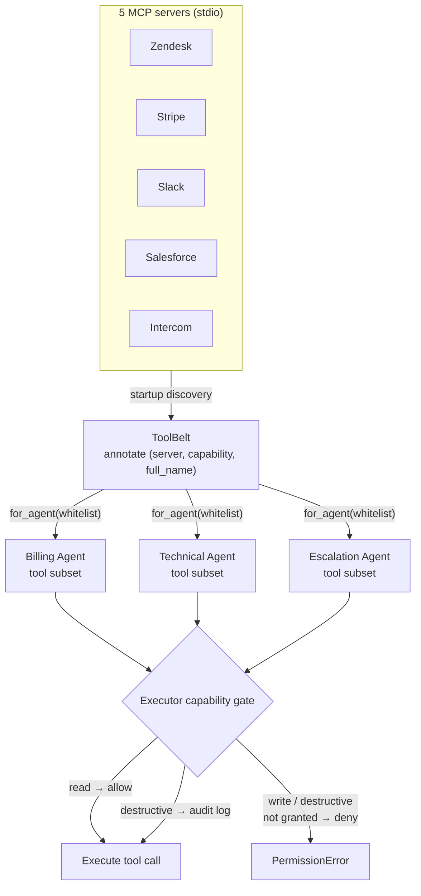

# Milestone 3 — Technical implementation plan

**Status:** Implemented (see [roadmap.md](roadmap.md) Milestone 3).

**Goal:** Finish the remaining MCP-native tool layer, specifically three things:

1. Upgrade Zendesk / Slack / Salesforce / Intercom from `TOOLS`-only stubs to **real stdio MCP servers** (aligned with the M2 Stripe template);
2. Wrap tool discovery in a unified `ToolBelt`;
3. Extend the capability gate from blocking only `destructive` to **default-deny for both write and destructive**.

No external SaaS credentials are required at any point — each server follows the `mcp_servers.stripe` “mock-first, in-memory deterministic data” pattern.

---

## 1. Industry alignment (2026 default choices)

| Subsystem | Choice | Rationale |
|-----------|--------|-----------|
| Tool protocol | **Anthropic MCP** (`mcp.server.lowlevel.Server` + `stdio_server`) | De-facto standard since 2025 (Anthropic + OpenAI + Cursor + Bedrock) |
| Client bridge | `langchain-mcp-adapters` `MultiServerMCPClient.get_tools()` | Official LangChain ↔ MCP adapter; auto-converts to `BaseTool` |
| Tool registry | New `ToolBelt` class wrapping `loader.py` | Single source of truth + per-agent filtering + JSON manifest |
| Capability policy | **read / write / destructive**, latter two default-deny | Aligned with OpenAI tool calling + Anthropic computer-use guidance + Bedrock Agents IAM model |
| Mock servers | Stripe-template (`server.py` + `data.py` + `reset_store()`) | Deterministic; same contract as a future real adapter |

In one sentence:

> *Every SaaS an agent touches is reached via MCP; the API discovers tools at startup, annotates `(server, capability, full_name)`, and the Executor rejects any `write` or `destructive` call the agent did not explicitly grant.*

---

## 2. Deliverables

| # | Item | Notes |
|---|------|-------|
| 1 | 4 new MCP servers (Zendesk / Slack / Salesforce / Intercom) | Mirror Stripe layout; deterministic seed data; failure paths |
| 2 | `mcp.toolbelt.ToolBelt` | Discovery + per-agent slice + capability lookup + manifest |
| 3 | Executor three-tier capability gate | `write` and `destructive` need an explicit grant; `read` default-allow |
| 4 | Tests: per-server happy + error paths, multi-server discovery, capability matrix | Hermetic, no network |
| 5 | `Technical` + `Escalation` agents reuse the billing Plan-Execute-Replan subgraph | Each agent gets a sliced toolbelt |
| 6 | Update `.env.example` to enable all 5 `MCP_*_CMD` | Document Stripe-only fallback |

---

## 3. Per-server contract

Each new package mirrors `packages/mcp-servers/stripe/`:

```
packages/mcp-servers/<name>/
  pyproject.toml
  src/mcp_servers/<name>/
    __init__.py
    __main__.py        # python -m mcp_servers.<name>
    server.py          # @server.list_tools / @server.call_tool
    data.py            # in-memory store + reset_store()
```

Capability triage covers later roadmap consumers (Escalation / Technical):

| Server | Tool | Capability | Consumer |
|--------|------|------------|----------|
| **Zendesk** | `get_ticket_history(customer_id)` | `read` | Billing / Technical |
| | `update_ticket(ticket_id, status?, note?)` | `write` | Billing / Technical |
| | `escalate(ticket_id, reason)` | `destructive` | Escalation |
| **Slack** | `notify_team(channel, message, mention?)` | `write` | Escalation |
| | `post_message(channel, message)` | `write` | Internal collab |
| **Salesforce** | `get_account(customer_id)` | `read` | Billing |
| | `update_opportunity(opportunity_id, stage?, amount?)` | `write` | Billing |
| **Intercom** | `get_conversation(conversation_id)` | `read` | Technical |
| | `tag_user(user_id, tag)` | `write` | Technical |

Each server must include:

- a `*_not_found` error path,
- idempotent state transitions (e.g. re-escalating an already-escalated ticket raises `already_escalated`),
- a `reset_store()` hook, autoused by `apps/api/tests/conftest.py`.

---

## 4. `ToolBelt` design

`apps/api/src/resolveai_api/mcp/toolbelt.py`:

```python
class ToolBelt:
    """Single source of truth for MCP-backed LangChain tools."""

    def __init__(self, tools: list[BaseTool]) -> None: ...

    @classmethod
    async def from_settings(cls) -> "ToolBelt":
        """Build MultiServerMCPClient from registry, discover, annotate."""

    def for_agent(self, whitelist: list[str]) -> list[BaseTool]:
        """Filter by metadata.full_name (replaces filter_by_whitelist)."""

    def by_capability(self, capability: str) -> list[BaseTool]: ...

    def manifest(self) -> list[dict]:
        """Serializable view for /admin and ablation logs."""
```

Lifespan simplifies to:

```python
toolbelt = await ToolBelt.from_settings()
app.state.supervisor = SupervisorGraph(checkpointer=checkpointer, toolbelt=toolbelt)
```

`SupervisorGraph._build_agents()` switches from `filter_by_whitelist(mcp_tools, …)` to `toolbelt.for_agent(WHITELIST)`. Agent code no longer references `loader.py`.

Getting from “5 MCP servers” to “the few tools an agent may call” is three steps: discover and annotate at startup, slice by agent whitelist, then let the Executor enforce capability on every call.



---

## 5. Capability policy upgrade

Current state ([`core/executor.py`](../apps/api/src/resolveai_api/core/executor.py)) only blocks `destructive`. After M3:

| Capability | Default | Requirement |
|------------|---------|-------------|
| `read` | allow | — |
| `write` | **deny** | `full_name` must be on the agent whitelist |
| `destructive` | **deny + audit** | whitelist + write a log entry on every call |

Errors keep the existing `PermissionError(f"{capability} tool {full!r} not granted (whitelist=...)")` shape; the billing subgraph’s outer `try/except` still records them as `past_steps` observations.

---

## 6. Tests (new in M3)

| File | Behavior locked |
|------|--------------------|
| `apps/api/tests/test_zendesk_mcp.py` | `list_tools`, ticket read, update, escalate happy + sad |
| `apps/api/tests/test_slack_mcp.py` | `notify_team` happy + mention parsing |
| `apps/api/tests/test_salesforce_mcp.py` | account fetch + opportunity update |
| `apps/api/tests/test_intercom_mcp.py` | conversation fetch + tag user |
| `apps/api/tests/test_toolbelt.py` | `ToolBelt.from_settings()` discovers all 5 servers; manifest fields complete |
| `apps/api/tests/test_capability_whitelist.py` (extended) | `write` denied without grant; `destructive` audited |

All tests stay hermetic — no real network, no external SaaS calls.

---

## 7. Delivery checklist

- [x] **zendesk** — real stdio server + `data.py` + tests
- [x] **slack** — real stdio server + `data.py` + tests
- [x] **salesforce** — real stdio server + `data.py` + tests
- [x] **intercom** — real stdio server + `data.py` + tests
- [x] **toolbelt** — `ToolBelt` class + lifespan wiring + `SupervisorGraph` plumbing
- [x] **capability** — Executor enforces `write` + `destructive`; `audit=True` on destructive
- [x] **agents** — Escalation runs deterministic Slack + Zendesk handoff; Technical pulls Zendesk ticket history (Plan-Execute-Replan reuse deferred until M6 KB retrieval lands)
- [x] **multi-loader** — `test_toolbelt.py::test_from_settings_discovers_all_five_servers` proves 5-server end-to-end discovery
- [x] **env** — `.env.example` lists all 5 `MCP_*_CMD` by default; `conftest.py` autouse resets each store
- [x] **verify** — `uv run python -m pytest` green (65 tests); roadmap M3 checked off

---

## 8. Non-goals (deferred to later milestones)

- Real HTTP calls to Zendesk / Slack / Salesforce / Intercom (key-gated `live` mode is follow-on; see M9 / a dedicated milestone). MCP is intentionally designed so swapping `data.py` for `client_real.py` later does not move agent or executor code.
- Streaming tool responses (MCP supports this; not needed yet).
- `/admin/tools` UI surface (Phase 2 — `manifest()` already returns the JSON it will consume).
