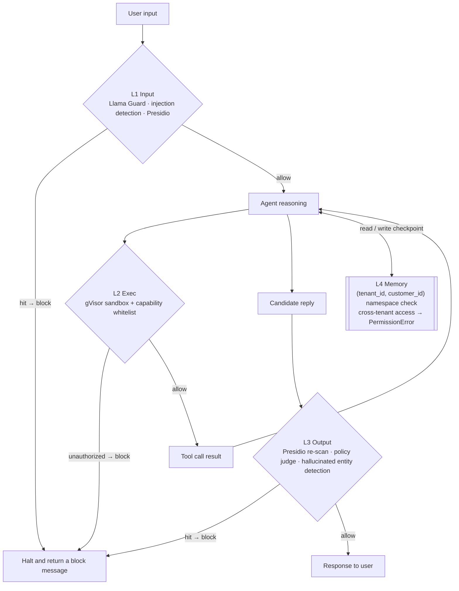

# Milestone 4 — Four-layer Guardrails implementation

**Status:** Implemented (see [roadmap.md](roadmap.md) Milestone 4).

**Goal:** Upgrade existing guardrail hook points from stubs to production-like behavior across input, execution, output, and memory, while keeping the architecture simple enough for Milestone 5 ablation.

---

## 1. Deliverables

| Layer | Implementation |
|------|-----------------|
| Input | `InputGuardrail` now runs indirect-injection heuristics, local Ollama Llama Guard classification, and Presidio redaction (with timeout/fallback flags) |
| Exec | MCP stdio commands are sandbox-wrapped in `docker run`; `SANDBOX_MODE=gvisor` appends `--runtime=runsc`; `off` for local tests |
| Output | `OutputGuardrail` now does Presidio re-scan, a structured policy judge (`PolicyVerdict`), and hallucinated entity checks against `tool_calls` |
| Memory | `IsolatedCheckpointer` enforces `(tenant_id, customer_id)` namespace checks on checkpoint read/write and supervisor config propagation |

The four layers hang at different points on the request path: L1 before the LLM, L2 around each tool call, L3 before the reply is returned, L4 across all state reads and writes. A block decision at any layer immediately halts.

---

## 2. Key file changes

- Input guardrails: [`apps/api/src/resolveai_api/guardrails/input_filter.py`](../apps/api/src/resolveai_api/guardrails/input_filter.py)
- Exec sandboxing: [`apps/api/src/resolveai_api/mcp/loader.py`](../apps/api/src/resolveai_api/mcp/loader.py), [`apps/api/src/resolveai_api/guardrails/exec_sandbox.py`](../apps/api/src/resolveai_api/guardrails/exec_sandbox.py), [`packages/mcp-servers/Dockerfile`](../packages/mcp-servers/Dockerfile)
- Output guardrails: [`apps/api/src/resolveai_api/guardrails/output_filter.py`](../apps/api/src/resolveai_api/guardrails/output_filter.py), [`apps/api/src/resolveai_api/agents/supervisor.py`](../apps/api/src/resolveai_api/agents/supervisor.py)
- Memory isolation: [`apps/api/src/resolveai_api/core/checkpointer.py`](../apps/api/src/resolveai_api/core/checkpointer.py), [`apps/api/src/resolveai_api/guardrails/memory_isolator.py`](../apps/api/src/resolveai_api/guardrails/memory_isolator.py)
- Config surface: [`apps/api/src/resolveai_api/config.py`](../apps/api/src/resolveai_api/config.py), [`.env.example`](../.env.example)
- Frontend blocked event: [`apps/web/app/chat/page.tsx`](../apps/web/app/chat/page.tsx)

---

## 3. New config

- `SANDBOX_MODE=off|docker|gvisor`
- `MCP_SANDBOX_IMAGE`
- `LLAMA_GUARD_MODEL`, `LLAMA_GUARD_TIMEOUT_MS`
- `PRESIDIO_LANGUAGE`
- `POLICY_JUDGE_MODEL`, `POLICY_JUDGE_TIMEOUT_MS`
- `GUARDRAIL_L1`, `GUARDRAIL_L2`, `GUARDRAIL_L3`, `GUARDRAIL_L4`

All guardrail toggles default to `on`; tests force selected layers off for deterministic runs.

---

## 4. Verification

Ran:

- `uv run pytest apps/api/tests/test_guardrails.py apps/api/tests/test_isolated_checkpointer.py`

Result:

- `11 passed`

Coverage highlights:

- L1 block + Presidio redaction
- L2 sandbox command wrapping (`off` / `docker` / `gvisor`)
- L3 policy flags + hallucinated entity detection
- L4 cross-tenant checkpoint access raises `PermissionError`

---

## 5. Notes for later milestones

- Guardrail layer switches (`GUARDRAIL_L1..L4`) are ready for M5 ablation runs.
- `SANDBOX_MODE=off` remains the default for local macOS dev and CI; a Linux host can enable `gvisor`.
