# Milestone 4 — 四层 Guardrails 实现

**Status:** 已实现（见 [roadmap.md](roadmap.md) Milestone 4）。

**Goal:** 将现有 guardrail hook points 从 stub 升级为 input、execution、output、memory 四层上的 production-like 行为，同时保持架构简单、便于 Milestone 5 ablation。

---

## 1. 交付内容

| Layer | Implementation |
|------|-----------------|
| Input | `InputGuardrail` 现运行 indirect-injection heuristics、本地 Ollama Llama Guard classification、Presidio redaction（带 timeout/fallback flags） |
| Exec | MCP stdio commands 在 `docker run` 中 sandbox-wrapped；`SANDBOX_MODE=gvisor` 追加 `--runtime=runsc`，`off` 用于本地 tests |
| Output | `OutputGuardrail` 现做 Presidio re-scan、structured policy judge（`PolicyVerdict`）、针对 `tool_calls` 的 hallucinated entity checks |
| Memory | `IsolatedCheckpointer` 在 checkpoint read/write 及 supervisor config propagation 上强制 `(tenant_id, customer_id)` namespace checks |

四层挂在请求路径的不同位置：L1 在 LLM 之前、L2 包住每次工具调用、L3 在回复返回之前、L4 横跨整个 state 读写。任一层判定 block 都会直接中断（halt）。

```mermaid
flowchart TD
  in["用户输入 User input"] --> l1
  l1{"L1 Input<br/>Llama Guard · 注入检测 · Presidio"}
  l1 -->|"命中 → block"| blocked["中断并返回拦截提示"]
  l1 -->|放行| agent["Agent 推理"]
  agent --> l2
  l2{"L2 Exec<br/>gVisor 沙箱 + capability 白名单"}
  l2 -->|"越权 → block"| blocked
  l2 -->|放行| tool["工具调用结果"]
  tool --> agent
  agent --> answer["候选回复"]
  answer --> l3
  l3{"L3 Output<br/>Presidio 复扫 · policy judge · 幻觉实体检测"}
  l3 -->|"命中 → block"| blocked
  l3 -->|放行| out["返回用户 Response"]
  l4[["L4 Memory<br/>(tenant_id, customer_id) 命名空间校验<br/>跨租户访问 → PermissionError"]]
  agent <-->|"读 / 写 checkpoint"| l4
```

---

## 2. 关键文件变更

- Input guardrails：[`apps/api/src/resolveai_api/guardrails/input_filter.py`](../apps/api/src/resolveai_api/guardrails/input_filter.py)
- Exec sandboxing：[`apps/api/src/resolveai_api/mcp/loader.py`](../apps/api/src/resolveai_api/mcp/loader.py)、[`apps/api/src/resolveai_api/guardrails/exec_sandbox.py`](../apps/api/src/resolveai_api/guardrails/exec_sandbox.py)、[`packages/mcp-servers/Dockerfile`](../packages/mcp-servers/Dockerfile)
- Output guardrails：[`apps/api/src/resolveai_api/guardrails/output_filter.py`](../apps/api/src/resolveai_api/guardrails/output_filter.py)、[`apps/api/src/resolveai_api/agents/supervisor.py`](../apps/api/src/resolveai_api/agents/supervisor.py)
- Memory isolation：[`apps/api/src/resolveai_api/core/checkpointer.py`](../apps/api/src/resolveai_api/core/checkpointer.py)、[`apps/api/src/resolveai_api/guardrails/memory_isolator.py`](../apps/api/src/resolveai_api/guardrails/memory_isolator.py)
- Config surface：[`apps/api/src/resolveai_api/config.py`](../apps/api/src/resolveai_api/config.py)、[`.env.example`](../.env.example)
- Frontend blocked event：[`apps/web/app/chat/page.tsx`](../apps/web/app/chat/page.tsx)

---

## 3. 新增配置项

- `SANDBOX_MODE=off|docker|gvisor`
- `MCP_SANDBOX_IMAGE`
- `LLAMA_GUARD_MODEL`、`LLAMA_GUARD_TIMEOUT_MS`
- `PRESIDIO_LANGUAGE`
- `POLICY_JUDGE_MODEL`、`POLICY_JUDGE_TIMEOUT_MS`
- `GUARDRAIL_L1`、`GUARDRAIL_L2`、`GUARDRAIL_L3`、`GUARDRAIL_L4`

所有 guardrail toggles 默认 `on`；tests 为 deterministic runs 强制关闭选定 layer。

---

## 4. 验证

已执行：

- `uv run pytest apps/api/tests/test_guardrails.py apps/api/tests/test_isolated_checkpointer.py`

结果：

- `11 passed`

覆盖要点：

- L1 block + Presidio redaction
- L2 sandbox command wrapping（`off` / `docker` / `gvisor`）
- L3 policy flags + hallucinated entity detection
- L4 cross-tenant checkpoint access 抛出 `PermissionError`

---

## 5. 后续 milestone 说明

- Guardrail layer switches（`GUARDRAIL_L1..L4`）已就绪，供 M5 ablation runs 使用。
- `SANDBOX_MODE=off` 仍为本地 macOS dev 与 CI 默认；Linux host 可开启 `gvisor`。
