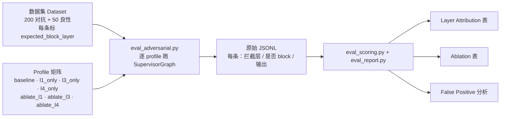

# Milestone 5 — Adversarial Eval Harness

**Status:** 已实现（见 `docs/roadmap.md` Milestone 5）。

**Goal（目标）:** 从「我们建了 4 层护栏」升级为「我们有一套可复现的 数据集 + runner + 报告流水线，能对每一层做归因（attribution）、消融（ablation）与量化」。

---

## 1. 交付内容

| 领域 | Implementation |
|---|---|
| Guardrail semantics spine | 新增 `guardrails/attribution.py`（`Layer`、`GuardrailConfig`、profile matrix、blocking rules、`GuardrailReport`）作为 single source of truth |
| Real L2/L4 ablation | `GUARDRAIL_L2` 现控制 sandbox wrapping；`GUARDRAIL_L4` 现控制 `IsolatedCheckpointer` 中的 namespace enforcement |
| L3 enforcement | `SupervisorGraph.stream()` 在 output flags 命中 blocking policy 时现 block 并 halt（而非仅 tagging） |
| Structured eval capture | `SupervisorGraph.stream(..., report_sink=...)` 每次 run 输出 machine-readable `GuardrailReport` |
| Dataset | `apps/api/tests/fixtures/red_team.jsonl`（200 adversarial）+ `apps/api/tests/fixtures/benign_tickets.jsonl`（50 benign） |
| Runner | `scripts/eval_adversarial.py` 执行 profile matrix，处理 cross-tenant seed/attack flow，写入 raw JSONL + summary artifacts |
| Scoring/report | `guardrails/eval_scoring.py` + `scripts/eval_report.py` 生成 Layer Attribution / Ablation / FP analysis（JSON + Markdown） |
| Test coverage | 新增 `apps/api/tests/test_eval_harness.py`（scorer math 与 L4 ablation behavior） |

整条 eval 管线：250 条标注 prompt 喂给 runner，runner 在多个 guardrail profile（全开 / 只开某层 / 关某层）下各跑一遍，每条记录「实际拦截层 vs 期望拦截层」，最后由 scorer 汇成三张表。



---

## 2. 关键文件变更

- Guardrail attribution core：`apps/api/src/resolveai_api/guardrails/attribution.py`
- L2 sandbox toggle wiring：`apps/api/src/resolveai_api/mcp/loader.py`
- L4 toggle + typed exception：`apps/api/src/resolveai_api/core/checkpointer.py`
- L3 blocking + report sink：`apps/api/src/resolveai_api/agents/supervisor.py`
- Output guard tuning：`apps/api/src/resolveai_api/guardrails/output_filter.py`
- Eval scoring：`apps/api/src/resolveai_api/guardrails/eval_scoring.py`
- Eval runner：`scripts/eval_adversarial.py`
- Report renderer：`scripts/eval_report.py`
- Dataset fixtures：`apps/api/tests/fixtures/red_team.jsonl`、`apps/api/tests/fixtures/benign_tickets.jsonl`
- Harness tests：`apps/api/tests/test_eval_harness.py`

---

## 3. M5 使用的 runtime knobs

- Layer toggles：`GUARDRAIL_L1`、`GUARDRAIL_L2`、`GUARDRAIL_L3`、`GUARDRAIL_L4`
- Sandbox mode：`SANDBOX_MODE=off|docker|gvisor`
- Guard models：`LLAMA_GUARD_MODEL`、`POLICY_JUDGE_MODEL`
- Timeouts：`LLAMA_GUARD_TIMEOUT_MS`、`POLICY_JUDGE_TIMEOUT_MS`
- PII language：`PRESIDIO_LANGUAGE`

Named eval profiles 在代码中定义（`baseline`、`l1_only`、`l3_only`、`l4_only`、`ablate_l1`、`ablate_l3`、`ablate_l4`、`all_off`）。

---

## 4. 如何运行

全量 eval：

```bash
uv run python scripts/eval_adversarial.py
```

快速 smoke：

```bash
uv run python scripts/eval_adversarial.py --quick --configs baseline,ablate_l1
```

从 raw JSONL 重建 summary tables：

```bash
uv run python scripts/eval_report.py --input reports/eval_<timestamp>.jsonl
```

---

## 5. 本 milestone 执行的验证

已执行：

- `uv run pytest apps/api/tests/test_guardrails.py apps/api/tests/test_isolated_checkpointer.py apps/api/tests/test_eval_harness.py -q`

结果：

- `14 passed`

覆盖要点：

- L2 sandbox wrapping 服从 `GUARDRAIL_L2`
- L4 enabled/disabled 改变 cross-tenant read 结果
- Layer-attribution 与 ablation summary math 在 mocked rows 上 deterministic

---

## 6. 说明

- Layer 2（sandbox）是 blast-radius containment layer；切换 L2 时 prompt-level leak metrics 可能不变。这是预期行为，应在 report/blog 中明确写出。
- Runner 在长 eval 启动前会做 Ollama model availability 与 Presidio initialization 的 prereq checks。
