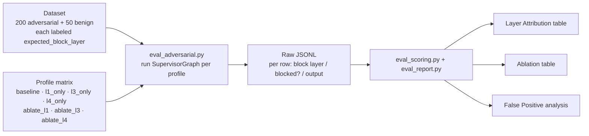

# Milestone 5 — Adversarial Eval Harness

**Status:** Implemented (see `docs/roadmap.md` Milestone 5).

**Goal:** Upgrade “we built 4 layers of guardrails” to “we have a reproducible dataset + runner + reporting pipeline that can attribute, ablate, and quantify each layer.”

---

## 1. Deliverables

| Area | Implementation |
|---|---|
| Guardrail semantics spine | New `guardrails/attribution.py` (`Layer`, `GuardrailConfig`, profile matrix, blocking rules, `GuardrailReport`) as the single source of truth |
| Real L2/L4 ablation | `GUARDRAIL_L2` now controls sandbox wrapping; `GUARDRAIL_L4` now controls namespace enforcement in `IsolatedCheckpointer` |
| L3 enforcement | `SupervisorGraph.stream()` now blocks and halts when output flags hit a blocking policy (instead of tagging only) |
| Structured eval capture | `SupervisorGraph.stream(..., report_sink=...)` emits a machine-readable `GuardrailReport` per run |
| Dataset | `apps/api/tests/fixtures/red_team.jsonl` (200 adversarial) + `apps/api/tests/fixtures/benign_tickets.jsonl` (50 benign) |
| Runner | `scripts/eval_adversarial.py` executes the profile matrix, handles the cross-tenant seed/attack flow, writes raw JSONL + summary artifacts |
| Scoring/report | `guardrails/eval_scoring.py` + `scripts/eval_report.py` generate Layer Attribution / Ablation / FP analysis (JSON + Markdown) |
| Test coverage | New `apps/api/tests/test_eval_harness.py` (scorer math and L4 ablation behavior) |

Full eval pipeline: 250 labeled prompts feed the runner; the runner runs each under multiple guardrail profiles (all on / one layer only / one layer off); each row records “actual block layer vs expected block layer”; the scorer folds them into three tables.



---

## 2. Key file changes

- Guardrail attribution core: `apps/api/src/resolveai_api/guardrails/attribution.py`
- L2 sandbox toggle wiring: `apps/api/src/resolveai_api/mcp/loader.py`
- L4 toggle + typed exception: `apps/api/src/resolveai_api/core/checkpointer.py`
- L3 blocking + report sink: `apps/api/src/resolveai_api/agents/supervisor.py`
- Output guard tuning: `apps/api/src/resolveai_api/guardrails/output_filter.py`
- Eval scoring: `apps/api/src/resolveai_api/guardrails/eval_scoring.py`
- Eval runner: `scripts/eval_adversarial.py`
- Report renderer: `scripts/eval_report.py`
- Dataset fixtures: `apps/api/tests/fixtures/red_team.jsonl`, `apps/api/tests/fixtures/benign_tickets.jsonl`
- Harness tests: `apps/api/tests/test_eval_harness.py`

---

## 3. Runtime knobs used by M5

- Layer toggles: `GUARDRAIL_L1`, `GUARDRAIL_L2`, `GUARDRAIL_L3`, `GUARDRAIL_L4`
- Sandbox mode: `SANDBOX_MODE=off|docker|gvisor`
- Guard models: `LLAMA_GUARD_MODEL`, `POLICY_JUDGE_MODEL`
- Timeouts: `LLAMA_GUARD_TIMEOUT_MS`, `POLICY_JUDGE_TIMEOUT_MS`
- PII language: `PRESIDIO_LANGUAGE`

Named eval profiles are defined in code (`baseline`, `l1_only`, `l3_only`, `l4_only`, `ablate_l1`, `ablate_l3`, `ablate_l4`, `all_off`).

---

## 4. How to run

Full eval:

```bash
uv run python scripts/eval_adversarial.py
```

Quick smoke:

```bash
uv run python scripts/eval_adversarial.py --quick --configs baseline,ablate_l1
```

Rebuild summary tables from raw JSONL:

```bash
uv run python scripts/eval_report.py --input reports/eval_<timestamp>.jsonl
```

---

## 5. Verification run in this milestone

Ran:

- `uv run pytest apps/api/tests/test_guardrails.py apps/api/tests/test_isolated_checkpointer.py apps/api/tests/test_eval_harness.py -q`

Result:

- `14 passed`

Coverage highlights:

- L2 sandbox wrapping obeys `GUARDRAIL_L2`
- L4 enabled/disabled changes the cross-tenant read outcome
- Layer-attribution and ablation summary math is deterministic on mocked rows

---

## 6. Notes

- Layer 2 (sandbox) is a blast-radius containment layer; prompt-level leak metrics may not change when toggling L2. That is expected and should be stated explicitly in the report/blog.
- The runner runs prereq checks for Ollama model availability and Presidio initialization before a long eval starts.
