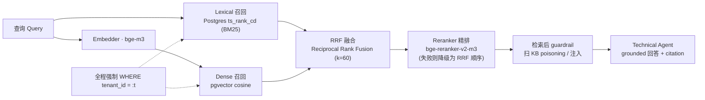

# Milestone 6 — Hybrid Retrieval

**Status:** 已实现（见 [roadmap.md](roadmap.md) Milestone 6）。

**Goal:** 交付 hybrid KB retrieval stack（BM25 + dense + RRF + reranker），让 Technical Agent 产出 KB-grounded、citation-verified 的回答 — 同时抽象 M7（architecture ablation）、M8（chaos/demo）、M9（multi-tenant）所依赖的 interfaces、tenant filtering、observability 与 eval hooks。

**Design principle:** 调库优先（library-first）。复用 database 与现有 frameworks；项目代码仅为 thin orchestration/contract layer。

- BM25 → PostgreSQL `ts_rank_cd`（无自定义 inverted index）
- Dense → pgvector `<=>` cosine（无自定义 ANN engine）
- Embeddings → `langchain-ollama` / `langchain-openai`（无 self-hosted inference）
- Reranker → `sentence-transformers` CrossEncoder（可选 extra，graceful fallback）
- DB access → SQLAlchemy async + psycopg（已在 deps 中）

一次检索把 query 同时走两条召回路（lexical + dense），用 RRF 融合排名，再由 reranker 精排，最后交给 Technical Agent 做带 citation 的回答。两条召回路都强制按 `tenant_id` 过滤。



---

## 1. 交付内容

| 领域 | Implementation |
|---|---|
| Shared types | `retrieval/types.py` — `RetrievedDoc`（统一 contract；`id` = KB doc id，用于 citation + grounding）与 `RetrievalTrace`（observability snapshot） |
| Embedding | `retrieval/embedder.py` — factory 镜像 `core/llm.py`；默认 `bge-m3`（1024-dim，对齐 `kb_documents.embedding vector(1024)`） |
| Store | `retrieval/store.py` — async `dense_search`（pgvector cosine）+ `lexical_search`（Postgres `ts_rank_cd`），均 **forced tenant-scoped** |
| Fusion | `retrieval/fusion.py` — 纯 Reciprocal Rank Fusion（默认 `k=60`），deterministic tie-break |
| Reranker | `retrieval/reranker.py` — lazy `bge-reranker-v2-m3` CrossEncoder；任意 failure（missing extra / no torch / inference error）降级为 RRF order |
| Orchestrator | `retrieval/hybrid.py` — `HybridRetriever` 串联 embedder→store→fusion→reranker；`hybrid` / `dense_only` profiles；输出 OTel span + `RetrievalTrace` |
| Factory | `retrieval/__init__.py` — `get_retriever()`（lazy：首次 `search` 前不连 DB/embedder） |
| Metrics | `retrieval/metrics.py` — Recall@k / proportional Recall@k / MRR@k 纯函数 |
| Agent grounding | `agents/technical.py` 重写：KB retrieve → chunk scan → structured `TechnicalAnswer`，citations verified ⊆ retrieved doc ids（hallucinated ids 丢弃 + flagged） |
| Post-retrieval guardrail | `guardrails/retrieval_filter.py` — 扫描 retrieved chunks 中的 indirect injection / KB poisoning（复用 L1 patterns），quarantine poisoned docs（补齐 M5 仅 input 的 gap） |
| Seed | `scripts/seed_db.py` — 幂等、dim-checked 灌入 53 条 FAQ/runbook docs + embeddings |
| Retrieval eval | `scripts/eval_retrieval.py` — golden set 上 Recall/MRR per profile（hybrid vs dense-only，供 M7 对比 harness） |
| Datasets | `apps/api/tests/fixtures/kb_documents.jsonl`（53 docs）、`apps/api/tests/fixtures/kb_retrieval_golden.jsonl`（22 query→expected-title cases） |
| Tests | `test_retrieval_fusion.py`、`test_retrieval_metrics.py`、`test_retrieval_chunk_scan.py`、重写 `test_technical_agent.py`、guarded `test_retrieval_integration.py` |

---

## 2. 关键文件变更

- Retrieval package：`apps/api/src/resolveai_api/retrieval/{types,embedder,store,fusion,reranker,hybrid,metrics,__init__}.py`
- Technical Agent grounding：`apps/api/src/resolveai_api/agents/technical.py`
- Post-retrieval scan：`apps/api/src/resolveai_api/guardrails/retrieval_filter.py`
- Config surface：`apps/api/src/resolveai_api/config.py`
- Dependencies：`apps/api/pyproject.toml`（`sqlalchemy[asyncio]` for greenlet；optional `rerank` extra）
- Seed + eval scripts：`scripts/seed_db.py`、`scripts/eval_retrieval.py`
- Fixtures：`apps/api/tests/fixtures/kb_documents.jsonl`、`apps/api/tests/fixtures/kb_retrieval_golden.jsonl`
- Tests：`apps/api/tests/test_retrieval_fusion.py`、`test_retrieval_metrics.py`、`test_retrieval_chunk_scan.py`、`test_technical_agent.py`、`test_retrieval_integration.py`

---

## 3. 新增配置项

- Embedding：`EMBEDDING_BACKEND=ollama|openai`、`EMBEDDING_MODEL`（默认 `bge-m3`）、`EMBEDDING_DIM`（默认 `1024`）
- Retrieval：`RETRIEVAL_PROFILE=hybrid|dense_only`、`RETRIEVAL_TOP_K`（5）、`RETRIEVAL_CANDIDATE_K`（50）、`RETRIEVAL_RRF_K`（60）
- Reranker：`RERANKER_ENABLED=on|off`、`RERANKER_MODEL`（默认 `BAAI/bge-reranker-v2-m3`）

`dense_only` 是 roadmap 文档化的 fall-back path，同时作为 M7 ablation variant。

---

## 4. 如何运行

灌 KB（需 Postgres + embedding model，如 `ollama pull bge-m3`）：

```bash
uv run python scripts/seed_db.py --truncate
```

评估 retrieval 质量（hybrid vs dense-only）：

```bash
uv run python scripts/eval_retrieval.py --profiles hybrid,dense_only --k 5
```

启用 reranker（可选，会拉 torch）：

```bash
uv sync --extra rerank   # in apps/api
```

---

## 5. 本 milestone 执行的验证

已执行：

- `uv run python -m pytest apps/api/tests --ignore=apps/api/tests/test_llm_live.py -q` → `85 passed`
- 向 `resolveai-postgres` live seed 53 docs，然后跑 `scripts/eval_retrieval.py`

结果：

- Retrieval eval（golden set，k=5）：`hybrid` 与 `dense_only` 均为 `recall@5=1.000`、`prop_recall@5=1.000`、`mrr@5=1.000`
- Live integration test（lexical search + tenant isolation）对真实 Postgres 通过
- 未安装 `sentence-transformers` 时 reranker 正确降级为 RRF order

覆盖要点：

- RRF fusion math 与 ranking determinism
- Recall@k / MRR@k metric 正确性
- Chunk scanner quarantine KB-poisoning / injection content
- Technical Agent grounding：citations verified ⊆ retrieved ids；hallucinated ids flagged；empty-corpus → escalation

---

## 6. M7 / M8 / M9 的前向适配

- **M7（architecture ablation）：** `RetrievalTrace`（doc ids、per-path ids、latency）与 profile switch 喂给 ablation runner；`eval_retrieval.py` 提供 retrieval-quality 维度。注：当前 golden set 足够简单，hybrid 与 dense-only 均 1.0 — 需增加 keyword-heavy / 更难 query 以展示 hybrid 优势。
- **M8（chaos/demo）：** retrieval 输出 OTel span（`retrieval.search`），含 profile / counts / result ids / latency，供 online regression 与 demo traces。
- **M9（multi-tenant）：** 每次 query 均 `tenant_id`-scoped，可迁移到 Postgres RLS。同一 `HybridRetriever` abstraction 可被 `Memory.search_long_term` 复用，filter 更严（`tenant_id + customer_id`）。

---

## 7. 说明

- Grounding contract（「cited doc ids ⊆ retrieved set」）是干净、deterministic 的信号 — 与 M5 的 `attribution_correct`（针对 guardrail layers，非 KB citations）不同。
- 因 `create_async_engine` 需要 greenlet，必须引入 `sqlalchemy[asyncio]`（现有 checkpointer 直接用 psycopg async，此前未拉入）。
- 未使用的 `rank-bm25` dependency 有意保留；BM25 path 用 Postgres `ts_rank_cd`，后续 cleanup 可删 `rank-bm25`。
