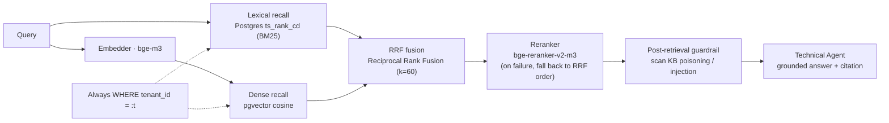

# Milestone 6 — Hybrid Retrieval

**Status:** Implemented (see [roadmap.md](roadmap.md) Milestone 6).

**Goal:** Deliver a hybrid KB retrieval stack (BM25 + dense + RRF + reranker) so the Technical Agent produces KB-grounded, citation-verified answers; also abstract the interfaces, tenant filtering, observability, and eval hooks that M7 (architecture ablation), M8 (chaos load / demo), and M9 (multi-tenant) depend on.

**Design principle:** **Library-first** — reuse the database and existing frameworks; project code is a thin orchestration / contract layer.

- BM25 → PostgreSQL `ts_rank_cd` (no custom inverted index)
- Dense → pgvector `<=>` cosine (no custom ANN engine)
- Embeddings → `langchain-ollama` / `langchain-openai` (no self-hosted inference)
- Reranker → `sentence-transformers` CrossEncoder (optional extra, graceful fallback)
- DB access → SQLAlchemy async + psycopg (already in deps)

A search sends the query down two recall paths (lexical + dense), fuses ranks with RRF, reranks, then hands results to the Technical Agent for a cited answer. Both recall paths are forced to filter by `tenant_id`.



---

## 1. Deliverables

| Area | Implementation |
|---|---|
| Shared types | `retrieval/types.py` — `RetrievedDoc` (unified contract; `id` = KB doc id, used for citation + grounding) and `RetrievalTrace` (observability snapshot) |
| Embedding | `retrieval/embedder.py` — factory mirrors `core/llm.py`; default `bge-m3` (1024-dim, aligned with `kb_documents.embedding vector(1024)`) |
| Store | `retrieval/store.py` — async `dense_search` (pgvector cosine) + `lexical_search` (Postgres `ts_rank_cd`), both **forced tenant-scoped** |
| Fusion | `retrieval/fusion.py` — pure Reciprocal Rank Fusion (default `k=60`), deterministic tie-break |
| Reranker | `retrieval/reranker.py` — lazy `bge-reranker-v2-m3` CrossEncoder; any failure (missing extra / no torch / inference error) falls back to RRF order |
| Orchestrator | `retrieval/hybrid.py` — `HybridRetriever` chains embedder→store→fusion→reranker; `hybrid` / `dense_only` profiles; emits OTel span + `RetrievalTrace` |
| Factory | `retrieval/__init__.py` — `get_retriever()` (lazy: no DB/embedder connection until first `search`) |
| Metrics | `retrieval/metrics.py` — Recall@k / proportional Recall@k / MRR@k pure functions |
| Agent grounding | `agents/technical.py` rewritten: KB retrieve → chunk scan → structured `TechnicalAnswer`, citations verified ⊆ retrieved doc ids (hallucinated ids dropped + flagged) |
| Post-retrieval guardrail | `guardrails/retrieval_filter.py` — scan retrieved chunks for indirect injection / KB poisoning (reuse L1 patterns), quarantine poisoned docs (closes the M5 input-only gap) |
| Seed | `scripts/seed_db.py` — idempotent, dim-checked load of 53 FAQ/runbook docs + embeddings |
| Retrieval eval | `scripts/eval_retrieval.py` — Recall/MRR per profile on the golden set (hybrid vs dense-only, for the M7 comparison harness) |
| Datasets | `apps/api/tests/fixtures/kb_documents.jsonl` (53 docs), `apps/api/tests/fixtures/kb_retrieval_golden.jsonl` (22 query→expected-title cases) |
| Tests | `test_retrieval_fusion.py`, `test_retrieval_metrics.py`, `test_retrieval_chunk_scan.py`, rewritten `test_technical_agent.py`, guarded `test_retrieval_integration.py` |

---

## 2. Key file changes

- Retrieval package: `apps/api/src/resolveai_api/retrieval/{types,embedder,store,fusion,reranker,hybrid,metrics,__init__}.py`
- Technical Agent grounding: `apps/api/src/resolveai_api/agents/technical.py`
- Post-retrieval scan: `apps/api/src/resolveai_api/guardrails/retrieval_filter.py`
- Config surface: `apps/api/src/resolveai_api/config.py`
- Dependencies: `apps/api/pyproject.toml` (`sqlalchemy[asyncio]` for greenlet; optional `rerank` extra)
- Seed + eval scripts: `scripts/seed_db.py`, `scripts/eval_retrieval.py`
- Fixtures: `apps/api/tests/fixtures/kb_documents.jsonl`, `apps/api/tests/fixtures/kb_retrieval_golden.jsonl`
- Tests: `apps/api/tests/test_retrieval_fusion.py`, `test_retrieval_metrics.py`, `test_retrieval_chunk_scan.py`, `test_technical_agent.py`, `test_retrieval_integration.py`

---

## 3. New config

- Embedding: `EMBEDDING_BACKEND=ollama|openai`, `EMBEDDING_MODEL` (default `bge-m3`), `EMBEDDING_DIM` (default `1024`)
- Retrieval: `RETRIEVAL_PROFILE=hybrid|dense_only`, `RETRIEVAL_TOP_K` (5), `RETRIEVAL_CANDIDATE_K` (50), `RETRIEVAL_RRF_K` (60)
- Reranker: `RERANKER_ENABLED=on|off`, `RERANKER_MODEL` (default `BAAI/bge-reranker-v2-m3`)

`dense_only` is the documented fallback path in the roadmap and also an M7 ablation variant.

---

## 4. How to run

Seed the KB (needs Postgres + an embedding model, e.g. `ollama pull bge-m3`):

```bash
uv run python scripts/seed_db.py --truncate
```

Evaluate retrieval quality (hybrid vs dense-only):

```bash
uv run python scripts/eval_retrieval.py --profiles hybrid,dense_only --k 5
```

Enable the reranker (optional; pulls torch):

```bash
uv sync --extra rerank   # from workspace root (root extra forwards to resolveai-api[rerank])
```

Without the extra, the reranker automatically falls back to RRF fusion order. `scripts/eval_retrieval.py` now explicitly prints
`reranker=active|fallback(rrf)|disabled`, and emits an extra WARNING on fallback so you do not think you are scoring the reranker
when you are actually scoring fusion order.

---

## 5. Verification run in this milestone

Ran:

- `uv run python -m pytest apps/api/tests --ignore=apps/api/tests/test_llm_live.py -q` → `85 passed`
- Live-seeded 53 docs into `resolveai-postgres`, then ran `scripts/eval_retrieval.py`

Result:

- Retrieval eval (golden set, k=5): both `hybrid` and `dense_only` at `recall@5=1.000`, `prop_recall@5=1.000`, `mrr@5=1.000`
- Live integration test (lexical search + tenant isolation) passed against real Postgres
- Reranker correctly fell back to RRF order when `sentence-transformers` was not installed

Coverage highlights:

- RRF fusion math and ranking determinism
- Recall@k / MRR@k metric correctness
- Chunk scanner quarantines KB-poisoning / injection content
- Technical Agent grounding: citations verified ⊆ retrieved ids; hallucinated ids flagged; empty-corpus → escalation

---

## 6. Forward fit for M7 / M8 / M9

- **M7 (architecture ablation):** `RetrievalTrace` (doc ids, per-path ids, latency) and the profile switch feed the ablation runner; `eval_retrieval.py` supplies a retrieval-quality dimension. Note: the current golden set is simple enough that hybrid and dense-only both score 1.0 — add keyword-heavy / harder queries to show hybrid’s advantage.
- **M8 (chaos/demo):** retrieval emits an OTel span (`retrieval.search`) with profile / counts / result ids / latency for online regression and demo traces.
- **M9 (multi-tenant):** every query is `tenant_id`-scoped and can move onto Postgres RLS. The same `HybridRetriever` abstraction can be reused by `Memory.search_long_term` with a tighter filter (`tenant_id + customer_id`).

---

## 7. Notes

- The grounding contract (“cited doc ids ⊆ retrieved set”) is a clean, deterministic signal — distinct from M5’s `attribution_correct` (which is about guardrail layers, not KB citations).
- `sqlalchemy[asyncio]` had to be added because `create_async_engine` needs greenlet (the existing checkpointer used psycopg async directly and had not pulled it in).
- Unused `rank-bm25` dependency is kept on purpose; the BM25 path uses Postgres `ts_rank_cd`. A later cleanup can delete `rank-bm25`.
