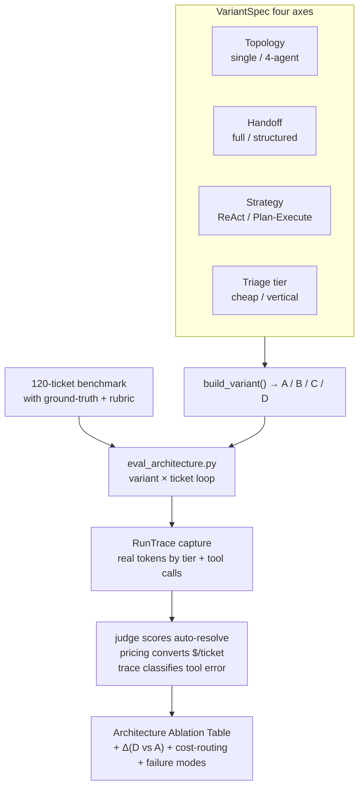

# Milestone 7 — Quantified Architecture Ablation

**Status:** Implemented (see [roadmap.md](roadmap.md) Milestone 7).

**Goal:** Upgrade “I used multi-agent / Plan-and-Execute / structured handoff / cost routing” to “I **benchmarked** the cost and benefit of each choice and can defend every trade-off.” Deliverable: a reusable eval library + a 120-ticket benchmark + a runner that produces an Architecture Ablation Table across 4 contrast configs.

**Design principle:** **Additive + library-first**. The four variants are the same `VariantSpec` with different values on four independent axes; the production path stays on variant **D** via defaults, and M1–M6 behavior is unchanged (108/108 tests pass). Token / tool tracing is a cross-cutting no-op until an eval run activates it.

---

## 1. Four variants

Expressed as a `VariantSpec` (`eval/variants.py`) switching four axes; `build_variant()` returns a uniform `VariantRunner`.

| Variant | Topology | Handoff | Business strategy | Triage tier | What it tests |
|---|---|---|---|---|---|
| **A** | single agent | — | ReAct | vertical | Is multi-agent worth it? |
| **B** | 4 agents | full transcript | Plan-Execute | triage | Value of a *structured* ticket summary |
| **C** | 4 agents | structured | ReAct | triage | Value of Plan-and-Execute vs ReAct |
| **D** | 4 agents | structured | Plan-Execute | triage | Shipped baseline |
| **D_triage_vertical** | 4 agents | structured | Plan-Execute | **vertical** | Cost-routing micro-ablation |

Runs **call the compiled LangGraph directly** (**no guardrail wrapper**), so numbers reflect agent architecture rather than the constant (M5-owned) guardrail layer — especially the vertical-tier policy judge.

The four variants are different values of the same `VariantSpec` on four axes: topology, handoff style, business strategy, and which model tier triage uses. Each variant runs the same 120-ticket benchmark; real tokens / tool calls are captured on the trace; the judge scores whether the ticket was actually resolved; pricing converts to cost; then the Ablation Table is assembled.



---

## 2. Deliverables

| Area | Implementation |
|---|---|
| Token/tool trace | `core/usage.py` — contextvar `RunTrace`; `TierUsageCallback` buckets each chat-model call by cost tier (including Ollama `prompt_eval_count`/`eval_count` fallback); `record_tool_call` records each `Executor` invocation. No-op without an active `capture_run()` |
| Eval trace surface | `eval/trace.py` — re-export `core.usage` primitives + `classify_tool_errors` (failed call / wrong-tool / hallucinated entity) |
| Pricing | `eval/pricing.py` — tier→representative-Anthropic price (triage≈Haiku, vertical≈Sonnet); `cost_usd` makes cost routing visible. Tokens are real; dollars are modeled |
| Resolution judge | `eval/judge.py` — `ResolutionJudge` → structured `ResolutionVerdict(resolved, score, reason)`; runs **outside** the token window so judge tokens do not pollute variant counts |
| Variants | `eval/variants.py` — `VariantSpec` + registry, `VariantRunner`, `build_variant`, `_build_single_agent_graph` (1 LLM + all 12 tools, ReAct) |
| Scoring + report | `eval/arch_scoring.py` — per-variant aggregates (tokens, $/ticket, P50/P95, auto-resolve, tool-error), Ablation Table + `Δ (D vs A)`, cost-routing table, failure-mode report; `render_markdown()` |
| Runner | `scripts/eval_architecture.py` — variant×ticket loop → `reports/arch_eval_<ts>.{jsonl,json,md}`; graceful per-ticket timeout/error handling |
| Benchmark | `apps/api/tests/fixtures/benchmark_tickets.jsonl` — 120 handwritten tickets (72 billing / 36 technical / 12 escalation), ground-truth `expected_intent` / `expected_resolution_path` / `expected_tool_calls` + `rubric`, aligned with MCP mock seed entities |
| Blog draft | Inlined into the README “Benchmark & adversarial research” section |
| Tests | `apps/api/tests/test_arch_eval.py` (17 tests) |

---

## 3. Key file changes

- New eval package: `apps/api/src/resolveai_api/eval/{__init__,trace,pricing,judge,variants,arch_scoring}.py`
- Cross-cutting accounting: `apps/api/src/resolveai_api/core/usage.py`
- LLM factory hooks tier callback: `apps/api/src/resolveai_api/core/llm.py`
- Executor records tool calls: `apps/api/src/resolveai_api/core/executor.py`
- Additive `GraphOptions` refactor: `apps/api/src/resolveai_api/agents/supervisor.py`
- Billing handoff/strategy + ReAct builder: `apps/api/src/resolveai_api/agents/billing.py`, `agents/billing_graph.py`
- Triage tier override + handoff plumbing: `agents/triage.py`, `agents/technical.py`, `agents/escalation.py`
- Runner: `scripts/eval_architecture.py`
- Benchmark + tests: `apps/api/tests/fixtures/benchmark_tickets.jsonl`, `apps/api/tests/test_arch_eval.py`
- Docs: README “Benchmark & adversarial research” section, `docs/roadmap.md`

---

## 4. Metrics

- **Token / ticket** (input + output separately) — real local-Ollama counts, captured by cost tier, including nested Plan-Execute subgraph and structured-output calls (which may never enter message state).
- **$ / ticket** — modeled: each tier priced at a representative Anthropic list price. Token counts are real; only the USD conversion is a model (the benchmark stays free + reproducible while still showing cost-routing economics).
- **Latency P50 / P95** — per-ticket end-to-end wall clock.
- **Auto-resolution rate** — LLM judge against each ticket’s rubric.
- **Tool error rate** — failed/blocked tool call + wrong-tool selection (called tool not in `expected_tool_calls`) + hallucinated-entity flags.

---

## 5. How to run

Full ablation (A/B/C/D) + cost-routing variant:

```bash
uv run python scripts/eval_architecture.py --variants A,B,C,D --cost-routing
```

Quick smoke (3 tickets per class, fewer steps), e.g. a single variant:

```bash
uv run python scripts/eval_architecture.py --variants D --quick --case-timeout 240
```

Output lands in `reports/arch_eval_<ts>.{jsonl,json,md}`; paste the `.md` Ablation Table into the README “Benchmark & adversarial research” section.

> Prereqs for Technical grounded answers: seed the KB first (`uv run python scripts/seed_db.py --truncate`) so the Technical Agent can retrieve real docs instead of falling back to escalation. The runner auto-enables all 5 MCP servers and uses `CHECKPOINT_BACKEND=memory`.

---

## 6. Verification run in this milestone

Ran:

- `uv run python -m pytest -q` → `108 passed` (full suite; confirms the additive refactor is backward compatible — production is still variant D).
- `uv run python -m pytest apps/api/tests/test_arch_eval.py -q` → `17 passed`.
- Live single-ticket smoke (variant D, technical) against Ollama → complete `outcome=ok` row, **real tokens (1277 in / 80 out by tier)**, modeled cost, latency, `agent_path=["triage","technical"]` (`path_match=true`), captured tool calls (`zendesk.get_ticket_history`), scored judge verdict + reason. All three markdown tables rendered.

Coverage highlights:

- Pricing math + cost-routing (same tokens, triage cheaper than vertical).
- `TierUsageCallback` bucketing + Ollama `response_metadata` fallback + no-op when no active trace.
- `classify_tool_errors` covers three error kinds; clean when all calls are expected.
- `arch_scoring` aggregation, percentile interpolation, `Δ (D vs A)`, error-row exclusion.
- `build_variant` smoke for A/B/C/D/D_triage_vertical; `SupervisorGraph` default options == variant D.
- Judge no-LLM paths (blocked / empty answer) and verdict schema bounds.

---

## 7. Honest caveats

- **Headline numbers wait for a full run.** A single billing Plan-Execute ticket on local 9B Ollama can exceed 200s, so the A/B/C/D table deliberately leaves `TBD` (same convention as blog-1) rather than inventing numbers. Paste the generated `.md` after running the harness on the target hardware/model.
- **Variant C mainly affects billing.** The Technical Agent is already a fixed 3-phase pipeline (not Plan-Execute); ReAct ablation is meaningful for billing. State this in the blog; do not hide it.
- **Single-agent (A) has no KB tool.** `kb.search` is in-process (not an MCP tool); variant A sees 12 SaaS tools but no KB grounding — a realistic disadvantage of the single-agent design, noted in the failure-mode write-up.
- One pre-existing ruff warning in `core/checkpointer.py` is unrelated to this milestone and was left alone.

---

## 8. Forward fit for M8 / M9

- **M8 (chaos/demo + online regression):** the same `RunTrace` (tokens by tier + tool calls), `pricing`, `judge`, and `arch_scoring` primitives feed online regression via EvalGate; the Ablation Table is a demo-video artifact.
- **M9 (multi-tenant):** variants already run under namespaced `(tenant, customer, thread)` checkpointing; the harness is tenant-agnostic and can be reused per tenant.
