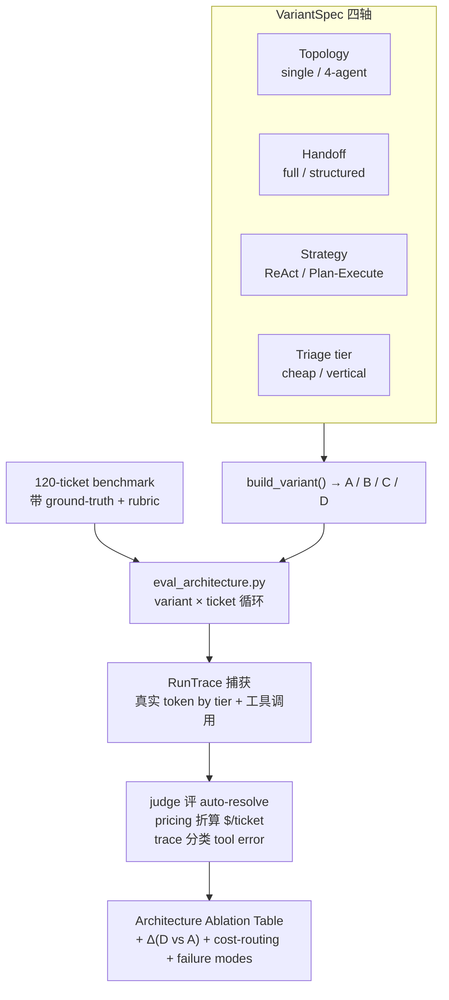

# Milestone 7 — 量化 Architecture Ablation

**Status:** 已实现（见 [roadmap.md](roadmap.md) Milestone 7）。

**Goal（目标）:** 把「我用了 multi-agent / Plan-and-Execute / 结构化 handoff / cost routing」升级为「我 **benchmark 过**每个选择的代价与收益，能为每一个 trade-off 辩护」。交付物：一套可复用的 eval 库 + 120 条 ticket 的 benchmark + 一个能在 4 个对照配置上产出 Architecture Ablation Table 的 runner。

**Design principle（设计原则）:** **增量式（additive）+ 调库优先（library-first）**。四个 variant 其实是同一个 `VariantSpec` 在四条独立轴上的不同取值；生产路径通过默认值保持在 variant **D**，M1–M6 行为完全不变（108/108 测试通过）。Token / 工具追踪是一条横切（cross-cutting）的空操作（no-op），只有 eval run 激活时才生效。

---

## 1. 四个 variant

表达为一个 `VariantSpec`（`eval/variants.py`）切换四轴；`build_variant()` 返回 uniform `VariantRunner`。

| Variant | Topology | Handoff | Business strategy | Triage tier | 验证什么 |
|---|---|---|---|---|---|
| **A** | single agent | — | ReAct | vertical | Multi-agent 是否值得？ |
| **B** | 4 agents | full transcript | Plan-Execute | triage | *Structured* ticket summary 的价值 |
| **C** | 4 agents | structured | ReAct | triage | Plan-and-Execute 相对 ReAct 的价值 |
| **D** | 4 agents | structured | Plan-Execute | triage | 已 ship 的 baseline |
| **D_triage_vertical** | 4 agents | structured | Plan-Execute | **vertical** | Cost-routing micro-ablation |

Runs **直接调用** compiled LangGraph（**无 guardrail wrapper**），数字反映 agent architecture，而非恒定（M5 负责）的 guardrail layer —— 尤其是 vertical-tier 的 policy judge。

四个 variant 其实是同一个 `VariantSpec` 在四条轴上的不同取值：拓扑、handoff 方式、业务策略、triage 用哪档模型。每个 variant 对同一份 120-ticket benchmark 跑一遍，真实 token / 工具调用经 trace 捕获，再由 judge 评是否真解决、由 pricing 折算成本，最后汇成 Ablation Table。



---

## 2. 交付内容

| 领域 | Implementation |
|---|---|
| Token/tool trace | `core/usage.py` — contextvar `RunTrace`；`TierUsageCallback` 按 cost tier 分桶每次 chat-model call（含 Ollama `prompt_eval_count`/`eval_count` fallback）；`record_tool_call` 记录每次 `Executor` invocation。无 active `capture_run()` 时为 no-op |
| Eval trace surface | `eval/trace.py` — re-export `core.usage` primitives + `classify_tool_errors`（failed call / wrong-tool / hallucinated entity） |
| Pricing | `eval/pricing.py` — tier→representative-Anthropic price（triage≈Haiku，vertical≈Sonnet）；`cost_usd` 使 cost routing 可见。Tokens 真实，美元为 modeled |
| Resolution judge | `eval/judge.py` — `ResolutionJudge` → structured `ResolutionVerdict(resolved, score, reason)`；在 token window **外**运行，judge tokens 不污染 variant counts |
| Variants | `eval/variants.py` — `VariantSpec` + registry、`VariantRunner`、`build_variant`、`_build_single_agent_graph`（1 LLM + 全部 12 tools，ReAct） |
| Scoring + report | `eval/arch_scoring.py` — per-variant aggregates（tokens、$/ticket、P50/P95、auto-resolve、tool-error）、Ablation Table + `Δ (D vs A)`、cost-routing table、failure-mode report；`render_markdown()` |
| Runner | `scripts/eval_architecture.py` — variant×ticket loop → `reports/arch_eval_<ts>.{jsonl,json,md}`；graceful per-ticket timeout/error handling |
| Benchmark | `apps/api/tests/fixtures/benchmark_tickets.jsonl` — 120 条手写 ticket（72 billing / 36 technical / 12 escalation），ground-truth `expected_intent` / `expected_resolution_path` / `expected_tool_calls` + `rubric`，对齐 MCP mock seed entities |
| Blog draft | 已内联进 README「Benchmark & 对抗研究」章节 |
| Tests | `apps/api/tests/test_arch_eval.py`（17 tests） |

---

## 3. 关键文件变更

- New eval package：`apps/api/src/resolveai_api/eval/{__init__,trace,pricing,judge,variants,arch_scoring}.py`
- Cross-cutting accounting：`apps/api/src/resolveai_api/core/usage.py`
- LLM factory hooks tier callback：`apps/api/src/resolveai_api/core/llm.py`
- Executor records tool calls：`apps/api/src/resolveai_api/core/executor.py`
- Additive `GraphOptions` refactor：`apps/api/src/resolveai_api/agents/supervisor.py`
- Billing handoff/strategy + ReAct builder：`apps/api/src/resolveai_api/agents/billing.py`、`agents/billing_graph.py`
- Triage tier override + handoff plumbing：`agents/triage.py`、`agents/technical.py`、`agents/escalation.py`
- Runner：`scripts/eval_architecture.py`
- Benchmark + tests：`apps/api/tests/fixtures/benchmark_tickets.jsonl`、`apps/api/tests/test_arch_eval.py`
- Docs：README「Benchmark & 对抗研究」章节、`docs/roadmap.md`

---

## 4. 测量指标

- **Token / ticket**（input + output 分开）— 真实 local-Ollama counts，按 cost tier 捕获，含 nested Plan-Execute sub-graph 与 structured-output calls（可能 never 进入 message state）。
- **$ / ticket** — modeled：每个 tier 按 representative Anthropic list price 计价。Token counts 真实；仅 USD conversion 是 model（benchmark 免费 + 可复现，同时展示 cost-routing economics）。
- **Latency P50 / P95** — 每条 ticket 端到端 wall clock。
- **Auto-resolution rate** — LLM judge 对照每条 ticket 的 rubric。
- **Tool error rate** — failed/blocked tool call + wrong-tool selection（called tool 不在 `expected_tool_calls`）+ hallucinated-entity flags。

---

## 5. 如何运行

全量 ablation（A/B/C/D）+ cost-routing variant：

```bash
uv run python scripts/eval_architecture.py --variants A,B,C,D --cost-routing
```

快速 smoke（每类 3 tickets、更少 steps），例如单 variant：

```bash
uv run python scripts/eval_architecture.py --variants D --quick --case-timeout 240
```

输出落在 `reports/arch_eval_<ts>.{jsonl,json,md}`；将 `.md` Ablation Table 粘贴进 README「Benchmark & 对抗研究」章节。

> Technical grounded answers 的 prereqs：先 seed KB（`uv run python scripts/seed_db.py --truncate`），Technical Agent 才能 retrieve 真实 docs 而非降级 escalation。Runner 自动启用全部 5 个 MCP server，并使用 `CHECKPOINT_BACKEND=memory`。

---

## 6. 本 milestone 执行的验证

已执行：

- `uv run python -m pytest -q` → `108 passed`（全 suite；确认 additive refactor 向后兼容 — 生产仍为 variant D）。
- `uv run python -m pytest apps/api/tests/test_arch_eval.py -q` → `17 passed`。
- Live single-ticket smoke（variant D，technical）对 Ollama → 完整 `outcome=ok` row，**真实 tokens（1277 in / 80 out by tier）**、modeled cost、latency、`agent_path=["triage","technical"]`（`path_match=true`）、captured tool calls（`zendesk.get_ticket_history`）、scored judge verdict + reason。三个 markdown tables 均已渲染。

覆盖要点：

- Pricing math + cost-routing（相同 tokens 下 triage 比 vertical 便宜）。
- `TierUsageCallback` bucketing + Ollama `response_metadata` fallback + 无 active trace 时 no-op。
- `classify_tool_errors` 覆盖三种 error kinds；全部 calls expected 时 clean。
- `arch_scoring` aggregation、percentile interpolation、`Δ (D vs A)`、error-row exclusion。
- `build_variant` smoke for A/B/C/D/D_triage_vertical；`SupervisorGraph` default options == variant D。
- Judge no-LLM paths（blocked / empty answer）与 verdict schema bounds。

---

## 7. 诚实 caveat

- **关键数字待全量 run 后填入。** 本地 9B Ollama 上单条 billing Plan-Execute ticket 可超 200s，故 A/B/C/D 表刻意留 `TBD`（对齐 blog-1 惯例），而非编造。在目标 hardware/model 上跑 harness 后粘贴生成的 `.md`。
- **Variant C 主要影响 billing。** Technical Agent 已是固定 3-phase pipeline（非 Plan-Execute），ReAct ablation 对 billing 有意义；blog 中说明，不隐藏。
- **Single-agent（A）无 KB tool。** `kb.search` 是 in-process（非 MCP tool），variant A 见 12 个 SaaS tools 但无 KB grounding — single-agent 设计的 realistic disadvantage，failure-mode write-up 中注明。
- `core/checkpointer.py` 中一条 pre-existing ruff warning 与本 milestone 无关，未动。

---

## 8. M8 / M9 前向适配

- **M8（chaos/demo + online regression）：** 同一 `RunTrace`（tokens by tier + tool calls）、`pricing`、`judge`、`arch_scoring` primitives 经 EvalGate 喂 online regression；Ablation Table 为 demo video 展示 artifact。
- **M9（multi-tenant）：** variants 已在 namespaced `(tenant, customer, thread)` checkpointing 下运行；harness tenant-agnostic，可按 tenant 复用。
