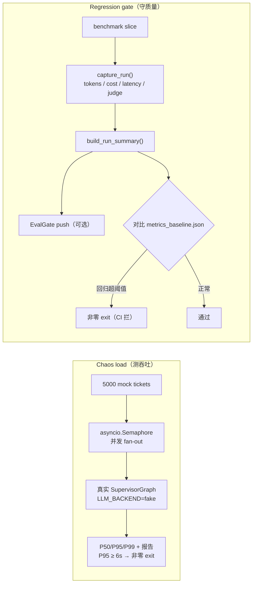

# Milestone 8 — Chaos Demo & 视频 Artifact

**Status:** 已实现（见 [roadmap.md](roadmap.md) Milestone 8）。

**Goal（目标）:** 证明系统**扛得住规模（scale）**，在 M7 的 eval 原语之上接上**在线回归（online regression）**，并把完整故事做成一段**可重复的 demo 视频**。三项交付：

1. 5,000 并发的混沌压测 harness（chaos load）；
2. OTel span → 喂给 EvalGate push + 回归门禁（regression gate）；
3. 自动化的 Playwright 录制器 + 旁白脚本（narration kit）。

**Design principle（设计原则）:** **调库优先（library-first）+ 增量式（additive）**。新增的 `LLM_BACKEND=fake` 把「框架吞吐」与「模型延迟」隔离开；OTel span 与 EvalGate 在未配置时都是空操作（no-op），生产路径不变（121/121 测试通过）。

---

## 1. 交付内容

| 领域 | Implementation |
|---|---|
| Fake LLM backend | `core/_fake_llm.py` — `FakeChatModel` + `FakeStructuredRunnable`；deterministic、零 network。Triage 按 keyword 路由，billing/technical/escalation paths 均可跑。经 `core/llm.py`（+ `config.py`）`LLM_BACKEND=fake` 接入 |
| Chaos load | `scripts/chaos_load.py` — `asyncio.Semaphore` fan-out 生成 mock tickets，走真实 `SupervisorGraph`；P50/P95/P99 + throughput；JSON + markdown report；P95 未达标非零 exit |
| OTel spans | `observability/tracing.py` `get_tracer()/span()` no-op helper；`agents/supervisor.py` 中 `ticket.run` + `agent.{node}` + `guardrail.block` spans；`core/executor.py` 中 `tool.call` span |
| EvalGate | `observability/evalgate.py` — `build_run_summary()`（tokens/cost/tool-error/latency from `RunTrace`）+ `EvalGateClient.push()`（httpx，未设 `EVALGATE_ENDPOINT` 即 no-op，吞 network errors） |
| Regression gate | `scripts/regression_gate.py` — 在 `capture_run()` 下 score benchmark slice（复用 M7 judge/pricing/trace），push summaries 到 EvalGate，对比 `reports/baseline/metrics_baseline.json`，回归则非零 exit（CI 可用） |
| Demo recorder | `apps/web/playwright.config.ts` + `apps/web/demo/record.spec.ts` — 驱动 4 beats，屏幕字幕叠加，录制真实 `webm`；web app 离线时仍能正常出片 |
| Demo artifacts | `scripts/render_metrics_page.py` — `metrics.html`（chaos P95 gauge + ablation table）与 `trace.html`（live guardrail/agent trace，含真实 cross-tenant `PermissionError`） |
| Narration kit | `docs/demo/narration.md`（带时间戳 voiceover + captions）+ `docs/demo/shot-list.md`（run book） |
| Make targets | `chaos`、`regression-gate`、`demo-assets`、`demo-record`、`obs` |
| Tests | `apps/api/tests/test_m8.py`（13 tests） |

三条交付各自的数据流：chaos 测吞吐、regression gate 守质量回归、recorder 产出 demo 视频。



---

## 2. 实测结果

Fake backend 上 chaos load（laptop，`--total 5000 --concurrency 200`）：

| Metric | Value |
|---|---:|
| Tickets completed | 5000 / 5000（0 errors） |
| Throughput | ~1248 req/s |
| Mean latency | 0.15 s |
| P50 latency | 0.15 s |
| **P95 latency** | **0.18 s**（目标 < 6 s → PASS） |
| P99 latency | 0.19 s |

> Fake backend 隔离 **framework** 并发开销（LangGraph orchestration、checkpointer、executor）与 model latency。本地 Ollama 真实端到端 latency 高得多且 CPU-bound；用 `--backend ollama` 且 server 预热可测。P95 < 6s 目标是 framework gate。

Regression gate baseline（`reports/baseline/metrics_baseline.json`，fake backend，variant D，24 tickets）：P95 ≈ 4.6 ms（仅 orchestration），auto-resolve 100%，tool-error 0%，~132 tokens/ticket。对该 baseline 重跑 gate 通过；P95 增 >50% 或 auto-resolve 降 >5pp 则 fail。

---

## 3. 如何运行

```bash
make chaos                       # 5K concurrent，写入 reports/chaos/
make regression-gate             # 对 baseline gate（刷新：--update-baseline）
make demo-assets                 # metrics.html + trace.html
make demo-record                 # 录制视频（先 `make dev`）
make obs                         # 本地 OTel collector（debug exporter）
```

完整录制 run book 见 [`docs/demo/shot-list.md`](demo/shot-list.md)。

---

## 4. 诚实的边界说明（caveat）

- **Demo 是「自动录制」，不是「带配音」。** Playwright 录制器产出的是带字幕的真实 `webm`；旁白（见 `narration.md`）可在 Loom / QuickTime 后期叠加，也可以直接发布「带字幕、无声」的版本。
- **UI 维持现状**（范围内的取舍）。聊天 UI 会显示 agent step 卡片 + 护栏 flag chip + 拦截横幅，但**不**显示工具调用 / trace 时间线 / 租户切换。那些「重 trace」的片段（Layer 高亮、跨租户 `PermissionError`、chaos 指标、ablation 表）改为渲染进 `trace.html` / `metrics.html`，由同一个录制器一并捕获。
- **跨租户拦截在 Layer-4 边界复现。** 设计上，按身份做命名空间隔离后，各 checkpoint key 互不相交，公开的 `stream()` 接口根本撞不到一起；所以 demo 直接触发 `IsolatedCheckpointer` 的元组命名空间校验（这才是真正的「防线」），抛出带精确「命名空间不匹配」信息的 `CrossTenantAccessBlockedError`。
- **Fake backend 的数字只关乎吞吐，不关乎质量。** fake 模式下 token / 美元都是建模出来的占位值；真实的经济性数据要用 Ollama / Anthropic 跑。
- **EvalGate 只负责 push，本地未配置即空操作。** `EvalGateClient.push()` 在设了 `EVALGATE_ENDPOINT` 时才上报 trace 摘要；而已交付的在线回归**门禁**本身，是离线对比 baseline 文件来工作的。

---

## 5. 前向适配

- `ticket.run` / `agent.{node}` / `tool.call` spans 可接真实 Jaeger/Tempo backend（换 collector 的 `debug` exporter）及 M9 per-tenant SLO dashboards。
- `build_run_summary()` 是 online EvalGate push 与 batch regression gate 的单一 payload shape，生产 traces 与 CI regression 计相同 metrics。
- `LLM_BACKEND=fake` 可用于未来 load/perf test 或 fast、deterministic e2e CI（无 model 仍 exercise orchestration）。
