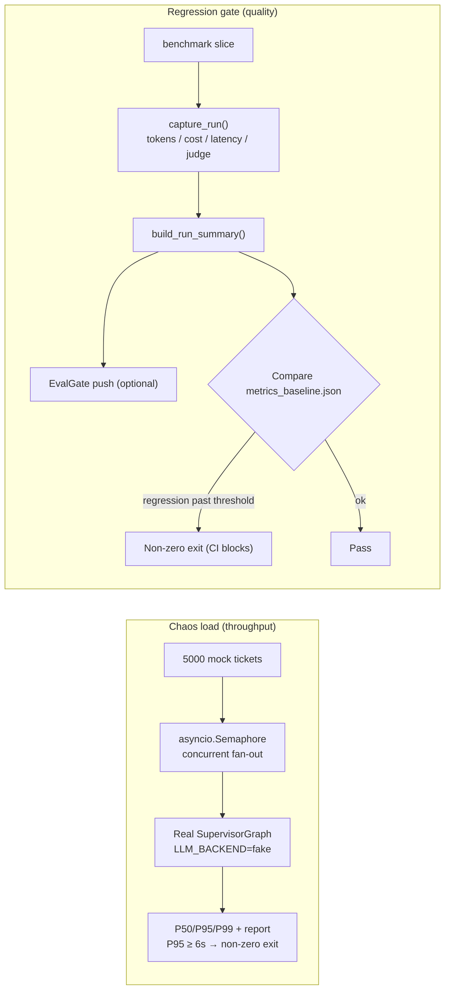

# Milestone 8 — Chaos Demo & video artifact

**Status:** Implemented (see [roadmap.md](roadmap.md) Milestone 8).

**Goal:** Show the system **holds at scale**, attach **online regression** on top of M7 eval primitives, and turn the full story into a **repeatable demo video**. Three deliverables:

1. A 5,000-concurrent chaos load harness;
2. OTel spans → EvalGate push + a regression gate;
3. An automated Playwright recorder + narration kit.

**Design principle:** **Library-first + additive**. New `LLM_BACKEND=fake` isolates “framework throughput” from “model latency”; OTel spans and EvalGate are no-ops when unconfigured, so the production path is unchanged (121/121 tests pass).

---

## 1. Deliverables

| Area | Implementation |
|---|---|
| Fake LLM backend | `core/_fake_llm.py` — `FakeChatModel` + `FakeStructuredRunnable`; deterministic, zero network. Triage routes by keyword; billing/technical/escalation paths all run. Wired via `core/llm.py` (+ `config.py`) `LLM_BACKEND=fake` |
| Chaos load | `scripts/chaos_load.py` — `asyncio.Semaphore` fan-out generates mock tickets through the real `SupervisorGraph`; P50/P95/P99 + throughput; JSON + markdown report; non-zero exit if P95 misses the target |
| OTel spans | `observability/tracing.py` `get_tracer()/span()` no-op helper; `ticket.run` + `agent.{node}` + `guardrail.block` spans in `agents/supervisor.py`; `tool.call` span in `core/executor.py` |
| EvalGate | `observability/evalgate.py` — `build_run_summary()` (tokens/cost/tool-error/latency from `RunTrace`) + `EvalGateClient.push()` (httpx; no-op if `EVALGATE_ENDPOINT` unset; swallows network errors) |
| Regression gate | `scripts/regression_gate.py` — scores a benchmark slice under `capture_run()` (reuses M7 judge/pricing/trace), pushes summaries to EvalGate, compares `reports/baseline/metrics_baseline.json`, non-zero exit on regression (usable in CI) |
| Demo recorder | `apps/web/playwright.config.ts` + `apps/web/demo/record.spec.ts` — drives 4 beats, overlays on-screen captions, records a real `webm`; still produces a video if the web app is offline |
| Demo artifacts | `scripts/render_metrics_page.py` — `metrics.html` (chaos P95 gauge + ablation table) and `trace.html` (live guardrail/agent trace, including a real cross-tenant `PermissionError`) |
| Narration kit | `docs/demo/narration.md` (timestamped voiceover + captions) + `docs/demo/shot-list.md` (run book) |
| Make targets | `chaos`, `regression-gate`, `demo-assets`, `demo-record`, `obs` |
| Tests | `apps/api/tests/test_m8.py` (13 tests) |

Three independent data flows: chaos measures throughput, the regression gate guards quality, the recorder produces the demo video.



---

## 2. Measured results

Chaos load on the fake backend (laptop, `--total 5000 --concurrency 200`):

| Metric | Value |
|---|---:|
| Tickets completed | 5000 / 5000 (0 errors) |
| Throughput | ~1248 req/s |
| Mean latency | 0.15 s |
| P50 latency | 0.15 s |
| **P95 latency** | **0.18 s** (target < 6 s → PASS) |
| P99 latency | 0.19 s |

> The fake backend isolates **framework** concurrency cost (LangGraph orchestration, checkpointer, executor) from model latency. Local Ollama real end-to-end latency is much higher and CPU-bound; measure with `--backend ollama` and a warmed server. The P95 < 6s target is a framework gate.

Regression gate baseline (`reports/baseline/metrics_baseline.json`, fake backend, variant D, 24 tickets): P95 ≈ 4.6 ms (orchestration only), auto-resolve 100%, tool-error 0%, ~132 tokens/ticket. Re-running the gate against that baseline passes; P95 up >50% or auto-resolve down >5pp fails.

---

## 3. How to run

```bash
make chaos                       # 5K concurrent, writes reports/chaos/
make regression-gate             # gate against baseline (refresh: --update-baseline)
make demo-assets                 # metrics.html + trace.html
make demo-record                 # record video (run `make dev` first)
make obs                         # local OTel collector (debug exporter)
```

Full recording run book: [`docs/demo/shot-list.md`](demo/shot-list.md).

---

## 4. Honest caveats

- **The demo is “auto-recorded,” not “voiced.”** The Playwright recorder produces a real `webm` with captions; narration (see `narration.md`) can be overlaid later in Loom / QuickTime, or you can publish the captioned silent version as-is.
- **UI is left as-is** (an in-scope trade-off). The chat UI shows agent-step cards + guardrail flag chips + a block banner, but **does not** show tool calls / a trace timeline / tenant switching. Those “heavy trace” beats (Layer highlight, cross-tenant `PermissionError`, chaos metrics, ablation table) are rendered into `trace.html` / `metrics.html` and captured by the same recorder.
- **Cross-tenant blocking is reproduced at the Layer-4 boundary.** By design, after identity-based namespace isolation, checkpoint keys do not intersect, so the public `stream()` API never collides; the demo therefore triggers `IsolatedCheckpointer` tuple-namespace checks directly (the actual defense), raising `CrossTenantAccessBlockedError` with a precise namespace-mismatch message.
- **Fake-backend numbers are about throughput, not quality.** In fake mode, tokens / dollars are modeled placeholders; real economics need Ollama / Anthropic runs.
- **EvalGate only pushes; locally unconfigured it is a no-op.** `EvalGateClient.push()` reports a trace summary only when `EVALGATE_ENDPOINT` is set; the delivered online regression **gate** itself works by offline comparison against the baseline file.

---

## 5. Forward fit

- `ticket.run` / `agent.{node}` / `tool.call` spans can attach to a real Jaeger/Tempo backend (swap the collector’s `debug` exporter) and M9 per-tenant SLO dashboards.
- `build_run_summary()` is the single payload shape for online EvalGate push and batch regression gate; production traces and CI regression count the same metrics.
- `LLM_BACKEND=fake` can be used for future load/perf tests or fast, deterministic e2e CI (exercise orchestration with no model).
