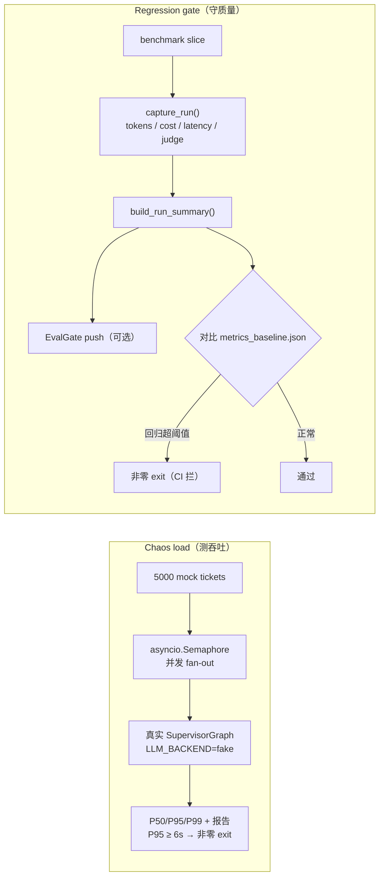

# Milestone 8 — Chaos Demo & 视频 Artifact

**Status:** 已实现（见 [roadmap.md](roadmap.md) Milestone 8）。

**Goal:** 证明系统可 scale，在 M7 eval primitives 之上接 online regression，并把完整故事变成可重复 demo video。三项交付：5K-concurrent chaos load harness、OTel spans  feeding EvalGate push + regression gate、自动化 Playwright recorder + narration kit。

**Design principle:** library-first 且 additive。新 `LLM_BACKEND=fake` 将 framework throughput 与 model latency 隔离；OTel spans 与 EvalGate 未配置时为 no-op，生产路径不变（121/121 tests 绿）。

---

## 1. 交付内容

| 领域 | Implementation |
|---|---|
| Fake LLM backend | `core/_fake_llm.py` — `FakeChatModel` + `FakeStructuredRunnable`；deterministic、零 network。Triage 按 keyword 路由，billing/technical/escalation paths 均可跑。经 `core/llm.py`（+ `config.py`）`LLM_BACKEND=fake` 接入 |
| Chaos load | `scripts/chaos_load.py` — `asyncio.Semaphore` fan-out 生成 mock tickets，走真实 `SupervisorGraph`；P50/P95/P99 + throughput；JSON + markdown report；P95 未达标非零 exit |
| OTel spans | `observability/tracing.py` `get_tracer()/span()` no-op helper；`agents/supervisor.py` 中 `ticket.run` + `agent.{node}` + `guardrail.block` spans；`core/executor.py` 中 `tool.call` span |
| EvalGate | `observability/evalgate.py` — `build_run_summary()`（tokens/cost/tool-error/latency from `RunTrace`）+ `EvalGateClient.push()`（httpx，未设 `EVALGATE_ENDPOINT` 即 no-op，吞 network errors） |
| Regression gate | `scripts/regression_gate.py` — 在 `capture_run()` 下 score benchmark slice（复用 M7 judge/pricing/trace），push summaries 到 EvalGate，对比 `reports/baseline/metrics_baseline.json`，回归则非零 exit（CI 可用） |
| Demo recorder | `apps/web/playwright.config.ts` + `apps/web/demo/record.spec.ts` — 驱动 4 beats，屏幕字幕叠加，录制真实 `webm`；web app 离线时仍能正常出片 |
| Demo artifacts | `scripts/render_metrics_page.py` — `metrics.html`（chaos P95 gauge + ablation table）与 `trace.html`（live guardrail/agent trace，含真实 cross-tenant `PermissionError`） |
| Narration kit | `docs/demo/narration.md`（带时间戳 voiceover + captions）+ `docs/demo/shot-list.md`（run book） |
| Make targets | `chaos`、`regression-gate`、`demo-assets`、`demo-record`、`obs` |
| Tests | `apps/api/tests/test_m8.py`（13 tests） |

三条交付各自的数据流：chaos 测吞吐、regression gate 守质量回归、recorder 产出 demo 视频。



---

## 2. 实测结果

Fake backend 上 chaos load（laptop，`--total 5000 --concurrency 200`）：

| Metric | Value |
|---|---:|
| Tickets completed | 5000 / 5000（0 errors） |
| Throughput | ~1248 req/s |
| Mean latency | 0.15 s |
| P50 latency | 0.15 s |
| **P95 latency** | **0.18 s**（目标 < 6 s → PASS） |
| P99 latency | 0.19 s |

> Fake backend 隔离 **framework** 并发开销（LangGraph orchestration、checkpointer、executor）与 model latency。本地 Ollama 真实端到端 latency 高得多且 CPU-bound；用 `--backend ollama` 且 server 预热可测。P95 < 6s 目标是 framework gate。

Regression gate baseline（`reports/baseline/metrics_baseline.json`，fake backend，variant D，24 tickets）：P95 ≈ 4.6 ms（仅 orchestration），auto-resolve 100%，tool-error 0%，~132 tokens/ticket。对该 baseline 重跑 gate 通过；P95 增 >50% 或 auto-resolve 降 >5pp 则 fail。

---

## 3. 如何运行

```bash
make chaos                       # 5K concurrent，写入 reports/chaos/
make regression-gate             # 对 baseline gate（刷新：--update-baseline）
make demo-assets                 # metrics.html + trace.html
make demo-record                 # 录制视频（先 `make dev`）
make obs                         # 本地 OTel collector（debug exporter）
```

完整录制 run book 见 [`docs/demo/shot-list.md`](demo/shot-list.md)。

---

## 4. 诚实 caveat

- **Demo「录制」是自动化，非旁白。** Playwright recorder 产出真实 captioned `webm`；voiceover（来自 `narration.md`）在 Loom/QuickTime 后加，或直接 ship 带字幕静音视频。
- **UI 保持现状**（scope 决策）。Chat UI 显示 agent step cards + guardrail flag chips + blocked banner，但不显示 tool calls / trace timeline / tenant switching。Trace 重的 beats（Layer 高亮、cross-tenant `PermissionError`、chaos metrics、ablation table）渲染进 `trace.html` / `metrics.html`，由同一 recorder 捕获。
- **Cross-tenant block 在 Layer-4 边界复现。** 设计上 per-identity namespacing 使 checkpoint keys 不相交，公开 `stream()` 无法 collide；demo 直接 exercise `IsolatedCheckpointer` 的 tuple-namespace check（defense of record），抛出带精确 namespace-mismatch message 的 `CrossTenantAccessBlocked`。
- **Fake backend 数字关于 throughput，非 quality。** Fake 下 token/$ 为 modeled placeholders；真实 economics 用 Ollama/Anthropic。
- **EvalGate 仅 push + 本地 no-op。** `EvalGateClient.push()` 在设 `EVALGATE_ENDPOINT` 时 post trace summaries；已提交的 online-regression *gate* 离线对比 baseline file 工作。

---

## 5. 前向适配

- `ticket.run` / `agent.{node}` / `tool.call` spans 可接真实 Jaeger/Tempo backend（换 collector 的 `debug` exporter）及 M9 per-tenant SLO dashboards。
- `build_run_summary()` 是 online EvalGate push 与 batch regression gate 的单一 payload shape，生产 traces 与 CI regression 计相同 metrics。
- `LLM_BACKEND=fake` 可用于未来 load/perf test 或 fast、deterministic e2e CI（无 model 仍 exercise orchestration）。
