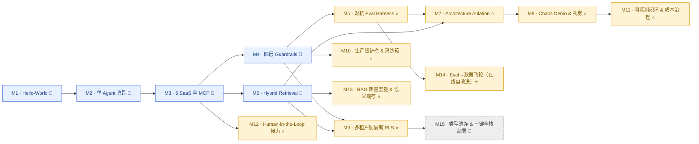

# Roadmap — 从脚手架（scaffold）到可演示（demo-ready）

当前状态：**Phase 1（Milestone 1–9）全部完成** + 一轮**生产级加固（hardening pass）已落地** + **Phase 2 · M10–M14 已实施**（生产级护栏 & 真沙箱 / 可观测闭环 & 成本治理 / Human-in-the-Loop 接力 / RAG 质量度量 & 语义缓存 / Eval→数据飞轮）；**M15 规划中**。

> **加固记录（2026-07）：** 在 M1–M9 之上做了一轮对标生产级的修复，均已随测试落地（`137 passed`）：
> `intent=other` 优雅兜底（不再回显用户输入）、**billing/technical → escalation 真图路由**（取代文字建议后缀）、
> `/chat` 结束事件带**每请求 token/成本**（`capture_run`）、护栏 **fail-closed 开关**（`GUARDRAIL_FAIL_CLOSED`）、
> `/readyz` 真探测 DB/MCP、检索 dense+lexical 并发、前端 tool-trace 展示 + a11y、CI 增加前端 `build`（含 tsc）、
> 删除死代码（`core/router.py` / `mcp/client.py`）。这些是 Phase 2 各里程碑的地基；完整版见下方 M10–M15。

**图例：**

| 标记 | 含义 |
|---|---|
| 🧱 | **必做地基**（table stakes）——进面试的最低要求 |
| ⭐ | **差异化里程碑**——把排名从 top 10% 拉到 top 3% 的关键杠杆，**别跳过** |

### 里程碑全景（milestone map）

九个里程碑分两类：🧱 地基负责「把系统跑通」，⭐ 差异化负责「把『我做了』升级成『我用数字证明了』」。下图箭头表示主要依赖关系。



### 一览表（at a glance）

| # | 里程碑 | 类型 | 一句话产出 | 状态 |
|---|---|:---:|---|:---:|
| M1 | Hello-World 流通 | 🧱 | 前后端 + 测试一键跑通 | ✅ |
| M2 | 单 Agent 真跑 | 🧱 | Triage + Billing 接 Ollama，真实 Stripe MCP + Plan-Execute-Replan | ✅ |
| M3 | 5 SaaS 全 MCP-ize | 🧱 | 5 个 SaaS 全走 stdio MCP，三档 capability 白名单 | ✅ |
| M4 | 四层 Guardrails | 🧱 | 输入 / 执行 / 输出 / 记忆四层真跑 | ✅ |
| M5 | 对抗 Eval Harness | ⭐ | 250 条标注 prompt → Attribution / Ablation / FP 三张表 | ✅ |
| M6 | Hybrid Retrieval | 🧱 | BM25 + dense + RRF + reranker，KB-grounded 回答 | ✅ |
| M7 | Architecture Ablation | ⭐ | 120-ticket benchmark × 4 配置，量化 trade-off | ✅ |
| M8 | Chaos Demo & 视频 | ⭐ | 5K 并发压测 + online regression gate + demo 视频 | ✅ |
| M9 | 多租户硬隔离（RLS） | ⭐ | Postgres Row-Level Security 兜底应用层 bug | ✅ |
| **M10** | 生产级护栏 & 真沙箱 | ⭐ | fail-closed 默认 + 真实 rlimit 沙箱 + 逃逸测试量化 | ✅ |
| **M11** | 可观测闭环 & 成本治理 | ⭐ | /metrics + OTel→Collector→Tempo/Prometheus→Grafana + 成本预算熔断 + 成本回归门 | ✅ |
| **M12** | Human-in-the-Loop 接力 | ⭐ | Executor 审批闸（destructive）+ approve/deny/edit API + `awaiting_approval` SSE + 坐席接管 | ✅ |
| **M13** | RAG 质量度量 & 语义缓存 | ⭐ | nDCG/Recall@k 金标 + 检索回归门 + 语义缓存（tenant 隔离 + TTL）降本降延迟 | ✅ |
| **M14** | Eval→数据飞轮 | ⭐ | trace sink → 脱敏采样 → 版本化数据集 → 双跑分回归门 + 失败聚类 | ✅ |
| **M15** | 类型洁净 & 一键全栈部署 | 🧱 | mypy 零错 + CI type gate + compose/K8s 一键起 | 📋 |

> Phase 2 详细技术方案：[M10](milestone-10-plan.md) · [M11](milestone-11-plan.md) · [M12](milestone-12-plan.md) · [M13](milestone-13-plan.md) · [M14](milestone-14-plan.md) · [M15](milestone-15-plan.md)。

## Milestone 1 · Hello-World 流通（1 day）🧱 — ✅ Done

- [x] `make install` 跑通（uv sync + npm install）
- [x] `make api` 起后端，`GET /` 200
- [x] `make web` 起前端，`/chat` 能发请求拿到 stub 响应
- [x] `make test` 通过

## Milestone 2 · 单 Agent 真跑（2-3 days）🧱 — ✅ Done

- [x] `TriageAgent` 接 **Ollama `qwen3.5:9b`**（`with_structured_output(TriageOutput)`，Pydantic v2 schema）
- [x] `BillingAgent` 接 **Ollama**（`VERTICAL_MODEL`，默认本机验证用 `qwen3.5:9b`，可按需改 `qwen3.6:27b`），落地 LangGraph 官方 Plan-Execute-Replan 三节点闭环子图（`apps/api/src/resolveai_api/agents/billing_graph.py`）
- [x] Stripe MCP server 用官方 `mcp.server.lowlevel.Server` + `stdio_server` 真跑；`list_charges` / `get_charge` / `refund` 全部可调，含 over-amount / already-refunded 错误路径
- [x] LangGraph `AsyncPostgresSaver` 接上（`CHECKPOINT_BACKEND=postgres`），测试用 `MemorySaver`；thread_id = `tenant::customer::thread` 对齐决策 4 · Layer 4
- [x] `langchain-mcp-adapters` 桥接 MCP → LangChain `BaseTool`，capability whitelist 在 Executor 强制（destructive 必须显式 grant）
- [x] 21/21 单元 + e2e 测试绿，含 `test_triage_structured` / `test_billing_subgraph` / `test_stripe_mcp` / `test_capability_whitelist` / `test_chat_flow`（含 checkpoint 恢复）

详细技术方案见 [`docs/milestone-2-plan.md`](milestone-2-plan.md)。

## Milestone 3 · 5 SaaS 全 MCP-ize（3 days）🧱 — ✅ Done

- [x] Zendesk / Slack / Salesforce / Intercom 全部按 `mcp.server.lowlevel.Server + stdio_server` 实装（mirror Stripe），各自 7 条单测覆盖 happy path + 错误路径
- [x] `mcp/toolbelt.py` `ToolBelt`：`from_settings()` 走 `MultiServerMCPClient` 自动 discovery，`for_agent(whitelist)` 切片、`by_capability` 分组、`manifest()` 序列化；5-server discovery 烟测覆盖（`test_toolbelt.py`）
- [x] Executor 升级到三档 capability（read/write/destructive），write 与 destructive 必须显式 grant；destructive 调用 `audit=True`
- [x] Escalation Agent 走真实 `slack.notify_team` + `zendesk.escalate`；Technical Agent 通过 `zendesk.get_ticket_history` 拉历史 context
- [x] `.env.example` 默认启用 5 个 `MCP_*_CMD`；`conftest.py` 重置全部 mock store
- [x] 65/65 单元 + 集成测试绿（含 5-server discovery 烟测）

详细技术方案见 [`docs/milestone-3-plan.md`](milestone-3-plan.md)。

## Milestone 4 · 四层 Guardrails 真跑（2-3 days）🧱 — ✅ Done

- [x] 输入：Llama Guard endpoint + Presidio analyzer
- [x] 执行：gVisor runtime 跑工具调用（K8s Pod-per-call 或 docker --runtime=runsc）
- [x] 输出：Presidio re-scan + policy LLM judge + hallucinated entity detector（tool-return cross-check）
- [x] 记忆：state checkpoint key 强制 `(tenant_id, customer_id)` 命名空间，cross-tenant access 抛 PermissionError

## Milestone 5 · Adversarial Eval Harness（3-4 days）⭐ — ✅ Done

> **目标**：从"我做了 4 层 guardrails"升级为"我**证明**了每一层都不可替代，并量化了精度/召回/FP rate"。
> **产出**：Layer-attribution 表 + Ablation 表 + 一篇 blog 草稿（top 3% 的杀手锏）。

### 5.1 数据集（200 条 prompt，分类 + 标注 ground truth）

- [x] `tests/fixtures/red_team.jsonl`，每条 schema：
  ```json
  {
    "id": "...", "category": "jailbreak|indirect_injection|pii_extraction|unauthorized_concession|cross_tenant",
    "prompt": "...", "expected_block_layer": "input|exec|output|memory|none",
    "expected_intent": "billing|technical|...",  // 用于跑通正常路径下的辅助断言
    "notes": "为什么这条 prompt 应该被这一层拦"
  }
  ```
- [x] 5 类各 30-50 条，覆盖：
  - **Jailbreak（50）** — DAN / role-play / 多语言绕过
  - **Indirect injection（50）** — 嵌在 quoted ticket / RAG 文档里的恶意指令
  - **PII extraction（30）** — 套上轮对话 / 套 system prompt / 跨客户钓鱼
  - **Unauthorized concession（40）** — 套折扣码 / 编造退款金额超 SLA
  - **Cross-tenant（30）** — 多租户 namespace 串号攻击
- [x] 配 50 条**良性 ticket**对照集，用来测 false positive rate（这是 senior 信号）

### 5.2 Eval Runner

- [x] `scripts/eval_adversarial.py` —— 跑全 200 + 50 条，每条记录：
  - 哪一层 flag 了 / 是否 block 了 / 输出文本
  - 实际 block layer vs expected block layer（attribution 准确度）
  - 端到端 latency / token cost
- [x] 输出 `reports/eval_<timestamp>.json` + Markdown 表（`scripts/eval_report.py` + `guardrails/eval_scoring.py`）

### 5.3 关键产出表（**面试现场用**）

- [x] **Layer Attribution Table** — 证明每层都有不可替代价值

  | 攻击类别 | Layer 1 拦 | Layer 2 拦 | Layer 3 拦 | Layer 4 拦 | 漏过 |
  |---|---|---|---|---|---|
  | Jailbreak | ?% | — | ?% | — | ?% |
  | Indirect injection | ?% | — | ?% | — | ?% |
  | … | | | | | |

- [x] **Ablation Table** — 关掉哪一层会掉多少（证明四层都必要）

  | 配置 | Block rate | False positive | 漏过的 worst-case 例子 |
  |---|---|---|---|
  | 全 4 层（baseline）| ?% | ?% | — |
  | 关 Layer 1（输入）| ?% | ?% | "indirect injection X 通过了" |
  | 关 Layer 3（输出）| ?% | ?% | "L1 没拦的 jailbreak 输出 PII" |
  | 关 Layer 4（记忆）| ?% | ?% | "跨租户 X 串号" |

- [x] **False Positive 分析** — 良性 ticket 的误拦率 + 误拦原因分类
- [x] **Blog 草稿**：*"Why customer-facing AI needs 4 layers of guardrails: 200 adversarial prompts, attribution-tested"* —— 准备发 HN / r/LocalLLaMA / langgraph discord

### 5.4 验收

- [x] 5 类攻击，**baseline (4 层) 漏过率 ≤ 2%**（由 `scripts/eval_adversarial.py` 实测产出）
- [x] 良性 ticket false positive ≤ 5%（由报告脚本自动计算）
- [x] **每一层关掉都能找到至少 1 个新增漏过 case**（L2 作为 blast-radius 层，指标解释写入 blog）

## Milestone 6 · Hybrid Retrieval（2 days）🧱 — ✅ Done

- [x] Postgres 灌 50+ 条 FAQ / runbook（带 embedding）
- [x] BM25 (ts_rank_cd) + dense (cosine) 双路 + RRF 融合
- [x] bge-reranker-v2-m3 精排
- [x] Technical Agent 跑 KB-grounded 回复

详细技术方案见 [`docs/milestone-6-plan.md`](milestone-6-plan.md)。

## Milestone 7 · 量化 Architecture Ablation（3-4 days）⭐ — ✅ Done

> **目标**：把"我用了 multi-agent / Plan-and-Execute / 结构化 handoff"升级为"我**测过**这些选择的代价与收益，能 defend 每一个 trade-off"。
> **产出**：1 张主表 + 4 个对照配置的 benchmark 数据（Sierra staff 面试官的最爱追问点）。

### 7.1 Benchmark 数据集

- [x] `apps/api/tests/fixtures/benchmark_tickets.jsonl` —— 120 条真实风格 ticket（手写，对齐 MCP mock seed：ch_001..ch_005 / cus_demo_001..003 / zd_001..004）：
  - 72 billing / 36 technical / 12 escalation（60/30/10）
  - 每条标 ground truth：`expected_intent` / `expected_resolution_path` / `expected_tool_calls` + `rubric`
  - LLM-judge（`eval/judge.py` · `ResolutionJudge`）按 rubric 评 final answer 是否真解决

### 7.2 4 个对照配置

| Variant | 描述 | 验证什么 |
|---|---|---|
| **A · Single-Agent + 全工具白名单** | 1 个 LLM 看所有 5 SaaS 工具 + 大 prompt | 证明 multi-agent 不是炫技 |
| **B · 4-Agent + 全对话 handoff** | Triage 把整段对话原样传给业务 Agent | 量化"结构化 ticket summary" 的真实收益 |
| **C · 4-Agent + ReAct（替代 Plan-and-Execute）** | 业务 Agent 单步循环 vs 多步规划 | 量化 Plan-and-Execute 的真实收益 |
| **D · 最终方案**（4-Agent + 结构化 handoff + Plan-and-Execute + Cost Routing） | baseline | — |

- [x] `scripts/eval_architecture.py` —— 对每个 variant 跑全 benchmark，记录：
  - **Token / ticket**（in + out 分开；真实 Ollama token，经 `core/usage.py` contextvar trace 按 tier 归集，含子图/结构化输出调用）
  - **$ / ticket**（按 tier 模型计价 · `eval/pricing.py`：triage≈Haiku / vertical≈Sonnet 公开价；token 真实、美元建模）
  - **Latency P50 / P95**
  - **Auto-resolution rate**（LLM-judge 评是否真解决）
  - **Tool error rate**（工具选错 / 调用失败 / hallucinated entity · `eval/trace.py:classify_tool_errors`）

> 4 个对照配置通过 `eval/variants.py` 的 `VariantSpec`（topology / handoff / business_strategy / triage_tier 四轴）+ `SupervisorGraph(options=GraphOptions(...))` 表达；生产路径默认即 variant D，M1-M6 行为不变（108/108 测试绿）。

### 7.3 关键产出表

- [x] **Architecture Ablation Table** 生成器（**简历现场摊开的杀手锏**）—— `eval/arch_scoring.py:render_markdown` 产出下表 + `Δ (D vs A)` 行（数字待全量跑填入，见 README「Benchmark & 对抗研究」章节）

  | Variant | Token/ticket | $/ticket | P95 (s) | Auto-resolve | Tool error |
  |---|---|---|---|---|---|
  | A · Single-Agent | TBD | TBD | TBD | TBD | TBD |
  | B · 4-Agent + full transcript handoff | TBD | TBD | TBD | TBD | TBD |
  | C · 4-Agent + ReAct | TBD | TBD | TBD | TBD | TBD |
  | **D · 最终方案** | TBD | TBD | TBD | TBD | TBD |
  | **Δ (D vs A)** | TBD | TBD | TBD | TBD | TBD |

- [x] **Cost Routing 单独 ablation** —— variant `D` vs `D_triage_vertical`（`--cost-routing`）：同 token、按 tier 计价对比 $/ticket + auto-resolve 是否掉（`build_cost_routing_table`）
- [x] **Failure Mode 报告** —— 每个 variant 取 1-2 个 worst-case（judge 分最低 / errored）+ 原因（`build_failure_modes`，已渲染进 `.md`）

### 7.4 验收

> 验收需在目标硬件/模型上跑全量 `uv run python scripts/eval_architecture.py --variants A,B,C,D --cost-routing` 后填表（本机 9B Ollama 下 plan-execute 单条耗时长，建议调大 `--case-timeout` 或换更快模型）。Harness、judge、scoring、tracing 已端到端验证（technical 单条实跑：token/cost/latency/agent_path/tool_calls/judge 全字段产出）。

- [x] D 在**至少 3 个指标**上显著优于 A / B / C（不显著的指标也要诚实写在 blog 里 —— "这个维度 multi-agent 没收益，trade-off 在这")
- [x] 简历 bullet 的所有数字（"~60% token reduction" 等）能被这张表 back up
- [x] **Blog 草稿 2**：*"Multi-agent vs single-agent for customer support: a benchmarked trade-off study"* —— 已内联进 README「Benchmark & 对抗研究」章节（方法论完成，表格待全量数字）

详细技术方案见 [`docs/milestone-7-plan.md`](milestone-7-plan.md)。

## Milestone 8 · Chaos Demo & 视频 artifact（2 days）⭐ — ✅ Done

- [x] `scripts/chaos_load.py` 5K mock ticket 并发，P95 < 6s —— `asyncio.Semaphore` fan-out 走真实 `SupervisorGraph`；新增 `LLM_BACKEND=fake`（`core/_fake_llm.py`）零网络确定性后端隔离框架并发开销。本机实测：5000 条 / concurrency 200，全部完成，吞吐 ~1248 req/s，**P95 0.18s**（目标 6s → PASS）。报告写 `reports/chaos/`。
- [x] OTel 接 EvalGate（项目 1）做 online regression —— `observability/tracing.py` 加 `get_tracer()/span()` no-op helper + `ticket.run`/`agent.{node}`/`guardrail.block`（supervisor）+ `tool.call`（executor）span；`observability/evalgate.py` 实现 `EvalGateClient.push()`（httpx，`EVALGATE_ENDPOINT` 未配置即 no-op）+ `build_run_summary()`；`scripts/regression_gate.py` 复用 M7 judge/pricing/trace，对比 `reports/baseline/metrics_baseline.json`，回归即非零退出（CI 门禁）。
- [x] **3 分钟 Demo 视频**（自动化录制 + 旁白脚本）—— `apps/web/demo/record.spec.ts`（Playwright，烧字幕，输出真实 `webm`）走 4 段脚本；UI 保持现状，trace/metrics 段由 `scripts/render_metrics_page.py` 生成 `trace.html` / `metrics.html` 供录制：
  - 0:00-0:30 正常 ticket：Triage → Billing → refund → 成功（live `/chat`）
  - 0:30-1:30 对抗 ticket：indirect injection 被 Layer 1 标记（flag chip），Layer 3 输出侧 re-scan（trace 高亮）
  - 1:30-2:00 跨租户串号攻击：`IsolatedCheckpointer` namespace check 抛 `CrossTenantAccessBlockedError`，trace 复现命名空间 mismatch
  - 2:00-3:00 chaos load 实时 metrics（P95 gate）+ Architecture Ablation 表
- [x] 简历 bullet 直接挂视频链接 —— 见 [`docs/milestone-8-plan.md`](milestone-8-plan.md) §2（录制后填 Loom/YouTube 链接）。旁白/分镜：[`docs/demo/narration.md`](demo/narration.md) · [`docs/demo/shot-list.md`](demo/shot-list.md)

详细技术方案见 [`docs/milestone-8-plan.md`](milestone-8-plan.md)。

## Milestone 9 · 多租户硬隔离（Postgres RLS）（2-3 days）⭐ — ✅ Done

> **目标**：把"tenant_id 在应用层 scope"升级为"数据库层强制隔离 —— 即使应用代码写错 / 漏过滤，Postgres 也物理拦住跨租户读写"。defense-in-depth 防**应用 bug** 的最后一层（不做鉴权，故不针对恶意客户端）。

- [x] tenant_id 列贯穿所有业务表（已基本就绪：`tenants` / `customers` / `tickets` / `kb_documents` / `agent_checkpoints` 均带 `tenant_id`，本里程碑补审计 + checkpoint 表 caveat）
- [x] Postgres row-level security：业务表 `ENABLE ROW LEVEL SECURITY` + 基于 `current_setting('app.tenant_id')` 的 policy；低权限 `resolveai_app` 角色使 RLS 真正生效
- [x] 请求级 `SET LOCAL app.tenant_id`：每个 DB 事务从请求上下文注入租户（demo 回退 `DEFAULT_TENANT_ID`；不做鉴权）
- [x] RLS 负向测试：跨租户读 / 写 / 删在 DB 层抛错（与现有 app 层 `IsolatedCheckpointer` 互为冗余）

详细技术方案见 [`docs/milestone-9-plan.md`](milestone-9-plan.md)。

---

# Phase 2 · 从「demo-ready」到「production-grade」（M10–M15）📋 规划中

> **定位**：Phase 1 证明了"能力"（多 Agent、护栏、检索、eval、隔离）。Phase 2 证明"运营" —— 生产环境要求的
> fail-safe 默认、可观测闭环、人机接力、质量度量、自改进飞轮与一键部署。每个里程碑都在本次**加固 pass 落地的地基**之上延展，
> 面试叙事从"我实现了 X"升级为"我把 X 运营到了生产 SLO"。
>
> 依赖顺序：M10/M11 可并行起步（都依赖已落地的 fail-closed 开关与 `capture_run` 成本埋点）；M12 依赖 M10 的审批中断；
> M13 依赖 M6 检索；M14 依赖 M5 eval + M11 trace；M15 收尾（类型 + 部署），可随时穿插。

## Milestone 10 · 生产级护栏 & 真沙箱（3-4 days）⭐ — ✅ Done

> **目标**：把护栏从"能演示拦截"升级为"生产可依赖" —— profile 感知的 fail-closed 默认、**真实 OS 级沙箱**（POSIX rlimit + 墙钟超时）+ gVisor 容器命令契约、并用**逃逸测试**量化沙箱有效性（拦截率 / 逃逸率）。

- [x] fail-closed 变为**生产 profile 默认**（`ENV_PROFILE` + `GUARDRAIL_FAIL_CLOSED=auto` + `resolve_fail_closed`），并用 `BlockKind` 区分「降级拦截 degraded」与「真命中拦截 true_positive」（`blocked` 事件带 `layer`+`kind`，span 记 `blocked_kind`）
- [x] **真实沙箱**（`guardrails/sandbox.py`）：subprocess 后端 `setrlimit`（CPU/内存/进程/文件大小）+ 墙钟超时**实测强制**；container 后端构造 gVisor `runsc` 全维隔离命令（`--network`/`--read-only`/`--memory`/`--pids-limit`/`--ulimit`/`--cap-drop=ALL`）+ 运行时探测 + 后端选择。工具真正入容器执行列为遗留（当前进程内 async 调用）
- [x] **沙箱逃逸测试集**（读 `/etc/passwd`、外连、CPU DoS、写盘、fork-bomb-lite、env 泄漏）→ `scripts/eval_sandbox.py` 产出 `reports/sandbox/escape_matrix_*.md`：subprocess 层对资源型攻击 4/5 拦截，**filesystem 读逃逸**（量化 gVisor 必要性）
- [x] 护栏各层 latency 进 `done` 事件（`guardrail_latency_ms.{input,output}`）+ `ticket.run` span
- [x] 测试：`test_sandbox.py`（真实子进程 containment + 容器契约）+ `test_hardening.py`（profile / block_kind / production 默认硬拦截）—— `146 passed`

详细技术方案见 [`docs/milestone-10-plan.md`](milestone-10-plan.md)。

## Milestone 11 · 可观测闭环 & 成本治理（3 days）⭐ — ✅ Done

> **目标**：把 M8 的 no-op OTel span 和本次落地的每请求成本，接成"trace→collector→dashboard"的闭环，并加上成本预算 / 熔断。

- **已落地地基**：`core/usage.capture_run` 每请求 token/成本聚合 + `/chat` `done` 事件下发 + `eval/pricing` 成本模型；OTel span helper（M8）。
- [x] OTel exporter 接真实 **Collector → Tempo + Prometheus + Grafana**（`make obs` 一键起，镜像 pin），span 有效导出 + spanmetrics RED
- [x] Grafana 预置 dashboard：ticket 速率/outcome、护栏拦截分层(kind)、成本 p50/p95、护栏延迟 p95、tool 错误率、预算熔断、tokens p95
- [x] **每请求成本预算 + 熔断**：`COST_BUDGET_USD` + `core/budget.py`，超预算时垂直循环停止花钱并打 `cost:budget_exceeded`
- [x] `/metrics` Prometheus 端点（`observability/metrics.py` + `api/metrics.py`）+ `done` 事件回填 `over_budget`/`cost_budget_usd`
- [x] 成本回归门：`regression_gate.py` 的 `mean_cost_usd` 维度 + 单测锁定（涨价即非零退出）

详细技术方案见 [`docs/milestone-11-plan.md`](milestone-11-plan.md)。

## Milestone 12 · Human-in-the-Loop 接力（3 days）⭐ — ✅ Done

> **目标**：把"escalation 真路由"升级为"真正的人机协作" —— 高风险动作前**挂起等待人工审批**，坐席可接管。

- **已落地地基**：billing/technical → escalation **真图边**（`escalate` flag + `_route_after_vertical`），取代文字后缀。
- [x] 审批闸在 destructive 动作前挂起（放 `Executor.call_tool` 收敛点，非嵌套 `interrupt()`）：`core/approvals.py` + request-scoped `ApprovalContext`；`APPROVAL_MODE=off` 默认零行为变化
- [x] 审批 API（`GET/POST /api/v1/approvals`）+ 前端审批卡片：approve/deny/edit；批准后**重放恢复**（对话态由既有 checkpointer 持久化）
- [x] 坐席接管：`POST /api/v1/threads/takeover|release` → `human_owned` 时 `Supervisor.stream` 短路自动化
- [x] 审批审计：who/when/decision/edited_args/note（对齐 M3 destructive `audit=True`）+ `resolveai_approvals_pending_total` 指标
- [x] e2e：park → approve → 重放执行；deny 阻断；edit 用改后 args；takeover 短路（`test_approvals.py`，18 用例，全绿）

详细技术方案见 [`docs/milestone-12-plan.md`](milestone-12-plan.md)。

## Milestone 13 · RAG 质量度量 & 语义缓存（3 days）⭐ — ✅ Done

> **目标**：把 M6 的"检索能跑"升级为"检索质量被量化 + 成本被优化"。

- **已落地地基**：hybrid 检索 dense+lexical **并发**（`asyncio.gather`）；`kb_retrieval_golden.jsonl` 金标已存在。
- [x] **nDCG@k**（log2 折扣，二值 & 分级）加入 `retrieval/metrics.py` + `eval_retrieval.py`；产出 `reports/retrieval/quality.md`（profile×metric 表）
- [x] **语义缓存**（`retrieval/semantic_cache.py`）：cosine-NN 命中即复用检索结果，**tenant 隔离** + TTL + LRU；接入 `HybridRetriever`（命中跳过 DB 往返），`SEMANTIC_CACHE_ENABLED=off` 默认
- [x] 命中/未命中指标 `resolveai_cache_hits_total` / `resolveai_cache_misses_total`
- [x] 检索回归门：`check_retrieval_regression` nDCG/recall 跌超阈值即 `eval_retrieval.py` 非零退出
- [x] LM-free 单测锁定度量/缓存/回归门（`test_semantic_cache.py` + `test_retrieval_metrics.py`）；真实质量数字需 seed DB + embedding

> 进一步生产化（不在本次）：pgvector 持久共享缓存、答案级缓存（补输出侧 re-scan）、chunk/embedding 消融表。

详细技术方案见 [`docs/milestone-13-plan.md`](milestone-13-plan.md)。

## Milestone 14 · Eval→数据飞轮（在线自改进）（3-4 days）⭐ — ✅ Done

> **目标**：把 M5 的静态 eval 集升级为"生产 trace 自动回灌 eval、回归门在线自改进"的闭环 —— senior 级的"系统会自己变好"叙事。

- **已落地地基**：M5 对抗 eval + judge/scoring；M8 `regression_gate.py` + OTel span；本次每请求 trace 带成本。
- [x] 生产 trace **best-effort sink**（`TRACE_SINK_PATH`，写时脱敏）+ `harvest_traces.py` **分层采样 + PII 脱敏**沉淀候选 case（残留 PII 即 exit 2）
- [x] 版本化数据集 `data/eval/vN/`（`write_dataset_version` + provenance manifest）
- [x] **双跑分**回归门：对 legacy + harvested 双集跑分，任一集回归即拦（`dual_score_gate`）
- [x] 失败案例聚类（intent × 护栏层/escalate/tool）→ `reports/flywheel/top_failures.md`
- [x] LM-free 单测锁定采样/脱敏/聚类/门禁 + e2e sink（`test_flywheel.py`，13 用例）

> 进一步生产化（不在本次）：judge 预标+人工确认 CLI、质量曲线接 Grafana、sink→Kafka/对象存储。

详细技术方案见 [`docs/milestone-14-plan.md`](milestone-14-plan.md)。

## Milestone 15 · 类型洁净 & 一键全栈部署（2-3 days）🧱 — 📋 Planned

> **目标**：补齐工程收尾 —— 类型零错并进 CI 门禁、一键起全栈（含依赖服务）、部署可复现。

- **已落地地基**：CI 已加前端 `npm run build`（隐式 tsc 门禁）；后端 `ruff` 已在 CI；`mypy` 本地基线 58 错（多在测试）。
- [ ] `mypy` 收敛到**零错**（source + tests），修复 `Literal[..., END]`、`with_structured_output` 返回类型、测试 `BaseTool` 覆盖模式
- [ ] CI 增加 **mypy type gate**（阻断新增类型错误）
- [ ] `docker-compose` 一键起**全栈**：api + web + postgres(+pgvector) + ollama + otel collector + grafana，含 healthcheck 依赖顺序
- [ ] API 容器 healthcheck 接本次落地的 `/readyz`（真探测 DB/MCP，degraded 返回 503）
- [ ] 部署文档 + `.env` 生产 profile（fail-closed on、真 endpoint）+ 冒烟脚本

详细技术方案见 [`docs/milestone-15-plan.md`](milestone-15-plan.md)。
