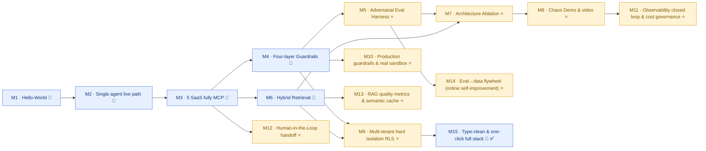

# Roadmap — From scaffold to demo-ready

Current status: **Phase 1 (Milestones 1–9) all complete** + one **production-grade hardening pass landed** + **Phase 2 · M10–M15 implemented** (production-grade guardrails & real sandbox / observability closed loop & cost governance / Human-in-the-Loop handoff / RAG quality metrics & semantic cache / Eval→data flywheel / type-clean & one-click full stack). **Every roadmap milestone has landed.**

> **Hardening notes (2026-07):** On top of M1–M9 we did a production-grade pass, all landed with tests (`137 passed`):
> graceful fallback for `intent=other` (no longer echoing user input), **billing/technical → escalation as a real graph route** (replacing a text-suggestion suffix),
> `/chat` completion events include **per-request tokens/cost** (`capture_run`), guardrail **fail-closed switch** (`GUARDRAIL_FAIL_CLOSED`),
> `/readyz` truly probes DB/MCP, dense+lexical retrieval in parallel, frontend tool-trace display + a11y, CI adds frontend `build` (including tsc),
> dead code removed (`core/router.py` / `mcp/client.py`). These are the foundation for Phase 2 milestones; the full version is in M10–M15 below.

**Legend:**

| Mark | Meaning |
|---|---|
| 🧱 | **Must-have foundation** (table stakes) — minimum bar for interviews |
| ⭐ | **Differentiating milestone** — the lever that moves ranking from top 10% to top 3%; **do not skip** |

### Milestone map

Nine milestones in two classes: 🧱 foundation is about getting the system running; ⭐ differentiation is about upgrading “I built it” into “I proved it with numbers.” Arrows in the diagram are primary dependencies.



### At a glance

| # | Milestone | Type | One-line deliverable | Status |
|---|---|:---:|---|:---:|
| M1 | Hello-World end-to-end | 🧱 | Frontend + backend + tests run with one command | ✅ |
| M2 | Single agent live path | 🧱 | Triage + Billing on Ollama, real Stripe MCP + Plan-Execute-Replan | ✅ |
| M3 | 5 SaaS fully MCP-ized | 🧱 | All 5 SaaS via stdio MCP, three-tier capability whitelist | ✅ |
| M4 | Four-layer Guardrails | 🧱 | Input / exec / output / memory layers actually running | ✅ |
| M5 | Adversarial Eval Harness | ⭐ | 250 labeled prompts → Attribution / Ablation / FP tables | ✅ |
| M6 | Hybrid Retrieval | 🧱 | BM25 + dense + RRF + reranker, KB-grounded answers | ✅ |
| M7 | Architecture Ablation | ⭐ | 120-ticket benchmark × 4 configs, quantified trade-off | ✅ |
| M8 | Chaos Demo & video | ⭐ | 5K concurrent load + online regression gate + demo video | ✅ |
| M9 | Multi-tenant hard isolation (RLS) | ⭐ | Postgres Row-Level Security as a backstop for app-layer bugs | ✅ |
| **M10** | Production guardrails & real sandbox | ⭐ | fail-closed by default + real rlimit sandbox + quantified escape tests | ✅ |
| **M11** | Observability closed loop & cost governance | ⭐ | /metrics + OTel→Collector→Tempo/Prometheus→Grafana + cost-budget circuit breaker + cost regression gate | ✅ |
| **M12** | Human-in-the-Loop handoff | ⭐ | Executor approval gate (destructive) + approve/deny/edit API + `awaiting_approval` SSE + human-agent takeover | ✅ |
| **M13** | RAG quality metrics & semantic cache | ⭐ | nDCG/Recall@k golden set + retrieval regression gate + semantic cache (tenant isolation + TTL) to cut cost and latency | ✅ |
| **M14** | Eval→data flywheel | ⭐ | trace sink → redacted sampling → versioned datasets → dual-score regression gate + failure clustering | ✅ |
| **M15** | Type-clean & one-click full stack | 🧱 | mypy zero errors (source+packages) + CI type gate + `make stack-up` compose one-shot + `make smoke` | ✅ |

> Phase 2 detailed designs: [M10](milestone-10-plan.md) · [M11](milestone-11-plan.md) · [M12](milestone-12-plan.md) · [M13](milestone-13-plan.md) · [M14](milestone-14-plan.md) · [M15](milestone-15-plan.md).

## Milestone 1 · Hello-World end-to-end (1 day) 🧱 — ✅ Done

- [x] `make install` works (uv sync + npm install)
- [x] `make api` starts the backend, `GET /` returns 200
- [x] `make web` starts the frontend, `/chat` can send a request and get a stub response
- [x] `make test` passes

## Milestone 2 · Single agent live path (2-3 days) 🧱 — ✅ Done

- [x] `TriageAgent` wired to **Ollama `qwen3.5:9b`** (`with_structured_output(TriageOutput)`, Pydantic v2 schema)
- [x] `BillingAgent` wired to **Ollama** (`VERTICAL_MODEL`, default local verify with `qwen3.5:9b`, can switch to `qwen3.6:27b` as needed), LangGraph official Plan-Execute-Replan three-node closed-loop subgraph (`apps/api/src/resolveai_api/agents/billing_graph.py`)
- [x] Stripe MCP server runs for real via official `mcp.server.lowlevel.Server` + `stdio_server`; `list_charges` / `get_charge` / `refund` all callable, including over-amount / already-refunded error paths
- [x] LangGraph `AsyncPostgresSaver` wired (`CHECKPOINT_BACKEND=postgres`), tests use `MemorySaver`; thread_id = `tenant::customer::thread` aligned with decision 4 · Layer 4
- [x] `langchain-mcp-adapters` bridges MCP → LangChain `BaseTool`, capability whitelist enforced in Executor (destructive requires an explicit grant)
- [x] 21/21 unit + e2e tests green, including `test_triage_structured` / `test_billing_subgraph` / `test_stripe_mcp` / `test_capability_whitelist` / `test_chat_flow` (including checkpoint resume)

Detailed design: [`docs/milestone-2-plan.md`](milestone-2-plan.md).

## Milestone 3 · 5 SaaS fully MCP-ized (3 days) 🧱 — ✅ Done

- [x] Zendesk / Slack / Salesforce / Intercom all implemented as `mcp.server.lowlevel.Server + stdio_server` (mirroring Stripe), each with 7 unit tests covering happy path + error paths
- [x] `mcp/toolbelt.py` `ToolBelt`: `from_settings()` uses `MultiServerMCPClient` auto-discovery, `for_agent(whitelist)` slices, `by_capability` groups, `manifest()` serializes; 5-server discovery smoke covered (`test_toolbelt.py`)
- [x] Executor upgraded to three-tier capability (read/write/destructive); write and destructive require an explicit grant; destructive calls `audit=True`
- [x] Escalation Agent uses real `slack.notify_team` + `zendesk.escalate`; Technical Agent pulls history context via `zendesk.get_ticket_history`
- [x] `.env.example` enables all 5 `MCP_*_CMD` by default; `conftest.py` resets every mock store
- [x] 65/65 unit + integration tests green (including 5-server discovery smoke)

Detailed design: [`docs/milestone-3-plan.md`](milestone-3-plan.md).

## Milestone 4 · Four-layer Guardrails live (2-3 days) 🧱 — ✅ Done

- [x] Input: Llama Guard endpoint + Presidio analyzer
- [x] Exec: gVisor runtime for tool calls (K8s Pod-per-call or docker --runtime=runsc)
- [x] Output: Presidio re-scan + policy LLM judge + hallucinated entity detector (tool-return cross-check)
- [x] Memory: state checkpoint key forced to `(tenant_id, customer_id)` namespace; cross-tenant access raises PermissionError

## Milestone 5 · Adversarial Eval Harness (3-4 days) ⭐ — ✅ Done

> **Goal:** Upgrade “I built 4 layers of guardrails” to “I **proved** each layer is irreplaceable, and quantified precision / recall / FP rate.”
> **Deliverable:** Layer-attribution table + Ablation table + a blog draft (the top-3% showpiece).

### 5.1 Dataset (200 prompts, classified + labeled ground truth)

- [x] `tests/fixtures/red_team.jsonl`, per-row schema:
  ```json
  {
    "id": "...", "category": "jailbreak|indirect_injection|pii_extraction|unauthorized_concession|cross_tenant",
    "prompt": "...", "expected_block_layer": "input|exec|output|memory|none",
    "expected_intent": "billing|technical|...",  // auxiliary assertion for the happy path
    "notes": "why this prompt should be stopped at this layer"
  }
  ```
- [x] 30–50 items per category, covering:
  - **Jailbreak (50)** — DAN / role-play / multilingual bypass
  - **Indirect injection (50)** — malicious instructions nested in quoted tickets / RAG documents
  - **PII extraction (30)** — fishing prior-turn context / fishing the system prompt / cross-customer phishing
  - **Unauthorized concession (40)** — fishing discount codes / fabricating refund amounts above SLA
  - **Cross-tenant (30)** — multi-tenant namespace mix-up attacks
- [x] Plus 50 **benign tickets** as a control set for false-positive rate (this is a senior signal)

### 5.2 Eval Runner

- [x] `scripts/eval_adversarial.py` — runs all 200 + 50, recording per item:
  - which layer flagged / whether it blocked / output text
  - actual block layer vs expected block layer (attribution accuracy)
  - end-to-end latency / token cost
- [x] Writes `reports/eval_<timestamp>.json` + Markdown tables (`scripts/eval_report.py` + `guardrails/eval_scoring.py`)

### 5.3 Key output tables (**for interviews**)

- [x] **Layer Attribution Table** — shows each layer has irreplaceable value

  | Attack category | Layer 1 blocked | Layer 2 blocked | Layer 3 blocked | Layer 4 blocked | Missed |
  |---|---|---|---|---|---|
  | Jailbreak | ?% | — | ?% | — | ?% |
  | Indirect injection | ?% | — | ?% | — | ?% |
  | … | | | | | |

- [x] **Ablation Table** — how much drops when a layer is off (proves all four are necessary)

  | Config | Block rate | False positive | Worst-case miss |
  |---|---|---|---|
  | All 4 layers (baseline) | ?% | ?% | — |
  | L1 off (input) | ?% | ?% | "indirect injection X got through" |
  | L3 off (output) | ?% | ?% | "jailbreak L1 missed leaked PII in output" |
  | L4 off (memory) | ?% | ?% | "cross-tenant X mix-up" |

- [x] **False Positive analysis** — benign-ticket false-block rate + reason taxonomy
- [x] **Blog draft:** *"Why customer-facing AI needs 4 layers of guardrails: 200 adversarial prompts, attribution-tested"* — ready for HN / r/LocalLLaMA / langgraph discord

### 5.4 Acceptance

- [x] For 5 attack categories, **baseline (4 layers) miss rate ≤ 2%** (measured by `scripts/eval_adversarial.py`)
- [x] Benign-ticket false positive ≤ 5% (computed by the report script)
- [x] **Turning any layer off yields at least 1 additional miss** (L2 is a blast-radius layer; the metric interpretation is written into the blog)

## Milestone 6 · Hybrid Retrieval (2 days) 🧱 — ✅ Done

- [x] Postgres seeded with 50+ FAQ / runbook rows (with embeddings)
- [x] Dual path BM25 (ts_rank_cd) + dense (cosine) + RRF fusion
- [x] bge-reranker-v2-m3 rerank
- [x] Technical Agent produces KB-grounded replies

Detailed design: [`docs/milestone-6-plan.md`](milestone-6-plan.md).

## Milestone 7 · Quantified Architecture Ablation (3-4 days) ⭐ — ✅ Done

> **Goal:** Upgrade “I used multi-agent / Plan-and-Execute / structured handoff” to “I **measured** the cost and benefit of each choice and can defend every trade-off.”
> **Deliverable:** 1 primary table + benchmark data for 4 contrast configs (a favorite follow-up from Sierra staff interviewers).

### 7.1 Benchmark dataset

- [x] `apps/api/tests/fixtures/benchmark_tickets.jsonl` — 120 realistic-style tickets (handwritten, aligned with MCP mock seed: ch_001..ch_005 / cus_demo_001..003 / zd_001..004):
  - 72 billing / 36 technical / 12 escalation (60/30/10)
  - Each labeled with ground truth: `expected_intent` / `expected_resolution_path` / `expected_tool_calls` + `rubric`
  - LLM-judge (`eval/judge.py` · `ResolutionJudge`) scores whether the final answer actually resolved the ticket against the rubric

### 7.2 Four contrast configs

| Variant | Description | What it tests |
|---|---|---|
| **A · Single-Agent + full tool whitelist** | 1 LLM sees all 5 SaaS tools + a large prompt | Shows multi-agent is not a vanity play |
| **B · 4-Agent + full-transcript handoff** | Triage forwards the entire conversation as-is to the business Agent | Quantifies the real gain from a structured ticket summary |
| **C · 4-Agent + ReAct (instead of Plan-and-Execute)** | Business Agent single-step loop vs multi-step planning | Quantifies the real gain from Plan-and-Execute |
| **D · Final design** (4-Agent + structured handoff + Plan-and-Execute + Cost Routing) | baseline | — |

- [x] `scripts/eval_architecture.py` — runs the full benchmark per variant, recording:
  - **Token / ticket** (in + out separately; real Ollama tokens, aggregated by tier via `core/usage.py` contextvar trace, including subgraph / structured-output calls)
  - **$ / ticket** (priced by tier model · `eval/pricing.py`: triage≈Haiku / vertical≈Sonnet public prices; tokens are real, dollars are modeled)
  - **Latency P50 / P95**
  - **Auto-resolution rate** (LLM-judge: whether it actually resolved)
  - **Tool error rate** (wrong tool / call failed / hallucinated entity · `eval/trace.py:classify_tool_errors`)

> The four contrast configs are expressed as `VariantSpec` in `eval/variants.py` (topology / handoff / business_strategy / triage_tier) + `SupervisorGraph(options=GraphOptions(...))`; the production path defaults to variant D; M1–M6 behavior is unchanged (108/108 tests green).

### 7.3 Key output tables

- [x] **Architecture Ablation Table** generator (**the interview showpiece**) — `eval/arch_scoring.py:render_markdown` produces the table below + a `Δ (D vs A)` row (numbers TBD until a full run; see the README “Benchmark & adversarial research” section)

  | Variant | Token/ticket | $/ticket | P95 (s) | Auto-resolve | Tool error |
  |---|---|---|---|---|---|
  | A · Single-Agent | TBD | TBD | TBD | TBD | TBD |
  | B · 4-Agent + full transcript handoff | TBD | TBD | TBD | TBD | TBD |
  | C · 4-Agent + ReAct | TBD | TBD | TBD | TBD | TBD |
  | **D · Final design** | TBD | TBD | TBD | TBD | TBD |
  | **Δ (D vs A)** | TBD | TBD | TBD | TBD | TBD |

- [x] **Cost Routing standalone ablation** — variant `D` vs `D_triage_vertical` (`--cost-routing`): same tokens, compare $/ticket by tier pricing + whether auto-resolve drops (`build_cost_routing_table`)
- [x] **Failure Mode report** — 1–2 worst cases per variant (lowest judge score / errored) + reasons (`build_failure_modes`, already rendered into `.md`)

### 7.4 Acceptance

> Acceptance requires filling the table after a full run of `uv run python scripts/eval_architecture.py --variants A,B,C,D --cost-routing` on the target hardware/model (on local 9B Ollama, plan-execute cases are slow; raise `--case-timeout` or use a faster model). Harness, judge, scoring, and tracing are already verified end-to-end (single technical live run: token/cost/latency/agent_path/tool_calls/judge all populated).

- [x] D is significantly better than A / B / C on **at least 3 metrics** (metrics that are not significant should still be written honestly in the blog — “multi-agent has no gain on this axis; the trade-off is here”)
- [x] Every number on the resume bullet (e.g. “~60% token reduction”) can be backed by this table
- [x] **Blog draft 2:** *"Multi-agent vs single-agent for customer support: a benchmarked trade-off study"* — already inlined into the README “Benchmark & adversarial research” section (methodology done; table awaits full-run numbers)

Detailed design: [`docs/milestone-7-plan.md`](milestone-7-plan.md).

## Milestone 8 · Chaos Demo & video artifact (2 days) ⭐ — ✅ Done

- [x] `scripts/chaos_load.py` 5K mock tickets concurrent, P95 < 6s — `asyncio.Semaphore` fan-out through the real `SupervisorGraph`; added `LLM_BACKEND=fake` (`core/_fake_llm.py`) as a zero-network deterministic backend to isolate framework concurrency cost. Local measurement: 5000 tickets / concurrency 200, all completed, throughput ~1248 req/s, **P95 0.18s** (target 6s → PASS). Reports written to `reports/chaos/`.
- [x] OTel wired to EvalGate (project 1) for online regression — `observability/tracing.py` adds `get_tracer()/span()` no-op helper + `ticket.run`/`agent.{node}`/`guardrail.block` (supervisor) + `tool.call` (executor) spans; `observability/evalgate.py` implements `EvalGateClient.push()` (httpx; no-op if `EVALGATE_ENDPOINT` is unset) + `build_run_summary()`; `scripts/regression_gate.py` reuses M7 judge/pricing/trace, compares against `reports/baseline/metrics_baseline.json`, non-zero exit on regression (CI gate).
- [x] **3-minute demo video** (automated recording + narration script) — `apps/web/demo/record.spec.ts` (Playwright, burned-in captions, real `webm`) walks 4 beats; UI stays as-is; trace/metrics beats use `scripts/render_metrics_page.py` to generate `trace.html` / `metrics.html` for recording:
  - 0:00-0:30 normal ticket: Triage → Billing → refund → success (live `/chat`)
  - 0:30-1:30 adversarial ticket: indirect injection flagged by Layer 1 (flag chip), Layer 3 output-side re-scan (trace highlight)
  - 1:30-2:00 cross-tenant mix-up: `IsolatedCheckpointer` namespace check raises `CrossTenantAccessBlockedError`, trace shows namespace mismatch
  - 2:00-3:00 chaos load live metrics (P95 gate) + Architecture Ablation table
- [x] Resume bullet links the video — see [`docs/milestone-8-plan.md`](milestone-8-plan.md) §2 (fill Loom/YouTube URL after recording). Narration/shot list: [`docs/demo/narration.md`](demo/narration.md) · [`docs/demo/shot-list.md`](demo/shot-list.md)

Detailed design: [`docs/milestone-8-plan.md`](milestone-8-plan.md).

## Milestone 9 · Multi-tenant hard isolation (Postgres RLS) (2-3 days) ⭐ — ✅ Done

> **Goal:** Upgrade “tenant_id is scoped in the app layer” to “the database enforces isolation — even if application code is wrong / forgets a filter, Postgres physically blocks cross-tenant reads and writes.” Last defense-in-depth layer against **application bugs** (this is not auth, so it is not aimed at a malicious client).

- [x] tenant_id column on all business tables (mostly already in place: `tenants` / `customers` / `tickets` / `kb_documents` / `agent_checkpoints` all have `tenant_id`; this milestone adds audit + checkpoint-table caveat)
- [x] Postgres row-level security: `ENABLE ROW LEVEL SECURITY` on business tables + policy based on `current_setting('app.tenant_id')`; low-privilege `resolveai_app` role so RLS actually takes effect
- [x] Request-scoped `SET LOCAL app.tenant_id`: each DB transaction injects the tenant from request context (demo falls back to `DEFAULT_TENANT_ID`; no auth)
- [x] RLS negative tests: cross-tenant read / write / delete fail at the DB layer (redundant with existing app-layer `IsolatedCheckpointer`)

Detailed design: [`docs/milestone-9-plan.md`](milestone-9-plan.md).

---

# Phase 2 · From “demo-ready” to “production-grade” (M10–M15) ✅ Implemented

> **Positioning:** Phase 1 proved capability (multi-agent, guardrails, retrieval, eval, isolation). Phase 2 proves operations — the fail-safe defaults, observability closed loop, human handoff, quality metrics, self-improvement flywheel, and one-click deploy that production requires. Each milestone extends the **foundation landed in the hardening pass**, and the interview story upgrades from “I implemented X” to “I operated X to a production SLO.”
>
> Dependency order: M10/M11 can start in parallel (both depend on the landed fail-closed switch and `capture_run` cost instrumentation); M12 depends on M10’s approval interrupt;
> M13 depends on M6 retrieval; M14 depends on M5 eval + M11 traces; M15 is wrap-up (types + deploy) and can be interleaved anytime.

## Milestone 10 · Production guardrails & real sandbox (3-4 days) ⭐ — ✅ Done

> **Goal:** Upgrade guardrails from “can demo a block” to “dependable in production” — profile-aware fail-closed defaults, a **real OS-level sandbox** (POSIX rlimit + wall-clock timeout) + gVisor container command contract, and **escape tests** that quantify sandbox effectiveness (block rate / escape rate).

- [x] fail-closed becomes the **production-profile default** (`ENV_PROFILE` + `GUARDRAIL_FAIL_CLOSED=auto` + `resolve_fail_closed`), and `BlockKind` distinguishes “degraded block” from “true-positive block” (`blocked` events carry `layer`+`kind`; spans record `blocked_kind`)
- [x] **Real sandbox** (`guardrails/sandbox.py`): subprocess backend `setrlimit` (CPU/memory/process/file size) + wall-clock timeout **actually enforced**; container backend builds a full-dimension gVisor `runsc` isolation command (`--network`/`--read-only`/`--memory`/`--pids-limit`/`--ulimit`/`--cap-drop=ALL`) + runtime probe + backend selection. Running tools inside the container is leftover work (today: in-process async calls)
- [x] **Sandbox escape test set** (read `/etc/passwd`, outbound connect, CPU DoS, disk write, fork-bomb-lite, env leak) → `scripts/eval_sandbox.py` writes `reports/sandbox/escape_matrix_*.md`: subprocess layer blocks 4/5 resource attacks, **filesystem read escape** (quantifies why gVisor is needed)
- [x] Per-layer guardrail latency on `done` events (`guardrail_latency_ms.{input,output}`) + `ticket.run` span
- [x] Tests: `test_sandbox.py` (real subprocess containment + container contract) + `test_hardening.py` (profile / block_kind / production-default hard block) — `146 passed`

Detailed design: [`docs/milestone-10-plan.md`](milestone-10-plan.md).

## Milestone 11 · Observability closed loop & cost governance (3 days) ⭐ — ✅ Done

> **Goal:** Connect M8’s no-op OTel spans and the landed per-request cost into a “trace→collector→dashboard” loop, plus cost budget / circuit breaker.

- **Foundation already landed:** `core/usage.capture_run` per-request token/cost aggregation + `/chat` `done` event + `eval/pricing` cost model; OTel span helper (M8).
- [x] OTel exporter wired to a real **Collector → Tempo + Prometheus + Grafana** (`make obs` one-shot, image pins), spans actually exported + spanmetrics RED
- [x] Grafana preset dashboard: ticket rate/outcome, guardrail blocks by layer (kind), cost p50/p95, guardrail latency p95, tool error rate, budget circuit breaker, tokens p95
- [x] **Per-request cost budget + circuit breaker:** `COST_BUDGET_USD` + `core/budget.py`; when over budget the vertical loop stops spending and emits `cost:budget_exceeded`
- [x] `/metrics` Prometheus endpoint (`observability/metrics.py` + `api/metrics.py`) + `done` events backfill `over_budget`/`cost_budget_usd`
- [x] Cost regression gate: `mean_cost_usd` dimension in `regression_gate.py` + unit tests that lock it (price increase → non-zero exit)

Detailed design: [`docs/milestone-11-plan.md`](milestone-11-plan.md).

## Milestone 12 · Human-in-the-Loop handoff (3 days) ⭐ — ✅ Done

> **Goal:** Upgrade “escalation is a real route” to “real human–machine collaboration” — **suspend and wait for human approval** before high-risk actions; a human agent can take over.

- **Foundation already landed:** billing/technical → escalation **real graph edge** (`escalate` flag + `_route_after_vertical`), replacing a text suffix.
- [x] Approval gate suspends before destructive actions (at the `Executor.call_tool` choke point, not nested `interrupt()`): `core/approvals.py` + request-scoped `ApprovalContext`; `APPROVAL_MODE=off` default is zero behavior change
- [x] Approval API (`GET/POST /api/v1/approvals`) + frontend approval card: approve/deny/edit; after approve, **replay resume** (conversation state persisted by the existing checkpointer)
- [x] Human-agent takeover: `POST /api/v1/threads/takeover|release` → when `human_owned`, `Supervisor.stream` short-circuits automation
- [x] Approval audit: who/when/decision/edited_args/note (aligned with M3 destructive `audit=True`) + `resolveai_approvals_pending_total` metric
- [x] e2e: park → approve → replay execute; deny blocks; edit uses revised args; takeover short-circuits (`test_approvals.py`, 18 cases, all green)

Detailed design: [`docs/milestone-12-plan.md`](milestone-12-plan.md).

## Milestone 13 · RAG quality metrics & semantic cache (3 days) ⭐ — ✅ Done

> **Goal:** Upgrade M6’s “retrieval runs” to “retrieval quality is measured + cost is optimized.”

- **Foundation already landed:** hybrid retrieval dense+lexical **concurrent** (`asyncio.gather`); `kb_retrieval_golden.jsonl` golden set already exists.
- [x] **nDCG@k** (log2 discount, binary & graded) added to `retrieval/metrics.py` + `eval_retrieval.py`; writes `reports/retrieval/quality.md` (profile×metric table)
- [x] **Semantic cache** (`retrieval/semantic_cache.py`): cosine-NN hit reuses retrieval results, **tenant isolation** + TTL + LRU; wired into `HybridRetriever` (hit skips DB round-trip); `SEMANTIC_CACHE_ENABLED=off` by default
- [x] Hit/miss metrics `resolveai_cache_hits_total` / `resolveai_cache_misses_total`
- [x] Retrieval regression gate: `check_retrieval_regression` non-zero-exits `eval_retrieval.py` if nDCG/recall drop past threshold
- [x] LM-free unit tests lock metrics/cache/regression gate (`test_semantic_cache.py` + `test_retrieval_metrics.py`); real quality numbers need a seeded DB + embeddings

> Further productionization (out of scope this pass): pgvector persistent shared cache, answer-level cache (plus output-side re-scan), chunk/embedding ablation table.

Detailed design: [`docs/milestone-13-plan.md`](milestone-13-plan.md).

## Milestone 14 · Eval→data flywheel (online self-improvement) (3-4 days) ⭐ — ✅ Done

> **Goal:** Upgrade M5’s static eval set to a closed loop where “production traces automatically refill eval, and the regression gate self-improves online” — the senior-level “the system gets better by itself” story.

- **Foundation already landed:** M5 adversarial eval + judge/scoring; M8 `regression_gate.py` + OTel spans; this pass’s per-request traces include cost.
- [x] Production-trace **best-effort sink** (`TRACE_SINK_PATH`, redact on write) + `harvest_traces.py` **stratified sampling + PII redaction** to land candidate cases (residual PII → exit 2)
- [x] Versioned datasets `data/eval/vN/` (`write_dataset_version` + provenance manifest)
- [x] **Dual-score** regression gate: score both legacy + harvested sets; regression on either set blocks (`dual_score_gate`)
- [x] Failure clustering (intent × guardrail layer/escalate/tool) → `reports/flywheel/top_failures.md`
- [x] LM-free unit tests lock sampling/redaction/clustering/gate + e2e sink (`test_flywheel.py`, 13 cases)

> Further productionization (out of scope this pass): judge pre-label + human-confirm CLI, quality curves in Grafana, sink→Kafka/object storage.

Detailed design: [`docs/milestone-14-plan.md`](milestone-14-plan.md).

## Milestone 15 · Type-clean & one-click full stack (2-3 days) 🧱 — ✅ Done

> **Goal:** Finish the engineering wrap-up — zero type errors in CI, one-click full stack (including dependency services), reproducible deploys.

- [x] `mypy apps/api/src packages` **zero errors**: fix `Literal[..., END]`→`str`, `FakeStructuredRunnable` inherits `Runnable`, checkpointer override uses `RunnableConfig`, covariant `callbacks` annotations, etc. (annotations only, no behavior change)
- [x] CI adds a **mypy type gate** (`.github/workflows/ci.yml` ruff→mypy→pytest, blocks new type errors); scope is source+packages; tests are not included yet
- [x] `docker-compose.full.yml` + `make stack-up` one-shot **full stack**: postgres(+pgvector) + api + web, healthcheck dependency order (web→api→postgres); observability stack / KB seed via `--profile obs` / `--profile seed`
- [x] API container healthcheck uses `/healthz` (liveness); `/readyz` truly probes DB/MCP for smoke/orchestration
- [x] `scripts/smoke.sh` (`make smoke`): wait for health → report readyz → wait for web → chat SSE round-trip assertion; default `LLM_BACKEND=fake` so it starts with zero model downloads

> Honest note: this environment did not run a full image build (heavy, slow); we only verified `docker compose config` wiring and healthcheck order. Full `make stack-up` + `make smoke` is the operator/CI acceptance path.

Detailed design: [`docs/milestone-15-plan.md`](milestone-15-plan.md).
