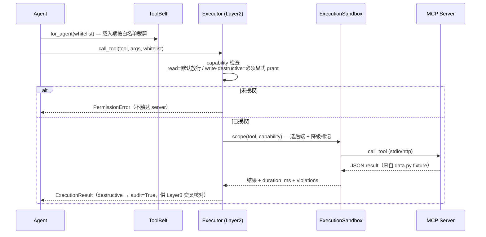

# Mock MCP Servers

5 个 SaaS 工具的 mock 实现，全部用**官方 [`mcp` Python SDK](https://modelcontextprotocol.io)** 按 [Model Context Protocol](https://modelcontextprotocol.io) 规范暴露 `list_tools` / `call_tool`。它们让整套多 Agent 客服系统可以在**不接真实 Stripe/Zendesk/…** 的情况下端到端跑通、被测试、被对抗评测。

> 为什么是 mock 而不是真连？—— 面试 / demo 场景要**确定性**（可重放的测试数据）、**零凭据**（不泄露真实 API key）、**零副作用**（`refund`/`escalate` 不会真的动钱动人）。协议层与真实 MCP server **完全一致**，换成生产实现时 Agent 侧一行不用改。

---

## 1. 在整体架构中的位置

```mermaid
flowchart LR
  subgraph agent["业务 Agent（Billing / Technical / Escalation）"]
    plan["规划 / 决策"] --> tb["ToolBelt.for_agent()<br/>按 TOOL_WHITELIST 过滤"]
  end
  tb --> ex["Executor.call_tool()<br/>Layer2 capability 检查 + sandbox scope"]
  ex --> loader["mcp/loader.py<br/>MCP Tool → LangChain BaseTool"]
  loader -->|stdio (dev) / HTTP+SSE (prod)| srv
  subgraph srv["MCP Servers（本目录）"]
    z["zendesk"]
    s["stripe"]
    sl["slack"]
    sf["salesforce"]
    ic["intercom"]
  end
  z & s & sl & sf & ic --> dat["data.py<br/>内存 fixtures（确定性）"]
  classDef gate fill:#fff3cd,stroke:#d39e00,color:#7a5c00;
  class ex gate;
```

一次工具调用的完整生命周期：



---

## 2. Server & 工具清单

| Server | 工具 | capability | 输入（必填） | 说明 |
|---|---|---|---|---|
| **zendesk** | `get_ticket_history` | `read` | `customer_id` | 拉某客户全部工单（新→旧） |
| | `update_ticket` | `write` | `ticket_id` | 改状态 / 追加内部备注（`status` ∈ open·pending·solved·escalated） |
| | `escalate` | `destructive` | `ticket_id`, `reason` | 升级到人工；`audit=True` |
| **stripe** | `list_charges` | `read` | `customer_id` | 列最近扣款（`limit` 默认 10） |
| | `get_charge` | `read` | `charge_id` | 单笔扣款详情 |
| | `refund` | `destructive` | `charge_id` | 全额/部分退款（`amount` 为分，省略=全额）；`audit=True` |
| **slack** | `notify_team` | `write` | `channel`, `message` | on-call 通知，可 `@mention`；Escalation 用于人工接力 |
| | `post_message` | `write` | `channel`, `message` | 普通消息（无 mention） |
| **salesforce** | `get_account` | `read` | `customer_id` | 查账户 |
| | `update_opportunity` | `write` | `opportunity_id` | 改商机 stage/amount |
| **intercom** | `get_conversation` | `read` | `conversation_id` | 查会话 |
| | `tag_user` | `write` | `user_id`, `tag` | 给用户打标签 |

> `kb.search`（技术 Agent 的检索工具）**不在**本目录——它由 `HybridRetriever` 进程内直接服务，无需 MCP。

---

## 3. Capability 三级 + 最小权限矩阵（决策 4 · 护栏 Layer 2）

每个工具声明一个 `capability`，`core/executor.py` 在**调用时**据此强制最小权限：

| capability | 规则 | 审计 |
|---|---|---|
| `read` | **默认放行**（即使不在白名单）—— 业务 Agent 通常需要读 | 否 |
| `write` | 必须在该 Agent 的 `TOOL_WHITELIST` 里**显式 grant** | 否 |
| `destructive` | 必须**显式 grant** + 自动标 `audit=True`，供 Layer 3 输出护栏交叉核对 | 是 |

各 Agent 实际被授予的 **write/destructive** 工具（read 工具对所有业务 Agent 默认可用，故不列）：

| 工具（capability） | Billing | Technical | Escalation | Triage |
|---|:---:|:---:|:---:|:---:|
| `zendesk.update_ticket` (write) | ✅ | ✅ | ✅ | — |
| `zendesk.escalate` (destructive) | — | — | ✅ | — |
| `stripe.refund` (destructive) | ✅ | — | — | — |
| `slack.notify_team` (write) | — | — | ✅ | — |
| `slack.post_message` (write) | — | — | — | — |
| `salesforce.update_opportunity` (write) | — | — | — | — |
| `intercom.tag_user` (write) | — | — | — | — |

要点（诚实版，恰是最小权限该有的样子）：
- **Triage 无任何工具**——它只做分类，不触达任何 SaaS。
- 只有 **Billing** 能 `refund`，只有 **Escalation** 能 `escalate`——高危动作的授权面收到最窄。
- `slack.post_message` / `salesforce.update_opportunity` / `intercom.tag_user` 存在于 mock 表面，但**当前无任何 Agent 被授权**调用——最小权限意味着「能力存在 ≠ 默认可用」。要启用，只需在对应 Agent 的 `TOOL_WHITELIST` 加一行。

---

## 4. 协议 & 启动

| 环境 | transport | 启动方式 |
|---|---|---|
| dev | `stdio` | `python -m mcp_servers.stripe`（API 进程 fork 子进程，经 stdin/stdout 通信） |
| prod | `HTTP` / SSE | 套进 gVisor pod 独立进程运行，API 经 URL 连接 |

- 每个 server 是独立 package，命名空间 `mcp_servers.<name>`，入口 `main()`（见各自 `__main__.py`）。
- 由 [`mcp/registry.py`](../../apps/api/src/resolveai_api/mcp/registry.py) 的 `default_servers()` **配置驱动**装配：只有配了非空启动命令（`MCP_<NAME>_CMD`）的 server 才会被拉起，其余静默跳过。transport 由 `MCP_TRANSPORT` 决定。
- 数据层（`data.py`）是**进程内内存 fixtures**——确定性、无外部依赖，测试可重放。

---

## 5. 新增一个 SaaS

1. 复制 `stripe/` 目录并改名（`server.py` + `data.py` + `__main__.py` + `pyproject.toml`）。
2. 在 `TOOLS` 里声明工具，**给每个工具标注 `capability`**（read/write/destructive）。
3. 改 `pyproject.toml` 的 package name + entry point。
4. 在 [`mcp/registry.py`](../../apps/api/src/resolveai_api/mcp/registry.py) 的候选列表加一行，并在 config 加对应 `MCP_<NAME>_CMD`。
5. 在需要它的 Agent 的 `TOOL_WHITELIST` 里，为 write/destructive 工具加白名单（read 工具无需）。

整个过程**不需要改 Agent 逻辑本身**——这正是走 MCP 协议 + capability 白名单带来的收益：接入是配置，不是改代码。

---

## 6. 测试

- 每个 server 可单独 `python -m mcp_servers.<name>` 手工冒烟。
- 端到端：API 侧 `mcp/` 测试用 stdio 拉起真实子进程，验证 `list_tools`/`call_tool` 往返；`core/executor.py` 的 capability 检查有独立单测（未授权 write/destructive → `PermissionError`，不触达 server）。
- 全部 mock 无网络、无凭据、确定性，可在 `LLM_BACKEND=fake` 下跑，契合 LM-free CI。
