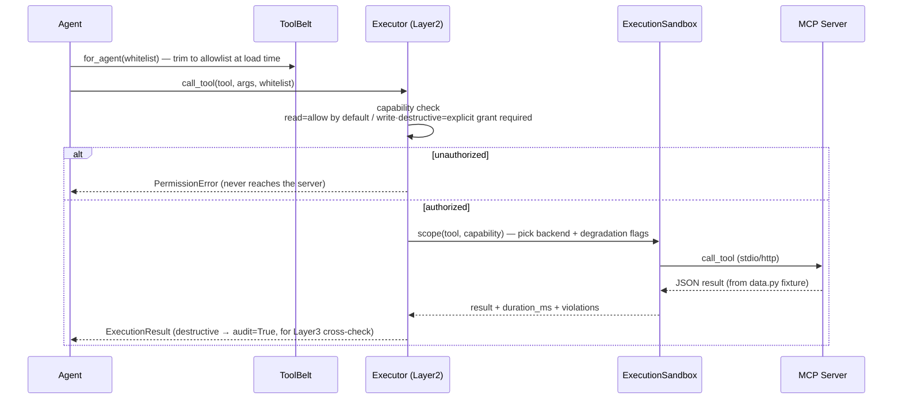

# Mock MCP Servers

Mock implementations of 5 SaaS tools, all exposing `list_tools` / `call_tool` via the official [`mcp` Python SDK](https://modelcontextprotocol.io) per the [Model Context Protocol](https://modelcontextprotocol.io) spec. They let the full multi-agent customer-support system run end-to-end, be tested, and be adversarially evaluated **without connecting to real Stripe/Zendesk/…**.

> Why mocks instead of live integrations? Interviews / demos need **determinism** (replayable fixtures), **zero credentials** (no real API keys), and **zero side effects** (`refund`/`escalate` must not move money or page people). The protocol layer matches a real MCP server **exactly**; swapping in a production implementation requires no agent-side code changes.

---

## 1. Place in the overall architecture

```mermaid
flowchart LR
  subgraph agent["Business agents (Billing / Technical / Escalation)"]
    plan["Plan / decide"] --> tb["ToolBelt.for_agent()<br/>filter by TOOL_WHITELIST"]
  end
  tb --> ex["Executor.call_tool()<br/>Layer2 capability check + sandbox scope"]
  ex --> loader["mcp/loader.py<br/>MCP Tool → LangChain BaseTool"]
  loader -->|stdio (dev) / HTTP+SSE (prod)| srv
  subgraph srv["MCP Servers (this directory)"]
    z["zendesk"]
    s["stripe"]
    sl["slack"]
    sf["salesforce"]
    ic["intercom"]
  end
  z & s & sl & sf & ic --> dat["data.py<br/>in-memory fixtures (deterministic)"]
  classDef gate fill:#fff3cd,stroke:#d39e00,color:#7a5c00;
  class ex gate;
```

Full lifecycle of one tool call:



---

## 2. Servers and tools

| Server | Tool | capability | Inputs (required) | Description |
|---|---|---|---|---|
| **zendesk** | `get_ticket_history` | `read` | `customer_id` | All tickets for a customer (newest first) |
| | `update_ticket` | `write` | `ticket_id` | Change status / append an internal note (`status` ∈ open·pending·solved·escalated) |
| | `escalate` | `destructive` | `ticket_id`, `reason` | Escalate to a human; `audit=True` |
| **stripe** | `list_charges` | `read` | `customer_id` | Recent charges (`limit` default 10) |
| | `get_charge` | `read` | `charge_id` | Single charge details |
| | `refund` | `destructive` | `charge_id` | Full/partial refund (`amount` in cents; omit = full); `audit=True` |
| **slack** | `notify_team` | `write` | `channel`, `message` | On-call notify, may `@mention`; Escalation uses this for human handoff |
| | `post_message` | `write` | `channel`, `message` | Ordinary message (no mention) |
| **salesforce** | `get_account` | `read` | `customer_id` | Look up an account |
| | `update_opportunity` | `write` | `opportunity_id` | Update opportunity stage/amount |
| **intercom** | `get_conversation` | `read` | `conversation_id` | Look up a conversation |
| | `tag_user` | `write` | `user_id`, `tag` | Tag a user |

> `kb.search` (the Technical agent’s retrieval tool) is **not** in this directory — `HybridRetriever` serves it in-process, no MCP.

---

## 3. Three capability tiers + least-privilege matrix (Decision 4 · Guardrail Layer 2)

Each tool declares a `capability`; `core/executor.py` enforces least privilege **at call time**:

| capability | Rule | Audited |
|---|---|---|
| `read` | **Allowed by default** (even if not on the allowlist) — business agents usually need to read | No |
| `write` | Must be **explicitly granted** in that agent’s `TOOL_WHITELIST` | No |
| `destructive` | Must be **explicitly granted** + automatically flagged `audit=True` for Layer 3 output-guardrail cross-check | Yes |

**write/destructive** tools actually granted per agent (read tools are default-available to all business agents, so they are omitted):

| Tool (capability) | Billing | Technical | Escalation | Triage |
|---|:---:|:---:|:---:|:---:|
| `zendesk.update_ticket` (write) | ✅ | ✅ | ✅ | — |
| `zendesk.escalate` (destructive) | — | — | ✅ | — |
| `stripe.refund` (destructive) | ✅ | — | — | — |
| `slack.notify_team` (write) | — | — | ✅ | — |
| `slack.post_message` (write) | — | — | — | — |
| `salesforce.update_opportunity` (write) | — | — | — | — |
| `intercom.tag_user` (write) | — | — | — | — |

Takeaways (the honest version — this is how least privilege should look):
- **Triage has no tools** — it only classifies; it never touches SaaS.
- Only **Billing** can `refund`, only **Escalation** can `escalate` — the authorization surface for high-risk actions is as narrow as it gets.
- `slack.post_message` / `salesforce.update_opportunity` / `intercom.tag_user` exist on the mock surface, but **no agent is currently authorized** to call them — least privilege means “capability exists ≠ available by default.” To enable one, add a line to that agent’s `TOOL_WHITELIST`.

---

## 4. Protocol & startup

| Environment | transport | How it starts |
|---|---|---|
| dev | `stdio` | `python -m mcp_servers.stripe` (the API process forks a child and talks over stdin/stdout) |
| prod | `HTTP` / SSE | Run as a separate process in a gVisor pod; the API connects by URL |

- Each server is its own package under `mcp_servers.<name>`, entry `main()` (see each `__main__.py`).
- Assembled in a **config-driven** way by `default_servers()` in [`mcp/registry.py`](../../apps/api/src/resolveai_api/mcp/registry.py): only servers with a non-empty start command (`MCP_<NAME>_CMD`) are launched; the rest are skipped silently. Transport is `MCP_TRANSPORT`.
- The data layer (`data.py`) is **in-process in-memory fixtures** — deterministic, no external deps, tests replay.

---

## 5. Adding a SaaS

1. Copy the `stripe/` directory and rename (`server.py` + `data.py` + `__main__.py` + `pyproject.toml`).
2. Declare tools in `TOOLS` and **annotate each with `capability`** (read/write/destructive).
3. Update the package name + entry point in `pyproject.toml`.
4. Add a row to the candidate list in [`mcp/registry.py`](../../apps/api/src/resolveai_api/mcp/registry.py) and the matching `MCP_<NAME>_CMD` in config.
5. For write/destructive tools, add allowlist entries on the agents that need them (read tools do not need this).

You **do not need to change agent logic itself** — that is the payoff of MCP + a capability allowlist: integration is configuration, not a code change.

---

## 6. Testing

- Each server can be smoke-tested by hand with `python -m mcp_servers.<name>`.
- End-to-end: API-side `mcp/` tests spawn real stdio children and check `list_tools`/`call_tool` round-trips; `core/executor.py` capability checks have their own unit tests (unauthorized write/destructive → `PermissionError`, never reaches the server).
- All mocks are network-free, credential-free, and deterministic, and run under `LLM_BACKEND=fake` — a fit for LM-free CI.
